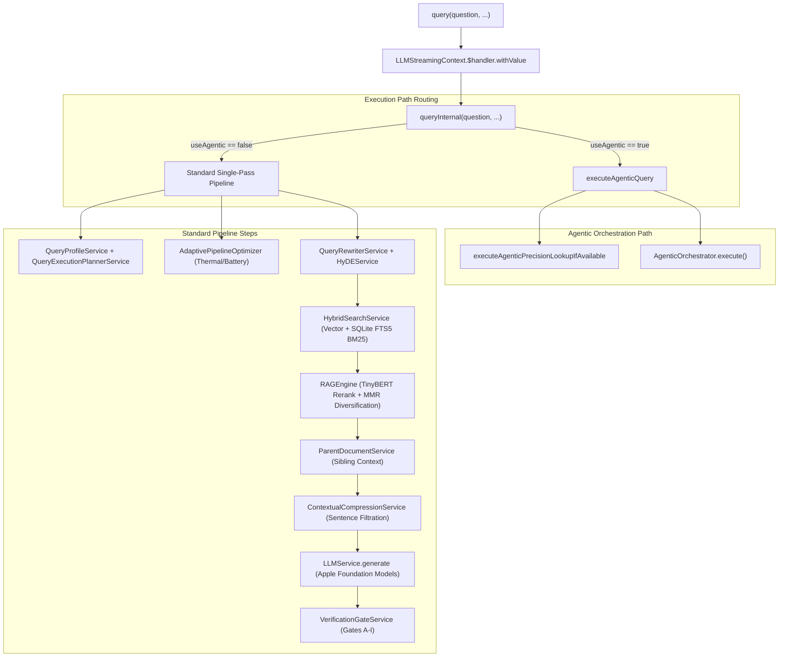

# AI Agent Map: OpenIntelligence Orchestration Architecture

This document maps the entry points, call graphs, framework dependencies, and service boundaries of the `OpenIntelligence` RAG runtime, specifically analyzing the mega-orchestrator `RAGService.swift` as of WWDC26 modernization plans.

---

## 1. RAGService.swift Line Count & API Surface

`RAGService.swift` is the central orchestrator of the local-first Apple-native RAG runtime.
* **Line Count**: 16,630 lines
* **API Categories**:
  1. **Public/Internal Facade Queries**: Conformances to `KnowledgeRetrievalEngine` and `RAGToolHandler`.
  2. **Ingestion & Processing Queue**: Managing document queues, background extraction, chunking, and database persistence.
  3. **Model & Consent Management**: Tracking on-device vs. Private Cloud Compute (PCC) settings, cloud provider consent states, and LLM fallbacks.
  4. **Diagnostic & Telemetry Center**: Storing audit snapshots, pipeline traces, thermal/battery optimizations, and user feedback.

### Key API Signatures
```swift
// Public Facade Conformance (KnowledgeRetrievalEngine)
func query(_ request: RetrievalRequest) async throws -> RAGResponse

// Orchestrated Multi-Mode Query Actions
func query(
    _ question: String,
    topK: Int = 3,
    config: InferenceConfig? = nil,
    containerId: UUID? = nil,
    qualityModeOverride: RAGQualityMode? = nil,
    streamHandler: LLMStreamHandler? = nil
) async throws -> RAGResponse

func queryWithAudit(
    _ question: String,
    topK: Int = 3,
    config: InferenceConfig? = nil,
    containerId: UUID? = nil,
    qualityModeOverride: RAGQualityMode? = nil,
    streamHandler: LLMStreamHandler? = nil
) async throws -> (response: RAGResponse, auditSnapshot: RAGAuditSnapshot?)

// Ingestion Orchestration
func enqueueDocuments(_ urls: [URL], context: IngestionContext = .userInitiated) -> [UUID]
func addDocument(
    at url: URL,
    context: IngestionContext = .userInitiated,
    trackingId: UUID? = nil,
    manageProcessingState: Bool = true
) async throws

// RAGToolHandler Tool Conformance
func searchDocuments(query: String) async throws -> String
func listDocuments() async throws -> String
func getDocumentSummary(documentName: String) async throws -> String
func countPatternInCorpus(pattern: String) async throws -> String
func searchExactPattern(pattern: String) async throws -> String
func getCorpusStats() async throws -> String
func findRelatedDocuments(topic: String, maxResults: Int) async throws -> String
func compareDocumentsOnTopic(topic: String, documentNames: [String]?) async throws -> String
```

---

## 2. Core Call Graphs

### A. Query Call Flow (`query` → `queryInternal`)

When the user or system triggers a query, it routes as follows:



### B. Ingestion Call Flow (`enqueueDocuments` → `runIngestionLoop` → `addDocument`)

```mermaid
graph TD
    Enqueue["enqueueDocuments(urls, ...)"] --> Queue["Ingestion Queue State"]
    Queue --> runIngestionLoop["runIngestionLoop() (Background Task)"]
    
    subgraph Ingestion Pipeline (Per Document)
        runIngestionLoop --> addDocument["addDocument(at: url, ...)"]
        addDocument --> Parse["DocumentProcessor.processDocument (PDFKit / Vision OCR)"]
        Parse --> Spotlight["SpotlightIndexService.indexDocument"]
        Parse --> SelfTune["LibraryIntelligenceCenter.analyzeLibrary"]
        SelfTune --> ContextualPrefix["Contextual Retrieval (Prepend Doc & Section Metadata)"]
        ContextualPrefix --> TokenValidation["BertTokenizer Length Validation (≤510 tokens)"]
        TokenValidation --> Embedding["EmbeddingService (CoreML Sentence Embedding)"]
        Embedding --> Store["BNNSVectorDatabase.storeBatch + SQLiteFullTextService"]
    end
```

---

## 3. Apple Framework Dependency Mapping

The RAG runtime leverages specific Apple OS-level frameworks, integrated as follows:

| Framework | Current Role in OpenIntelligence | Target WWDC2Modernization |
| :--- | :--- | :--- |
| **FoundationModels** | Language generation session lifecycle, token heuristics, and tool schema registration. | Upgrade to native `LanguageModel` protocol compliance, Dynamic Profiles, and PCC estimations. |
| **AppIntents** | Basic command-wrapper intents (`OIAskQueryIntent`, etc.) referencing new/ephemeral service instances. | Convert to entity-native intents backed by `AppEntity` (`OIDocumentEntity`, `OILibraryEntity`). |
| **CoreSpotlight** | Document discovery indexing (preview description and titles). | Upgrade to semantic retrieval plane by indexing chunk, section, and table metadata. |
| **Vision** | OCR processing, page-level visual complexity evaluation, and layout analyses. | Build `VisualEvidenceSource` to ground multimodal models directly in visual evidence. |
| **CoreML** | Embedding generation (`CoreMLSentenceEmbeddingProvider`) and TinyBERT reranker. | Leverage `CoreAI` for specialized local execution and compilation. |
| **NaturalLanguage** | Lemmatization, semantic chunking token boundaries, and language detection. | Integrate as the foundation for linguistic and syntactic parsing. |
| **Accelerate / BNNS** | Memory-mapped local vector calculations, vector indexing, and distance scoring. | Keep as target local vector acceleration layer. |

---

## 4. Logical Ingestion & Inferences (29 Steps)

Below is the logical pipeline tracing data from raw input files to a cited answers:

```
INGESTION:
  1. Parse: PDFKit & Vision OCR text/visual layout extraction
  2. SemanticChunker: Sentence-bound chunks capped at 310 words
  3. Entity Extraction: NLTagger NER extracts people/places/special terms
  4. Token Validation: Tokenizer ensures <= 510 tokens per chunk
  5. Embedding: Prepend Document & Section prefixes, embed using CoreML
  6. Store: Save to BNNS-backed vector store and SQLite FTS5 lexical index

QUERY-RESPONSE:
  0. Corpus Analysis: Load container-specific vocabulary cache
  1. Query Understanding: Resolve pronouns and entities via NLTagger
  1.5. Query Expansion: Enrich query with container vocabulary synonyms
  1.6. Intent Classification: Standard, lookup, procedure, or overview routing
  2. Query Embedding: Embed expanded query using active embedding model
  2.5. RAPTOR-lite Routing: Route overview queries to summary-level index
  3. Hybrid Search: Vector search + SQLite FTS5 lexical search fusion
  4. Cross-Encoder Rerank: Re-score top candidates using TinyBERT model
  4.3. Low-Confidence Filtering: Remove candidates below semantic overlap gates
  4.4. Multi-Document Representation: Ensure source document diversity
  4.5. MMR Diversification: Apply MMR (lambda = 0.6) to reduce redundancy
  4.6. Parent Document Retrieval: Expand selected chunks with sibling context
  4.7. Contextual Compression: Extrapolate only query-relevant sentences
  4.9. Graph Context Packing: Token packing optimized for context window
  5. Context Assembly: Interleave chunks using Lost-in-Middle reordering
  5.9. Extractive Summarization: Route summary intents to extractive summarizes
  5.10. Extractive QA: Determinstic exact-value retrieval for lookup intents
  6. LLM Generation: Local LanguageModelSession generation within 4K token limit
  6.5. Response Formatting: Markdown layout normalization
  7. Quality Assessment: Evaluate model outputs for structural correctness
  7.5. Verification Gates: Validate claims against retrieved source facts (Gates A-I)
  8. Package Results: Assemble citations and response container
  8.1. Calibrated Confidence: Scale response confidence via Platt scaling
  9. Response Metadata: Record timestamps, tokens, and telemetry
  10. Markdown Rendering: UI rendering of answer and citation anchors
```
