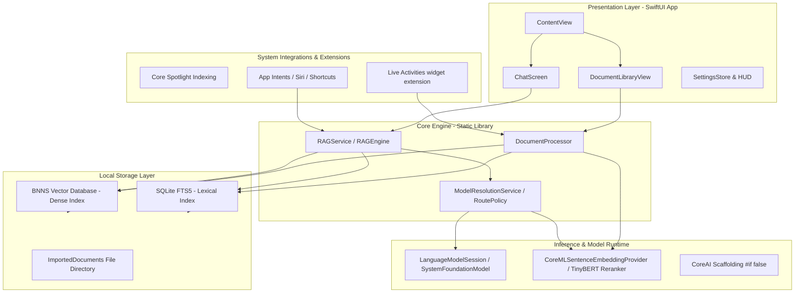

# Docs/ARCHITECTURE.md — historical, written at v4.1

> **Documentation status:** [Superseded]. Superseded by `Docs/OPENINTELLIGENCE_ARCHITECTURE_ATLAS.md`, and below that by `Docs/CANONICAL_OPENINTELLIGENCE_SOURCE_OF_TRUTH.md`, which wins over both. This file describes the v4.1 architecture and is kept for history. The shipped version is 4.9. Do not use it as the source of truth for any version. `[evidence_level: historical, confidence: superseded]`

OpenIntelligence is an Apple-native document intelligence application built around a SwiftUI app shell and a retrieval-oriented document engine.

The codebase is structured to expose the entire RAG pipeline: document ingestion, chunking, indexing, retrieval, grounded answer generation, citation handling, confidence surfaces, and diagnostics. The architecture is local-first, with Apple-managed cloud capacity (PCC) integrated natively on iOS 27 / macOS 27+ behind post-retrieval consent. Older OS versions stay fully on-device — PCC is never simulated.

---

## 1. System Architecture Map

---

## 2. Major Subsystems

- **`OpenIntelligence/App`**: Application entry points and top-level composition.
- **`OpenIntelligence/Features`**: User-facing document, chat, settings, diagnostics, telemetry, camera, onboarding, and billing surfaces.
- **`OpenIntelligence/Services/Document`**: Extraction, parsing, analysis, chunking, classification, and document processing.
- **`OpenIntelligence/Services/RAG`**: Retrieval, context packing, orchestration, verification, source-only answering, confidence, and safety checks.
- **`OpenIntelligence/Services/Embedding`**: Embedding generation utilizing Core ML, containing disabled Core AI providers.
- **`OpenIntelligence/Services/Storage`**: Full-text indexers (SQLite FTS5) and local storage services.
- **`OpenIntelligence/Services/VectorStore`**: Vector database abstractions and local vector search ([BNNSVectorDatabase.swift](file:///Users/gunnarhostetler/Documents/GitHub/OpenIntelligence/OpenIntelligence/Services/VectorStore/BNNSVectorDatabase.swift)).
- **`OpenIntelligence/Services/AIPlatform/AppleFoundationModels`**: Monolithic manager handling Apple Foundation Model sessions, prompt compilation, and token budgets.
- **`OpenIntelligence/Services/AIPlatform/CoreAI`**: Custom local model registry, local model runtimes, and disabled embedding/cross-encoder scaffolding.
- **`OpenIntelligence/Services/Evaluation`**: Local evaluation suite containing the RAG runner, JSONL datasets loader, report writer, and evaluations bridge.
- **`OpenIntelligence/SDK`**: Experimental package boundary for the engine-facing API.

---

## 3. Ingestion & Indexing Pipeline

1. **Parse**: Files enter through document workflows. Content is parsed using type-specific extractors. For PDFs, the system uses [LayoutAwareExtractor](file:///Users/gunnarhostetler/Documents/GitHub/OpenIntelligence/OpenIntelligence/Services/Document/Processing/LayoutAwareExtractor.swift) or Vision OCR when a native text layer is missing.
2. **Semantic Chunking**: [SemanticChunker](file:///Users/gunnarhostetler/Documents/GitHub/OpenIntelligence/OpenIntelligence/Services/Document/Chunking/SemanticChunker.swift) splits text into retrievable units (typically $\le 310$ words) while identifying document structures like sections, lists, and tables.
3. **Entity Extraction**: Runs `NLTagger` Named Entity Recognition (NER) to extract key entities, formatting them in PascalCase.
4. **Token Validation**: Chunks are validated using local tokenizers (e.g. `BertTokenizer` $\le 510$ tokens) to guarantee compatibility with embedding models.
5. **Embedding Generation**: Generates 384-dimensional dense vectors using a local Core ML model (`CoreMLSentenceEmbeddingProvider`).
6. **Corpus Storage**: Text and layout metadata are indexed into a shared SQLite FTS5 database (using `container_id` isolation), and dense vectors are written into [BNNSVectorDatabase](file:///Users/gunnarhostetler/Documents/GitHub/OpenIntelligence/OpenIntelligence/Services/VectorStore/BNNSVectorDatabase.swift).

---

## 4. Query-to-Response Pipeline

### Phase 1: Query Routing & Understanding
* **Query Expansion & Intent Classification**: Resolves pronouns, extracts entities via `NLTagger` NER, expands queries using Synonyms, and classifies user intent (lookup, procedure, compare, or summarize).
* **Query Embedding**: Generates a 384-dimensional query vector.
* **Model Routing Policy & Quality Modes**:
  The orchestrator escalates dynamically based on the user's selected Quality Mode:
  - **Standard**: Executes the 23-step query loop sequentially for maximum speed. Uses the on-device model (`SystemLanguageModel.default`) with a 4,096-token context limit per TN3193.
  - **Deep Think**: Actively loops the retrieval agent through 4-10 concurrent reasoning sessions until it hits 98% confidence (scales dynamically based on device thermal state). Runs on the on-device model; the "Advanced" route label is a preference, not a distinct selectable model (AFM 3 Core Advanced is OS-managed — the installed SDK exposes no selection or observation API; a CI canary alerts if that changes).
  - **Maximum**: Removes the 8-session ceiling, granting the orchestrator an unlimited budget to recursively hunt down answers up to 50 loops. May escalate final synthesis to **Private Cloud Compute** — only after post-retrieval planning determines the evidence justifies it and entitlement, availability, quota, and consent gates pass; retrieval and verification remain local either way.

### Phase 2: Evidence Retrieval & Packing
* **Hybrid Search**: Fuses vector similarity scores and FTS5 BM25 lexical scores using Reciprocal Rank Fusion (RRF).
* **Cross-Encoder Rerank**: Scores candidate chunks using a local Core ML TinyBERT reranker. If the model is absent, it falls back to a term-proximity/boost heuristic score.
* **Context Expansion**: Expands matching chunks to include neighboring sibling chunks using [ParentDocumentService](file:///Users/gunnarhostetler/Documents/GitHub/OpenIntelligence/OpenIntelligence/Services/RAG/Retrieval/ParentDocumentService.swift).
* **Context Assembly**: Arranges the evidence using a **Lost-in-Middle** reordering algorithm (placing high-relevance chunks at the start and end of the prompt window to maximize LLM attention).

### Phase 3: Generation & Safety Verification
* **LLM Generation**: Invokes the resolved foundation model using the packed evidence context.
* **Verification Gates**: Routes the generated response through safety checks in [VerificationGateService.swift](file:///Users/gunnarhostetler/Documents/GitHub/OpenIntelligence/OpenIntelligence/Services/RAG/Safety/VerificationGateService.swift) (including negation checks and word-overlap contradiction sweeps) to calibrate confidence and trigger abstentions when evidence is weak.

---

## 5. Continuous Evaluation and Quality Gates

To prevent regressions, the RAG pipeline is validated against test datasets using the `Evaluation` framework.
* **Test Suites**: Run JSONL test files containing ground-truth chunks and expected answers.
* **Compatibility**: The [AppleEvaluationsBridge](file:///Users/gunnarhostetler/Documents/GitHub/OpenIntelligence/OpenIntelligence/Services/Evaluation/AppleEvaluationsBridge.swift) bridges evaluation data to Apple's native command-line testing suite (`fm CLI`).

---

## 6. Design Goals

- Keep user files under user-controlled workflows.
- Keep library or workspace boundaries visible in retrieval.
- Prefer source-backed answers over un-+constrained model output.
- Make uncertainty inspectable instead of hiding it.
- Preserve enough diagnostics for rapid engineering iteration.
