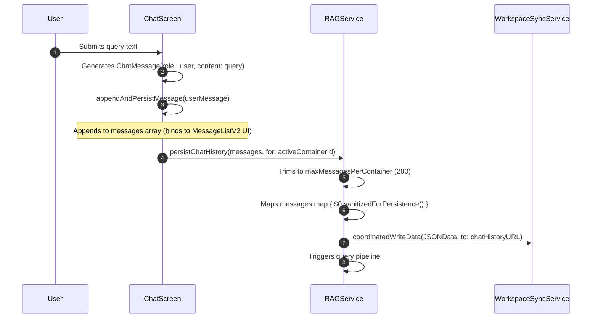
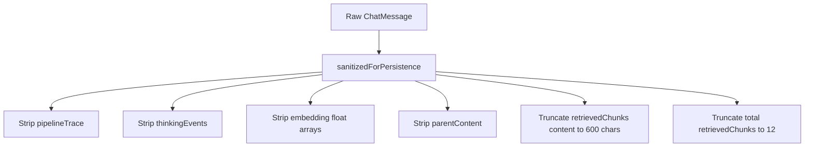

# Chat State Callgraph & Lifecyle Map

This document tracks the detailed execution trace of a chat message from submission, formatting, sanitization, disk serialization, app relaunch, active container restoration, and UI rendering.

## 1. Message Submission and Appending

When a user submits a query:



### Call Trace:
1.  **User Submission:** User types query in `ChatComposerV2` and taps send, calling the submit action in `ChatScreen.swift` (line 857).
2.  **User Message Appending:** An instance of `ChatMessage` with role `.user` is generated. It is appended to `ChatScreen.messages` via `appendAndPersistMessage(_:for:)` (line 1649) and written to disk.
3.  **Model Execution:** `ChatScreen.executeRAGQuery(question:)` (line 1735) triggers `RAGService.query(...)` (line 7521).
4.  **Assistant Message Generation:** An ephemeral assistant `ChatMessage` is created with `role: .assistant`. As tokens stream from `LLMService` / `AppleFoundationLLMService`, `ChatScreen` receives intermediate updates, updates the UI, and appends thinking events/pipeline traces.
5.  **Final Response Persistence:** Once the assistant response completes, the final message is appended to the UI state and written to disk via `persistChatHistory(for:)` (line 1645).

---

## 2. Message Sanitization on Persistence

The sanitization routine in [ChatMessage.swift](file:///Users/gunnarhostetler/Documents/GitHub/OpenIntelligence/OpenIntelligence/Core/Models/ChatMessage.swift#L111-L127) strips heavy resources to maintain a minimal disk profile:



*   **Excluded Fields:** `pipelineTrace` and `thinkingEvents` are omitted entirely from persistence via `CodingKeys` exclusion (line 85).
*   **Vector Pruning:** High-dimension embeddings arrays (`embedding: [Float]`) are set to empty (`[]`) to prevent database bloat.
*   **Text Pruning:** Raw parent document content (`parentContent`) is stripped, and the core chunk text (`content`) is truncated to a maximum of 600 characters.

---

## 3. Relaunch Restoration and Loading

Upon relaunching the application, the saved messages are restored:

```mermaid
sequenceDiagram
    autonumber
    AppLaunch->>ContainerService: Initializes & Restores activeContainerId from UserDefaults
    AppLaunch->>ChatScreen: Views loaded; task(id: activeContainerId) fires
    ChatScreen->>RAGService: preloadChatHistory(for: activeId)
    RAGService->>WorkspaceSyncService: coordinatedReadData(from: chatHistoryURL)
    WorkspaceSyncService-->>RAGService: Returns raw JSON Data
    RAGService->>RAGService: Decodes JSON array to [ChatMessage]
    RAGService->>RAGService: Maps messages.map { $0.sanitizedForPersistence() } (Verification)
    RAGService-->>ChatScreen: Returns loaded messages list
    ChatScreen->>ChatScreen: messages = loaded
    ChatScreen->>MessageListV2: Renders ChatMessage objects in UI
```

### Call Trace:
1.  **Launch Initialization:** `ContentView.swift` initializes `ContainerService` and `RAGService`.
2.  **Container Recovery:** `ContainerService` (line 30) reads the active container ID string from `UserDefaults` key `"activeContainerId"`.
3.  **Screen Load Task:** `ChatScreen.swift` (line 552) triggers the `.task(id: activeContainerId)` block on appearance or active container switch.
4.  **Disk Preloading:** `ChatScreen` calls `RAGService.preloadChatHistory(for: activeId)` (line 537).
5.  **Coordinated Read:** `RAGService` reads data from the path computed by `AppSupportPaths.chatHistoryURL(containerId:)` using `WorkspaceSyncService.coordinatedReadData(from:)`.
6.  **Decoding and Caching:** The JSON data is decoded into a list of `ChatMessage` objects, mapped through `sanitizedForPersistence()` to ensure schema safety, cached in `RAGService.chatHistories[activeId]`, and returned to the UI thread.
7.  **UI Population:** The preloaded messages are assigned to the `@State private var messages` array in `ChatScreen`, triggering the SwiftUI view updates in `MessageListV2` and `MessageBubbleV2`.
