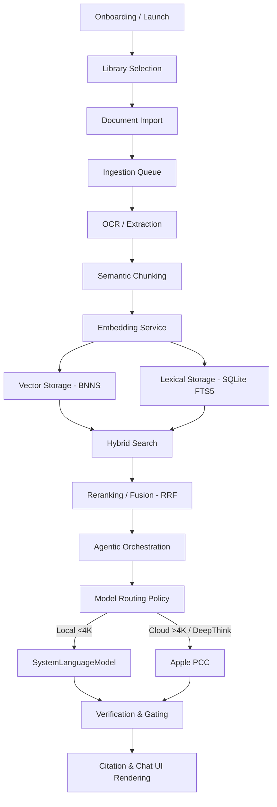

> **Documentation status:** [Archived]. This document is kept for historical evidence. Do not use as the source of truth for OpenIntelligence v4.3.

# OpenIntelligence Full-Repository Architecture and Product-Risk Audit
## Evidence Threads Feasibility Study

This document details a full-repository architecture and product-risk audit of the OpenIntelligence repository (approximately 180k lines of code, including vendor submodules). The objective is to determine the safest, smallest, source-backed way to implement local-only **Evidence Threads** without disrupting the existing storage substrates, model routing policies, sync boundaries, App Intents, StoreKit entitlements, or App Review compliance.

---

## Executive Summary (Phase 12 Preview)

*   **App Definition:** OpenIntelligence is an Apple-native, local-first RAG (Retrieval-Augmented Generation) evidence engine. It prioritizes private on-device execution (CoreML and local Apple Foundation Models) and scales dynamically to secure Private Cloud Compute (PCC) enclaves when context sizes exceed 4K tokens or deep reasoning modes are requested.
*   **The Case for Evidence Threads:** Conversational state in the modern UI (ChatV2) is currently transient and bound to a selected library. If a user clears the chat or switches libraries, the conversation history is overwritten on disk. Evidence Threads introduce a durable session layer allowing users to maintain multiple distinct lines of inquiry within a single library, pin findings, and review source-backed traces.
*   **MVP Architecture Recommendation:** Evidence Threads must be implemented as a **strictly local-only** feature in Phase 1. Adding thread JSON files to iCloud synchronization before proving a robust conflict-resolution strategy presents a high risk of data corruption, overwrites, or UI desync.
*   **Storage Substrate Recommendation:** Codable JSON files stored under `AppSupportPaths.baseDir()` matching the naming pattern `evidence_thread_<threadId>.json` must be used. SQLite Full-Text Storage is designed for global lexical searching and document text indexing, and the vector databases store heavy mathematical embeddings. Storing highly transient chat threads in SQLite would introduce locking contentions, while SwiftData would fracture the established data layer.
*   **Pricing & Entitlements Policy:** The initial local-only MVP must not require any changes to existing StoreKit configurations or pricing. A free quota cap (e.g., 3 active threads per library) will encourage conversion to the Pro/Lifetime tiers, which unlock unlimited threads.

---

## Phase 0: Repository Inventory

A repository-wide inventory has been compiled based on file structures and key term searches:

### 1. Total Files by Major Directory
*   **App Engine (`OpenIntelligence/App`)**: 3 files (e.g., `ContentView.swift`, `OpenIntelligenceApp.swift`) coordinating root lifecycle and diagnostic harnesses.
*   **Core Components (`OpenIntelligence/Core`)**: 29 files defining extensions, protocols, and standard model records.
*   **Features (`OpenIntelligence/Features`)**: 79 files containing SwiftUI views and feature-level view models (Chat: 29, Documents: 17, Settings: 9, Telemetry: 7, Diagnostics: 9, Billing: 4, Camera: 4).
*   **Services (`OpenIntelligence/Services`)**: 169 files implementing backend logic, including RAG (24), Documents (25), Infrastructure (24), AIPlatform (13), Agentic (11), Billing (8), and Vector Store (4).
*   **UI Components (`OpenIntelligence/UI`)**: 6 files defining design tokens and common controls.
*   **Submodules (`OpenIntelligence/swift-transformers`)**: Vendor framework for tokenization and model utilities.
*   **Tests (`OpenIntelligenceTests`)**: 5 files implementing unit tests for core RAG, search, and document systems.
*   **Scripts (`scripts/`)**: 18 python and bash utilities for benchmarks, schema audits, and deployment.

### 2. Major Modules & Feature Files
*   **Ingestion Queue:** Managed in [RAGService.swift](../OpenIntelligence/Services/RAG/Orchestration/RAGService.swift#L4023-L4090) and [BackgroundTaskService.swift](../OpenIntelligence/Services/Infrastructure/Background/BackgroundTaskService.swift).
*   **OCR & Extraction:** Handled by [DocumentProcessor.swift](../OpenIntelligence/Services/Document/Processing/DocumentProcessor.swift) and [LayoutAwareExtractor.swift](../OpenIntelligence/Services/Document/Processing/LayoutAwareExtractor.swift).
*   **Semantic Chunking:** Controlled by [SemanticChunker.swift](../OpenIntelligence/Services/Document/Chunking/SemanticChunker.swift).
*   **Vector & Lexical Storage:** Managed by [BNNSVectorDatabase.swift](../OpenIntelligence/Services/VectorStore/BNNSVectorDatabase.swift) and [SQLiteFullTextService.swift](../OpenIntelligence/Services/Storage/SQLiteFullTextService.swift).
*   **Hybrid Search & Reranking:** Implemented in [HybridSearchService.swift](../OpenIntelligence/Services/RAG/Retrieval/HybridSearchService.swift).
*   **Agentic Reasoning (Deep Think / Maximum):** Handled by [AgenticOrchestrator.swift](../OpenIntelligence/Services/Agentic/AgenticOrchestrator.swift).
*   **Session Management & Transcripts:** Managed via [TranscriptPersistenceService.swift](../OpenIntelligence/Services/Infrastructure/Background/TranscriptPersistenceService.swift).
*   **iCloud Synchronization:** Handled by [WorkspaceSyncService.swift](../OpenIntelligence/Services/Infrastructure/Storage/WorkspaceSyncService.swift).
*   **StoreKit & Billing:** Gated via [EntitlementStore.swift](../OpenIntelligence/Services/Billing/EntitlementStore.swift) and [StoreKitBillingService.swift](../OpenIntelligence/Services/Billing/StoreKitBillingService.swift).
*   **Siri App Intents:** Defined in [RAGAppIntents.swift](../OpenIntelligence/Services/Agentic/RAGAppIntents.swift), [ScreenAwarenessIntents.swift](../OpenIntelligence/Services/Agentic/ScreenAwarenessIntents.swift), and [VisualIntelligenceIntents.swift](../OpenIntelligence/Services/Agentic/VisualIntelligenceIntents.swift).

---

## Phase 1: Current Product Architecture Map

The application follows a structured, modular data flow from first launch to query execution:



### Architectural Stages & Specifications

1.  **First Launch / Onboarding:**
    *   *Responsible Files:* [OnboardingStateStore.swift](../OpenIntelligence/Features/Onboarding/OnboardingStateStore.swift), [OnboardingChecklistView.swift](../OpenIntelligence/Features/Onboarding/OnboardingChecklistView.swift).
    *   *Data Flow:* User options recorded in `UserDefaults`. Preloads sample documentation when onboarding tasks are marked complete.
    *   *Persistence:* Boolean checklist flags saved to `UserDefaults` keys (`onboarding.hasCompleted`, etc.).
    *   *Boundary:* Local-only; no cloud routing.
2.  **Library / Container Creation:**
    *   *Responsible Files:* [ContainerService.swift](../OpenIntelligence/Services/Infrastructure/Integration/ContainerService.swift), [KnowledgeContainer.swift](../OpenIntelligence/Core/Models/KnowledgeContainer.swift).
    *   *Data Flow:* Input parameters (name, color, icon) map to a `KnowledgeContainer` struct.
    *   *Persistence:* Saved to `containers.json` in the base directory. The selected container ID is stored in `UserDefaults` (`activeContainerId`).
    *   *Boundary:* Local-only by default; syncs to iCloud if `syncMode == .iCloudShared` (requires Pro/Lifetime).
3.  **Document Import:**
    *   *Responsible Files:* [DocumentPicker.swift](../OpenIntelligence/Features/Documents/Components/DocumentPicker.swift), [RAGService.swift](../OpenIntelligence/Services/RAG/Orchestration/RAGService.swift#L4600).
    *   *Data Flow:* Source file URLs are passed to `addDocument`. The file is copied to `baseDir()/ImportedDocuments/` with unique suffix naming to avoid collision.
    *   *Persistence:* Physical file written to disk. Metadata recorded in `documents_metadata.json` and `documents_<containerId>.json`.
    *   *Boundary:* Local-only; physical files are synced to iCloud if library sync is active.
4.  **Ingestion Queue:**
    *   *Responsible Files:* [RAGService.swift](../OpenIntelligence/Services/RAG/Orchestration/RAGService.swift#L4023-L4090), [IngestionItem.swift](../OpenIntelligence/Core/Models/IngestionItem.swift).
    *   *Data Flow:* Documents are appended to `ingestionItems` array and processed sequentially in `runIngestionLoop()`.
    *   *Persistence:* Serialized to `ingestion_queue.json` to allow recovery across app restarts.
    *   *Boundary:* Local-only.
5.  **OCR / Extraction:**
    *   *Responsible Files:* [DocumentProcessor.swift](../OpenIntelligence/Services/Document/Processing/DocumentProcessor.swift), [LayoutAwareExtractor.swift](../OpenIntelligence/Services/Document/Processing/LayoutAwareExtractor.swift).
    *   *Data Flow:* Reads raw PDF, docx, txt, image, or audio bytes. Uses Apple Vision framework for OCR if text extraction fails.
    *   *Persistence:* In-memory text structures during pipeline execution.
    *   *Boundary:* Local-only; no cloud offloading.
6.  **Chunking:**
    *   *Responsible Files:* [SemanticChunker.swift](../OpenIntelligence/Services/Document/Chunking/SemanticChunker.swift).
    *   *Data Flow:* Raw extracted text is divided into semantically bound sentences (280-400 words) using `NaturalLanguage` tags.
    *   *Persistence:* In-memory array of `ProcessedChunk` structures.
    *   *Boundary:* Local-only.
7.  **Embedding:**
    *   *Responsible Files:* [EmbeddingService.swift](../OpenIntelligence/Services/Embedding/EmbeddingService.swift).
    *   *Data Flow:* String chunks are processed through CoreML Sentence Embedding to output a 384-dimensional floating-point array.
    *   *Persistence:* Temporary in-memory float arrays.
    *   *Boundary:* Local-only (runs on GPU or Neural Engine).
8.  **Vector / Lexical Storage:**
    *   *Responsible Files:* [BNNSVectorDatabase.swift](../OpenIntelligence/Services/VectorStore/BNNSVectorDatabase.swift), [SQLiteFullTextService.swift](../OpenIntelligence/Services/Storage/SQLiteFullTextService.swift).
    *   *Data Flow:* Text chunks and embeddings are stored concurrently.
    *   *Persistence:* Vectors saved atomically to `vector_database_<containerId>.json` (plus associated binary files). Text chunks are written to local SQLite FTS5 virtual tables.
    *   *Boundary:* Vector files are synced via iCloud; SQLite tables are local-only and rebuilt locally upon synchronization.
9.  **Search / Retrieval:**
    *   *Responsible Files:* [HybridSearchService.swift](../OpenIntelligence/Services/RAG/Retrieval/HybridSearchService.swift).
    *   *Data Flow:* Incoming query triggers concurrent cosine similarity vector search and SQLite FTS5 lexical keyword search.
    *   *Persistence:* In-memory list of `RetrievedChunk` candidates.
    *   *Boundary:* Local-only.
10. **Reranking / Fusion:**
    *   *Responsible Files:* [HybridSearchService.swift](../OpenIntelligence/Services/RAG/Retrieval/HybridSearchService.swift) (Reciprocal Rank Fusion).
    *   *Data Flow:* Fuses rankings from lexical and vector results to prioritize factual and contextual matching.
    *   *Persistence:* In-memory reranked candidates.
    *   *Boundary:* Local-only.
11. **Generation:**
    *   *Responsible Files:* [LLMService.swift](../OpenIntelligence/Services/LLM/LLMService.swift), [FoundationModelSessionFactory.swift](../OpenIntelligence/Services/AIPlatform/AppleFoundationModels/FoundationModelSessionFactory.swift).
    *   *Data Flow:* Compiles system prompt, packed context chunks, and chat history into a generation call.
    *   *Persistence:* Ephemeral in-memory generation output.
    *   *Boundary:* Dynamic routing. Standard prompts within the 4,096 token limit execute locally using `SystemLanguageModel.default`. Larger inputs or Deep Think/Maximum queries escalate to `PrivateCloudComputeLanguageModel` if allowed by the user.
12. **Verification / Gating:**
    *   *Responsible Files:* [QualityAssuranceService.swift](../OpenIntelligence/Services/RAG/Safety/QualityAssuranceService.swift).
    *   *Data Flow:* Validates that every generated assertion maps directly to the cited chunk identifiers.
    *   *Persistence:* In-memory validation results.
    *   *Boundary:* Local-only.
13. **Citation Rendering:**
    *   *Responsible Files:* [SourceChipsView.swift](../OpenIntelligence/Features/Chat/Response/SourceChipsView.swift), [GroundedAnswerView.swift](../OpenIntelligence/Features/Chat/Response/GroundedAnswerView.swift).
    *   *Data Flow:* Resolves claim citations against retrieved source documents.
    *   *Persistence:* Persistent only within the associated chat message structure.
    *   *Boundary:* Local-only.
14. **Chat UI Rendering:**
    *   *Responsible Files:* [ChatScreen.swift](../OpenIntelligence/Features/Chat/Conversation/ChatScreen.swift), [MessageListV2.swift](../OpenIntelligence/Features/Chat/Conversation/MessageListV2.swift).
    *   *Data Flow:* Displays the array of `ChatMessage` objects in a standard list.
    *   *Persistence:* Bound to `RAGService.chatHistories` memory cache.
    *   *Boundary:* Local-only.
15. **Export / Trace Tools:**
    *   *Responsible Files:* [PipelineTraceExporter.swift](../OpenIntelligence/Features/Chat/Pipeline/PipelineTraceExporter.swift).
    *   *Data Flow:* Serializes structured query details, timings, and retrieval fidelity into a markdown trace string.
    *   *Persistence:* Ephemeral text; can be written to user-selected export paths.
    *   *Boundary:* Local-only.
16. **App Intents / Shortcuts Entry Points:**
    *   *Responsible Files:* [RAGAppIntents.swift](../OpenIntelligence/Services/Agentic/RAGAppIntents.swift).
    *   *Data Flow:* Triggers background queries or document imports via Siri/Shortcuts.
    *   *Persistence:* Updates active container documents and metadata.
    *   *Boundary:* Local execution with optional cloud escalation depending on query length.
17. **StoreKit / Paywall Gates:**
    *   *Responsible Files:* [EntitlementStore.swift](../OpenIntelligence/Services/Billing/EntitlementStore.swift).
    *   *Data Flow:* Reads receipt data to resolve active entitlement tiers (.free, .pro, .lifetime).
    *   *Persistence:* Values stored securely in Keychain and cached in `UserDefaults`.
    *   *Boundary:* Interacts with Apple App Store receipt validation.
18. **iCloud Shared Workspace:**
    *   *Responsible Files:* [WorkspaceSyncService.swift](../OpenIntelligence/Services/Infrastructure/Storage/WorkspaceSyncService.swift).
    *   *Data Flow:* Replicates the workspace root folder to the iCloud Ubiquity Container.
    *   *Persistence:* Remote CloudKit/iCloud drive sync.
    *   *Boundary:* iCloud cloud boundaries.
19. **Cloud / PCC Routing:**
    *   *Responsible Files:* [FoundationModelRoutePolicy.swift](../OpenIntelligence/Services/AIPlatform/AppleFoundationModels/FoundationModelRoutePolicy.swift), [CloudConsentPromptView.swift](../OpenIntelligence/UI/Components/CloudConsentPromptView.swift).
    *   *Data Flow:* Routes queries to secure PCC servers if context exceeds 4,096 tokens and user consent is active.
    *   *Persistence:* User consent preferences saved in settings.
    *   *Boundary:* Apple Private Cloud Compute boundaries.

---

## Phase 2: Chat State and Persistence Audit

Conversational state in OpenIntelligence is managed through a hybrid in-memory and disk architecture. The following points detail the exact behavior identified:

1.  **Is `ChatMessage` persisted anywhere?**
    Yes. Although modern V2 UI views treat messages as live state, the backend persists them to disk inside `chat_history_<containerId>.json` via [RAGService.swift](../OpenIntelligence/Services/RAG/Orchestration/RAGService.swift#L765-L775).
2.  **Is ChatV2 persisted?**
    Yes. ChatV2 binds directly to the active container's history managed by `RAGService`, which serializes state on changes and preloads history on active container switches.
3.  **Are legacy chat histories still used?**
    No. The system uses the single unified model [ChatMessage.swift](../OpenIntelligence/Core/Models/ChatMessage.swift). Older legacy chat history files have been replaced by the container-isolated JSON model.
4.  **Are files like `chat_history_<containerId>.json` active?**
    Yes. They are active, loaded via `loadChatHistoryFromDisk(for:)`, and saved via `saveChatHistory(_:for:)`.
5.  **Does switching libraries lose chat state?**
    No. Switching libraries updates the active container ID, prompts `RAGService` to write the current library's messages to disk, and preloads the target library's history from its own `chat_history_<targetContainerId>.json` file.
6.  **Does relaunching the app lose chat state?**
    No. The active library state is read from `UserDefaults` on launch, and its history is restored from disk.
7.  **Are retrieved chunks persisted?**
    Yes, but they are heavily pruned and sanitized. In `ChatMessage.swift`, `sanitizedForPersistence()` limits the persisted retrieved chunks to a maximum of 12 entries and truncates each text content block to 600 characters to prevent disk bloating.
8.  **Is `pipelineTrace` persisted?**
    No. The `pipelineTrace` and `thinkingEvents` arrays are explicitly marked in `CodingKeys` to be excluded from JSON serialization to keep file sizes lean.
9.  **Are citations restorable after relaunch?**
    Yes. Because the truncated `retrievedChunks` and full `structuredAnswer` are decoded from the JSON file on launch, citation mapping remains fully functional after relaunching.
10. **Are hidden/reported messages persisted?**
    Yes. User safety values like `isHidden`, `userReportedAt`, `userReportReason`, and `userReportNotes` are included in `CodingKeys` and persisted.

### Chat Persistence Truth Table

| Current Behavior | File/Function Proving It | Risk | Implication for Evidence Threads |
| :--- | :--- | :--- | :--- |
| **Container-bound History** | `RAGService.persistChatHistory` | Switching libraries swaps the active history, but only *one* chat history is maintained per library. | Evidence Threads must support *multiple* history instances per library. |
| **Ephemereal Trace & Thinking** | `ChatMessage.CodingKeys` | Detailed trace logging and raw intermediate reasoning steps are lost on app restart. | Keep detailed traces in-memory only; persist only high-level thread summaries and pinned findings. |
| **Sanitized Chunks** | `ChatMessage.sanitizedForPersistence` | Restored citations display truncated content (max 600 chars) instead of full source text. | Safe for Evidence Threads. Snippets are sufficient for thread citation lookup. |
| **Last-Write-Wins Sync** | `WorkspaceSyncService.synchronizeAuxiliaryFile` | Simultaneous chat writes on two devices will result in the older write being overwritten. | Defer thread syncing to a later phase to prevent data loss. |

---

## Phase 3: Storage Substrate Audit

The application leverages a multi-layered storage strategy optimized for performance and local privacy:

### Active Storage Mechanisms

1.  **Codable JSON Files:**
    *   *What it stores:* Library configurations (`containers.json`), global document metadata (`documents_metadata.json`), active ingestion queues (`ingestion_queue.json`), and individual container chat histories (`chat_history_<containerId>.json`).
    *   *Location:* Located directly under `AppSupportPaths.baseDir()` (typically application support sandbox).
    *   *Suitability for Evidence Threads:* High. Using Codable JSON aligns with the existing architecture and is easy to isolate, parse, and delete without database migrations.
2.  **SQLite Databases (FTS5):**
    *   *What it stores:* Fully indexed document text, page-level text, layout coordinates, and table data.
    *   *Location:* Saved under `AppSupportPaths.localCacheDir()/FTS5/`.
    *   *Suitability for Evidence Threads:* Low. SQLite is optimized for high-volume lexical querying and document chunk retrieval. Storing highly transient, UI-bound chat histories or threads directly in FTS5 tables would increase transaction overhead and risk write contention during background ingestion.
3.  **Vector Stores (BNNS / Vectura):**
    *   *What it stores:* 384D float embeddings mapped to document chunk IDs.
    *   *Location:* Serialized as JSON metadata (`vector_database_<containerId>.json`) and binary arrays (`_vectors.bin`).
    *   *Suitability for Evidence Threads:* None. Designed exclusively for similarity search; cannot store rich conversational text structures.
4.  **UserDefaults:**
    *   *What it stores:* Simple scalar preferences (active library ID, onboarding status, PCC preferences, daily quota limits).
    *   *Location:* Standard property list sandbox.
    *   *Suitability for Evidence Threads:* Limited. UserDefaults must only be used to store the active thread ID (`activeThreadId`) for UI state restoration.
5.  **Keychain:**
    *   *What it stores:* Secure StoreKit receipts and subscription credentials.
    *   *Location:* Hardware-backed keychain services.
    *   *Suitability for Evidence Threads:* None.

### Substrate Selection for Evidence Threads
Evidence Threads should be implemented using **Codable JSON files**.
*   *Justification:* The codebase already relies heavily on Codable JSON configurations for document metadata and chat histories. Introducing SwiftData or CoreData solely for Evidence Threads would add significant architectural weight, introduce schema migration overhead, and complicate file isolation. Storing threads as distinct, scoped JSON files (e.g., `evidence_thread_<threadId>.json`) allows them to be added, deleted, or cleared atomically using the existing file coordinators.

---

## Phase 4: iCloud and Sync Boundary Audit

iCloud synchronization is managed by `WorkspaceSyncService` using an NSFileCoordinator and NSMetadataQuery loop:

### iCloud Sync Boundaries

1.  **What iCloud Syncs:**
    *   *Synced:* Library configurations (`containers.json`), document metadata (`documents_metadata.json`), ingestion queues (`ingestion_queue.json`), auxiliary files (`chat_history_`, `transcript_`, and `conversation_memory_` files), and raw document files under the `ImportedDocuments/` subdirectory.
    *   *Explicitly Local-only:* The SQLite FTS5 database directory, temporary cache files (`LocalCache/`), and continued status records.
2.  **Per-Library Sync Modes:**
    *   The app supports per-library sync configurations. If a container's sync mode is `.localOnly`, its vector database and auxiliary files are omitted from the shared root sync folder.
3.  **Conflict Resolution:**
    *   For metadata files (`containers.json`), a custom merge function (`mergeContainers`) combines container lists.
    *   For documents, conflicts resolve using metadata timestamps and content hashes.
    *   For auxiliary files (like chat history), a last-write-wins strategy is used based on file modification dates (`modificationDate(for:)`).
4.  **Pro Entitlement Gates:**
    *   Activating shared workspace sync requires the user to have at least a Pro or Lifetime tier subscription:
        `guard EntitlementStore.currentEffectiveTier(defaults: self.defaults).isAtLeast(.pro) else { return false }`

### Implications for Evidence Threads
*   **iCloud sync must be deferred to a later phase.**
*   Because auxiliary files are synced using a simple last-write-wins strategy, adding multiple thread files to the sync directory without a detailed conflict-resolution schema would result in users' active threads overwriting each other across devices. Evidence Threads must remain strictly local-only during the Phase 1 MVP.

---

## Phase 5: Privacy, Routing, and PCC Audit

OpenIntelligence implements a local-first privacy routing framework defined in [FoundationModelRoutePolicy.swift](../OpenIntelligence/Services/AIPlatform/AppleFoundationModels/FoundationModelRoutePolicy.swift):

### Routing Rules & Context Caps

*   **Local Inference:** Embeddings are generated on-device via CoreML. Standard chat queries run locally on the 3B Core model (`SystemLanguageModel.default`) within a strict **4,096 token context cap**.
*   **Apple Private Cloud Compute (PCC) Fallback:** If a query is executed under Deep Think/Maximum modes, or if the packed context exceeds the 4,096-token local limit, it is routed to PCC secure enclaves using the `PrivateCloudComputeLanguageModel` with up to **32,768 tokens** of context.
*   **Cloud Consent Gate:** Cloud routing is strictly gated by the user's consent. If a user rejects PCC processing, the query is downgraded to local execution (with a hard 4,096 context cap) or blocked.
*   **What "Always Allow" Persists:** Selecting "Always Allow" writes the value `.allowed` to `UserDefaults` under `applePCCConsent`, bypassing the consent popup for subsequent reasoning-heavy or context-overflow queries.

### Marketing Copy Boundaries

*   **Unsafe Marketing Claims (Do Not Use):**
    *   *"100% on-device processing"* (Incorrect; complex queries route to PCC).
    *   *"Zero-knowledge, no data leaves device"* (Incorrect; data leaves the device to PCC servers).
    *   *"Enterprise/medical compliance certified"* (Fictional; no compliance files exist).
*   **Safe/Preferred Marketing Claims (Use These):**
    *   *Local-first processing.*
    *   *Transparent privacy routing.*
    *   *User-scoped libraries.*
    *   *Grounded answers with source citations.*
    *   *Apple-native evidence engine.*

---

## Phase 6: StoreKit / Entitlement Audit

Monetization is managed by `EntitlementStore.swift` and defined in `StoreKitConfiguration.storekit`:

### Quotas & Pricing

*   **Tiers & Prices:**
    *   `pro_monthly`: $5.99/month
    *   `pro_annual`: $49.99/year (Saves 30%)
    *   `lifetime_cohort`: $59.99 (One-time purchase)
    *   `doc_pack_addon`: $2.99 (Consumable; adds 10 documents)
*   **Quota Limits:**
    *   **Free Tier:** 1 library, 5 documents, 3 daily Maximum mode runs, no iCloud sync.
    *   **Pro Tier:** 10 libraries, 1,000 documents, unlimited Maximum mode, iCloud sync enabled.
    *   **Lifetime Tier:** 20 libraries, unlimited documents, unlimited Maximum mode, iCloud sync enabled.
*   **Legacy User Protection:**
    *   If `legacyProtectionState` is set to `.historicalPaidPurchase` or `.legacyDocumentPackOwner`, the user is automatically upgraded to the Lifetime tier allowances.

### Evidence Threads Monetization Fit
To avoid restrictive paywall gating, the core Evidence Threads workflow should be open to all tiers.
*   **Free Tier:** Cap at a small number of threads (e.g., 3 threads per library).
*   **Pro / Lifetime Tier:** Unlimited threads, with the option to export threads as markdown or copy with full formatted citations.

---

## Phase 7: App Intents Audit

OpenIntelligence defines its shortcuts integration inside `RAGAppIntents.swift`:

### App Intents Catalog

*   `QueryDocumentsIntent`: Prompts a query across active documents.
*   `AskDocumentIntent`: Prompts a query targeting a specific document.
*   `SummarizeDocumentIntent`: Requests a summary of a selected document.
*   `CompareDocumentsIntent`: Compares multiple selected documents.
*   `SearchLibraryIntent`: Searches a specific library.
*   `IngestDocumentIntent` / `IngestURLIntent`: Background ingestion of files or websites.

### Constraints & Shortcut Limits
*   **Apple ShortCut Limits:** iOS and macOS enforce a strict system limit of **10 App Shortcuts** registered via `AppShortcutsProvider`.
*   **Codebase Reality:** The app currently registers **9 shortcuts** in `RAGAppShortcutsProvider.appShortcuts` (lines 267-364). Only **1 slot remains** before hitting the system cap.
*   **Thread Intents:** Thread intents must not be added to `AppShortcutsProvider` during Phase 1 to prevent hitting the limit. They should run in-app only.

---

## Phase 8: Evidence Threads Feasibility Design

Below is the proposed design for the Phase 1 local-only MVP of Evidence Threads:

### 1. Data Models

```swift
/// Represents a durable conversation thread within a library
struct EvidenceThread: Identifiable, Codable, Sendable {
    let id: UUID
    let containerId: UUID
    var title: String
    let createdAt: Date
    var updatedAt: Date
    var pinnedFindingIds: Set<UUID>
    
    init(id: UUID = UUID(), containerId: UUID, title: String = "New Thread") {
        self.id = id
        self.containerId = containerId
        self.title = title
        self.createdAt = Date()
        self.updatedAt = Date()
        self.pinnedFindingIds = []
    }
}

/// Represents a pinned answer or quote within a thread
struct EvidenceFinding: Identifiable, Codable, Sendable {
    let id: UUID
    let threadId: UUID
    let messageId: UUID
    let content: String
    let sourceDocumentTitle: String
    let pageNumber: Int?
    let snippet: String
    let timestamp: Date
}
```

### 2. Storage Strategy
*   **Storage Location:** Threads will be written to `baseDir()/threads/` with filenames matching `thread_<threadId>.json`.
*   **Atomic Writes:** Writes must use `coordinatedWriteData` from `WorkspaceSyncService` to prevent file corruption.
*   **Message Association:** Messages in `chat_history_<containerId>.json` will be updated to include an optional `threadId: UUID?` field. When loading a thread, messages are filtered by the corresponding `threadId`.

### 3. Title Generation
*   When a thread is initialized, the title defaults to *"New Thread"*. After the first user message, the title can be updated to the first 4-5 words of the query or summarized locally using `SystemLanguageModel.default` (max 30 characters).

### 4. Memory & Performance Controls
*   **Max persisted messages:** Cap at 100 messages per thread.
*   **Sanitization:** Retrieved chunks must be pruned using `ChatMessage.sanitizedForPersistence()` before saving.
*   **Pipeline Traces:** Detailed pipeline logs must be stored in-memory only and omitted from JSON persistence.

---

## Phase 9: UI Integration Plan

The UI changes must be kept minimal, leveraging the existing sidebar and toolbar elements in `ChatScreen.swift`:

```
+-------------------------------------------------------------+
| [Sidebar: Libraries]    | [Thread Header: Thread Title v]   |
|                         |                                   |
| - General               | User: What is the main thesis?    |
| - Research (Active)     | Assistant: The thesis covers...   |
|   * Thread 1            |                                   |
|   * Thread 2            |                                   |
| - Archives              |                                   |
|                         |                                   |
|-------------------------|-----------------------------------|
| [Upgrade Plan: Pro]     | [Input Field: Ask anything...   ] |
+-------------------------------------------------------------+
```

### UX Controls
*   **Switching Threads:** Tapping a thread in the sidebar loads the selected thread's messages into the view state.
*   **Creating a Thread:** A *"+"* icon in the toolbar or sidebar resets the active thread ID and starts a clean conversation window.
*   **State Restoration:** The last active thread ID is stored in `UserDefaults` per container, ensuring the conversation is restored upon reopening the app.

---

## Phase 10: Export / Finding Plan

Phase 2 will introduce findings management and thread exporting:

1.  **Pinning Findings:** Users can tap a pin icon on any assistant message. This extracts the claim details and saves them as an `EvidenceFinding` in the thread's metadata.
2.  **Exporting to Markdown:** A share menu will export the thread as a clean Markdown file. Pinned findings will be listed at the top of the file, followed by the conversation transcript and formatting-friendly blockquote citations.

---

## Phase 11: Risk Register

| Risk | Severity | Likelihood | Affected Files | Mitigation |
| :--- | :--- | :--- | :--- | :--- |
| **Data Loss via Overwrites** | Critical | High | `WorkspaceSyncService.swift` | Defer iCloud sync to Phase 5. Store threads locally in isolated JSON files. |
| **UI State Desync** | Medium | Medium | `ChatScreen.swift` | Bind UI lists directly to `@Published` properties of a centralized `EvidenceThreadStore`. |
| **App Shortcut Limit Violation** | High | Low | `RAGAppIntents.swift` | Do not register Evidence Threads shortcuts in `AppShortcutsProvider`. |
| **StoreKit Quota Leaks** | Medium | Low | `EntitlementStore.swift` | Use the unified `isAtLeast(.pro)` check to resolve limits for thread creation. |

---

## Phase 12: Final Recommendations & Roadmap

### Smallest Safe Implementation Roadmap

```
+------------------+     +--------------------+     +---------------------+
| Phase 1: Local   | --> | Phase 2: Findings  | --> | Phase 3: Quota      |
| Thread MVP       |     | & Markdown Export  |     | Thread Limits       |
+------------------+     +--------------------+     +---------------------+
                                                               |
                                                               v
                         +--------------------+     +---------------------+
                         | Phase 5: iCloud    | <-- | Phase 4: App        |
                         | Sync Integration   |     | Intents Integration |
                         +--------------------+     +---------------------+
```

*   **Phase 1: Local Thread MVP**
    *   Create `EvidenceThread` models.
    *   Build `EvidenceThreadStore` to manage local file IO.
    *   Integrate a thread switcher and creator into `ChatScreen.swift`.
*   **Phase 2: Pinned Findings & Export**
    *   Implement `EvidenceFinding` pinning.
    *   Add Markdown export capabilities.
*   **Phase 3: Entitlement Gates**
    *   Restrict Free tier users to 3 active threads per library.
*   **Phase 4: App Intents Integration**
    *   Register one high-level query shortcut.
*   **Phase 5: iCloud Sync Integration**
    *   Introduce thread syncing after establishing a robust merge schema.

### Codebase Handoff Matrix

*   **Files to Create:**
    *   `OpenIntelligence/Core/Models/EvidenceThread.swift` (Model definitions).
    *   `OpenIntelligence/Services/Storage/EvidenceThreadStore.swift` (File manager and persistence controller).
*   **Files to Modify:**
    *   `OpenIntelligence/Core/Models/ChatMessage.swift` (Add optional `threadId` property).
    *   `OpenIntelligence/Features/Chat/Conversation/ChatScreen.swift` (Bind to the active thread and render the switcher).
*   **Files Not to Touch:**
    *   `OpenIntelligence/Services/Infrastructure/Storage/WorkspaceSyncService.swift` (Keep thread files local).
    *   `OpenIntelligence/Services/Billing/StoreKitBillingService.swift` (Maintain current pricing).
    *   `OpenIntelligence/Services/Agentic/RAGAppIntents.swift` (Keep shortcut provider intact).
