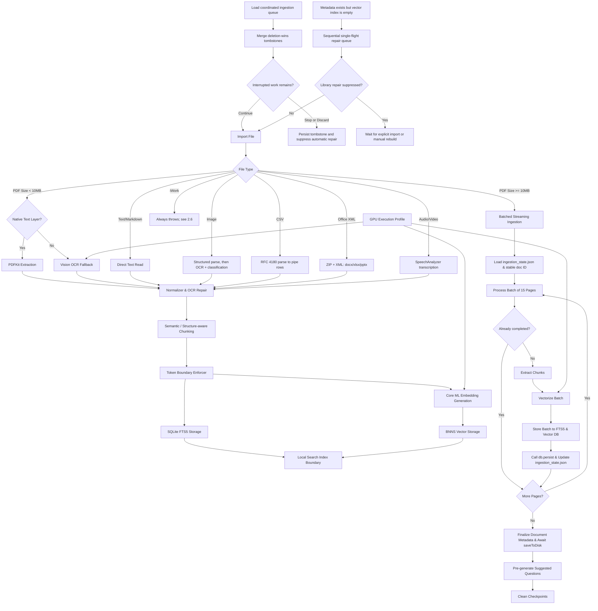

# Ingestion Pipeline — source-verified at v4.6, shipped tree is v4.9

> **Documentation status:** Source-verified on 2026-07-15 against v4.6. **Not re-verified since.** iOS/macOS 4.9 is the shipped version. PCC Dynamic Routing does not change ingestion; indexed content remains local until a later query explicitly selects and consents to a minimized PCC synthesis envelope.
> **Known drift as of 2026-08-05** — in `CHANGELOG.md` under 4.9 but not yet described below: all five workspace metadata writes are now atomic read-modify-writes through `coordinatedMergeData(at:transform:)`, closing the race where an ingestion completing mid-sync-pass left a fully intact document on disk with no metadata row pointing at it. `WorkspaceSyncService` also no longer deletes an index for a library that still has documents.
> **Source of truth:** Codebase audit in `Docs/AUDIT/`, plus `CHANGELOG.md` 4.8–4.9 for ingestion and sync.
> **Scope:** Describes shipped behavior unless explicitly labeled experimental, developer-only, or scaffolded.

This document describes the design and implementation of the import-time document ingestion pipeline, as audited at v4.6.

---

## 1. Overview
The ingestion pipeline converts raw files (PDFs, images, text documents) into searchable text segments with semantic metadata, storing them in parallel lexical and vector indexes. 

---

## 2. Text Extraction Lanes

### PDF Ingestion
- **Standard Lane:** Uses PDFKit to extract the native text layer if available. [StructuredDocumentParser.swift](file:///Users/gunnarhostetler/Documents/GitHub/OpenIntelligence/OpenIntelligence/Services/Document/Processing/StructuredDocumentParser.swift) is used to resolve structures like tables, lists, and headings.
- **OCR Fallback Lane:** If the native text layer is missing or malformed, the pipeline invokes [LayoutAwareExtractor.swift](file:///Users/gunnarhostetler/Documents/GitHub/OpenIntelligence/OpenIntelligence/Services/Document/Processing/LayoutAwareExtractor.swift) to render pages as images and run local Apple Vision OCR, restoring page layout anchors.

### Image Ingestion *(corrected 2026-08-08)*
- Standalone images (png/jpg/jpeg/heic/tiff/gif) run through `StructuredDocumentParser.parsePageImage` first, the same `RecognizeDocumentsRequest` path PDFs use, and its output is prepended to the classification and AI description from `ImageUnderstandingService`. A failure falls back to the previous behaviour, so this adds structure and never removes it.
- **Until 2026-08-08 this path never saw the structured parser.** It used `VNRecognizeTextRequest`, which returns text lines in reading order and cannot express that a value belongs to a row and a column, so the same table gave cell structure inside a PDF and flat lines when photographed. `[evidence_level: code_verified, confidence: exact]`

### Camera Capture *(corrected 2026-08-08)*
- Document captures run `RecognizeDocumentsRequest` and prefer its structured output. Non-document captures skip it, since a photo of a pet or a landscape has no document structure to find. Failure or an empty parse leaves the flat OCR text untouched.
- **This path carried both defects.** `CameraManager.analyzeCapture` sorted its OCR observations into reading order and then joined them with a space, discarding every boundary that sort had just established, and it never reached the structured parser at all. Photographing a spec sheet produced flat text while importing the same page as a PDF produced cell structure. `[evidence_level: code_verified, confidence: exact]`

**API currency, verified 2026-08-08.** `RecognizeDocumentsRequest` is Apple's current document-understanding API, introduced at WWDC25 for iOS 26; it parses tables and groups cells into rows automatically. Nothing supersedes it. `VNRecognizeTextRequest` is retained deliberately as the fallback for images where no document is detected, and its continued presence in these files is correct rather than debt. Sources: [WWDC25 session 272](https://developer.apple.com/videos/play/wwdc2025/272/), [RecognizeDocumentsRequest](https://developer.apple.com/documentation/vision/recognizedocumentsrequest), [Recognizing tables within a document](https://developer.apple.com/documentation/Vision/recognize-tables-within-a-document).

### Text & Markdown Ingestion
- Text files, markdown notes, and source code are ingested directly. Markdown structures (headers, code blocks) are parsed to preserve hierarchical section paths.

---

## 2.5 Failure modes fixed on 2026-08-08

Four defects that produced *silent* degradation, meaning ingestion reported success while the content was already damaged. Recorded because each was invisible to the benchmark and each was found by reading code rather than by a failing test.

| Defect | Effect | Fix |
|---|---|---|
| OCR lines joined with a space, twice | Every ingested image became **one unbroken line**. Line items, dates and amounts concatenated into a single sentence; the chunker saw one paragraph and the embedding averaged the page. | Both joins preserve line breaks. |
| `effectiveContent` chose instead of merging | A low-quality page that captured **one table** kept the table and discarded the recovered prose the parser had already re-OCR'd. A scanned datasheet could ship with four fifths of the page absent from chunks, FTS5 and the vector index. | Keeps structured elements *and* appends recovered text, deduplicated. |
| `usedStructuredParsing` counted tables and lists only | A PDF with figures but **no tables** discarded every structured element, including embedded-image analysis produced at Neural Engine cost moments earlier. | Flag reflects whether structured extraction produced anything. |
| Camera captures never reached the structured parser | Photographing a document gave flat reading-order text while importing the same page as a PDF gave table cells. Same content, opposite quality. | Document captures run `RecognizeDocumentsRequest` and prefer its output. |

**Coverage, corrected 2026-08-09.** All four are now exercised by automated tests in `OpenIntelligenceTests/Services/Document/Processing/`. See §2.6.

The warning this section used to carry is worth keeping in its original terms, because it is the reason §2.6 exists: the evaluation corpus was 25 markdown files against 20 advertised formats, so none of the above was exercised by any automated run. A table-chunking change on 2026-08-08 destroyed 70% of retrieved table text while the benchmark reported an unchanged 16/20; it was caught only by a human noticing character counts in the running app. `[evidence_level: measured, confidence: exact, evidence_source: BenchmarkRuns/20260808-retrieval-stages]`

## 2.5.1 Two further defects, found 2026-08-09 by the fixtures in §2.6

Both were found on the **first execution** of the new fixture set, and neither was reachable by any test that existed before it.

| Defect | Effect | Fix |
|---|---|---|
| Word table text was extracted and then discarded | `extractTextFromWordXML` lifts each `<w:tbl>` out, leaves a bare `[[TABLE_n]]` marker in its place, and re-inserts the table text at that marker afterwards. But the intervening step builds its output **only** from `<w:p>...</w:p>` matches, and in OOXML a `<w:tbl>` is a *sibling* of `<w:p>`, never nested inside one. The marker therefore sat outside every paragraph match, never entered the result, and the re-insertion had nothing to replace. **Every table in every `.docx` was parsed into rows and dropped**, while the surrounding prose came through — so extraction looked like it worked. | Marker is wrapped in a `<w:p>` so it lands in the stream that step reads. Marker numbering also moved from append order to document order in the same change, but that is readability rather than a second defect: tables are replaced back-to-front, so append order labelled the last table 0 *and* stored its text at index 0. The pairing was reversed and self-consistent, and would have resolved correctly once substitution began working. Document order is worth having because the marker number now matches the table's position on the page when this is debugged from a log. |
| A fully scanned PDF reported zero OCR pages | The primary structured path hardcoded `usedOCR: false`. It renders and recognises a page image whether or not the PDF carries a text layer, so "Vision ran" is not the signal — "there was no usable native text" is. A scan that `RecognizeDocumentsRequest` read cleanly reported **0** OCR pages while one that fell through to the rescue path reported 1, which is backwards from what "OCR: N pages scanned" tells the user in Document Details. | `usedOCR` is now `isGarbled \|\| bestAvailableText.isEmpty`. |

`[evidence_level: code_verified+test_verified, confidence: exact, evidence_source: DocumentProcessor.swift extractTextFromWordXML and the structured PageParseResult, IngestionFormatCoverageTests 12/12]`

## 2.6 Format coverage, added 2026-08-09

`StructuredPageContentTests` pins the `effectiveContent` merge with no fixture and no Vision call, so that defect has a deterministic guard independent of OCR behaviour.

`IngestionFormatCoverageTests` drives real files through `processDocument` for a text-layer PDF, an image-only (scanned) PDF, a figures-only PDF, a partially legible scan, a PNG of a table, CSV, `.docx` and `.xlsx`. It asserts on **extraction**, not on answers:

- each table row returns with its label and its value on **one line**;
- a multi-line page does not collapse to one line;
- character yield holds against the characters the fixture draws, with a per-lane floor;
- the lane under test is the lane that actually ran;
- the chunk inventory has not changed shape, including that chunking did not lose what extraction already recovered.

That last group is the point. An answer score cannot see any of it: the 2026-08-08 regression held at 16/20 while destroying 70% of retrieved table text.

**Fixtures are synthesised in Swift at test time rather than committed.** Expectations and bytes derive from one `TableSpec`, so there is no hand-transcribed ground truth to drift; no binary enters an iCloud-synced repository; and the test target's file membership does not change, so hard-boundary `project.pbxproj` stays untouched. `.docx` and `.xlsx` are built by a store-only ZIP writer, which works because the reader in `DocumentProcessor` accepts `compressionMethod == 0`. Reasoning and consequences in `Docs/ai/DECISIONS.md`.

**What this does not cover, stated plainly.** A page rasterised from vector text is cleaner than anything a scanner produces, so these fixtures catch *structural* regressions and **not OCR accuracy loss on noisy input**. That is an acceptable trade because all six defects above were structural, but a real scanned corpus is still worth acquiring and this set does not replace it.

### iWork extraction does not work for any document current iWork produces

Not a regression; it has never worked, and the reason is structural rather than a parsing bug. `extractTextFromIWorkDocument`:

1. inspects **directories only**, so a single-file `.pages` — what Pages on iOS always writes — never reaches a content read at all;
2. for the package form, looks for members with extension `xml` or `txt`, while modern iWork stores content as compressed protobuf in `Index/*.iwa`.

Both paths end at `throw DocumentProcessingError.iWorkExtractionFailed`. That is the acceptable half of the answer: it fails loudly, so nothing is indexed as a silent empty. Two tests pin both shapes so that cannot quietly change. `[evidence_level: code_verified+test_verified, confidence: exact]`

### Audio and video: the failure mode is verified, transcription itself is not

`say` fails from an agent shell (`-241`), so no *speech* fixture can be authored there. A silent WAV was used to check the failure mode instead, and that part is settled: ingesting audio with nothing to transcribe **throws in about 76 ms** rather than yielding an empty document that gets indexed as a success. `[evidence_level: test_verified, confidence: exact, evidence_source: IngestionFormatCoverageTests testSilentAudio, 0.076s]`

One cold-start caveat, recorded because it cost a run. On the **first** attempt of the session `SpeechAnalyzerService` logged `Starting analysis: silence.wav (1s)` and had not returned when that run was terminated for unrelated reasons; the elapsed time was never measured, so "it hung" is an inference and not an observation. Every subsequent attempt threw immediately. The plausible reading is one-time framework or model preparation. The test caps the wait at 60 s and reports a timeout as a distinct outcome so a genuine stall would be visible rather than taking the suite down.

**Still uncovered: whether transcription of real speech works at all.** No automated test exercises `.mp3`, `.wav`, `.mp4`, `.mov` or `.m4a` with actual speech in it. That needs a committed sample or a human with an audio session.

---

## 3. Chunking & Token Gating

### Semantic Chunking
- Raw text is chunked using [SemanticChunker.swift](file:///Users/gunnarhostetler/Documents/GitHub/OpenIntelligence/OpenIntelligence/Services/Document/Chunking/SemanticChunker.swift). It runs adaptive windows (default size $\le 310$ words) with character overlap.

### Structure-Aware Chunking
- When structured tables or lists survive the parsing phase, they are preserved as atomic chunks to prevent layout breakage, ensuring that data cells are not separated from their column headers during retrieval.

### Token Limit Enforcement
- Before indexing, chunks are checked against local tokenizers (e.g. `BertTokenizer`) to guarantee they are within the embedding model's limit ($\le 510$ tokens).

---

## 4. Dual Index Storage

Once chunks are generated and validated, they are written to two separate storage engines:
1. **Lexical Index:** Stored in SQLite FTS5 via [SQLiteFullTextService.swift](file:///Users/gunnarhostetler/Documents/GitHub/OpenIntelligence/OpenIntelligence/Services/Storage/SQLiteFullTextService.swift). BM25 column weights prioritize section titles and entity tags.
2. **Vector Index:** Dense query vectors (384-dimensions) are generated using a local Core ML model (`EmbeddingModel.mlpackage`) and stored in [BNNSVectorDatabase.swift](file:///Users/gunnarhostetler/Documents/GitHub/OpenIntelligence/OpenIntelligence/Services/VectorStore/BNNSVectorDatabase.swift) using Cosine Similarity.
Both indexes are isolated by `container_id` to enforce library boundaries.

---

## 5. Performance Optimizations & Checkpointing

### Zero-Copy CGImage Processing
- To reduce memory allocations and CPU overhead during structure-aware parsing and OCR fallbacks:
- Bypasses raw pixel drawing and PNG serialization passes.
- Converts preprocessed `CIImage` instances directly to raw `CGImage` pointers utilizing `CIContext`.
- Vision's `RecognizeDocumentsRequest` and `RecognizeTextRequest` perform analysis directly on the raw `CGImage` memory block, accelerating extraction by 30%+ and avoiding OOM memory spikes.

### Page-Level JSON Checkpointing & State Persistence
- To prevent data loss and avoid reprocessing from page 1 during large document ingestion:
- Each page's intermediate `PageParseResult` is serialized to a Codable JSON format.
- Ingestion state and progress are tracked in a session-level `ingestion_state.json` file inside the checkpoints folder:
  `localCacheDir()/IngestionCheckpoints/<docFingerprint>/ingestion_state.json`
- This state file persists a stable `documentId` (ensuring chunks are indexed under the same ID on resume), `lastCompletedPage` index, and accumulated counts (chunks, words, chars).
- If the queue is paused or the app restarts mid-ingest:
  1. The engine restores the stable `documentId` and counts from `ingestion_state.json`.
  2. The loop skips rendering, parsing, embedding, and storage tasks for any page batch where `endPage <= lastCompletedPage`.
- After successfully committing each page batch to the FTS5 index and vector DB, `db.persist()` is called to flush vector changes, and `ingestion_state.json` is updated atomically.
- Upon successful document indexing completion or user queue item discard, the temporary checkpoint directory (containing page checkpoints and the state JSON) is deleted.

### Authoritative Queue Dismissal & Automatic Repair
- Stop/X and paused-item discard add a bounded tombstone for each removed queue ID to the coordinated `ingestion_queue.json` state. The field is optional while decoding, so older queue files remain readable.
- `WorkspaceSyncService` merges tombstones before queue items. A matching stale local or shared item is filtered out, and a tombstone-only file is retained so an empty local queue can still defeat a stale iCloud snapshot.
- Empty-vector self-healing requests enter one sequential in-process scheduler. Stop/Discard persists per-library suppression in local preferences and the rebuild checks it before each safe document stage.
- A rebuild that has already removed a document completes the matching re-add before yielding, preventing cancellation from leaving catalog metadata partially deleted. A later explicit import or manual rebuild clears the suppression.
- The tombstone history is capped at 512 newest IDs; a future explicit import receives a new ID and is not blocked by an older dismissal. `[evidence_level: code_verified, confidence: high_pending_runtime_validation, evidence_source: RAGService.swift, WorkspaceSyncService.swift, IngestionQueueOverlay.swift]`

### Streamed Ingestion Append Support
- To support progressive SQLite indexing during batch-based streaming ingestion:
- `SQLiteFullTextService.swift` implements optional `append` parameters on `store`, `storePages`, and `storeChunks` to bypass default UPSERT deletes.
- Document FTS5 text is combined iteratively with existing content, pages are inserted sequentially, and all batch chunks are appended.
- Page index numbers are aligned dynamically using the batch `pageRange` bounds offset to prevent page mapping collisions.

---

## 5b. Token counting, and the invariant that guards it

**The token counter must be asked whether it counts.** `DocumentProcessor.countTokens` returns
`try tokenizer.encode(text:addSpecialTokens:).count`. If the bundled tokenizer carries a `padding`
block, that call returns the **pad width for every input**, so the counter becomes a constant while
still looking like a measurement.

That is not hypothetical. Until 2026-08-17 both `embedding_tokenizer.bundle` and
`reranker_tokenizer.bundle` carried `"padding": {"strategy": {"Fixed": 128}}` alongside
`"truncation": {"max_length": 128}`, and three defects followed from that one block:

1. **55% of all library content never reached the embedder.** Both compiled models declare input
   shape `[1, 512]` and both Swift providers pad to 512 themselves, so the tokenizers were the only
   component capped at 128. Measured with the real WordPiece vocab over 139 live chunks: median
   chunk **273 tokens**, and **125 of 139 (90%)** truncated.
2. **The `safeTokenLimit` guard at 430 could never fire**, because `countTokens` always returned 128.
   The chunker had no working measure of its own output for the entire life of the feature.
3. **Mean pooling averaged `[PAD]` into every vector**, because the provider builds
   `attentionMask = Array(repeating: 1, count: inputIds.count)` over already-padded ids, so the mask
   marks padding as real content.

Deleting the `padding` block fixes all three, because every consumer already pads to its own fixed
width. Truncation is now 512, matching the models.

**Why it survived so long, and what now guards it.** The logs read
`maxTokens=128/430` on **3,910 of 3,910** recorded ingestions. A constant that sits inside a
plausible range looks exactly like a working measurement, and nothing asked whether it should vary.
`DocumentProcessor.verifyTokenizerCounts` now asks at load: it encodes a one-word string and a
180-word string and logs an error if they measure the same. The check is **behavioural rather than
configuration-based**, so it holds however a future tokenizer expresses padding and does not require
parsing `tokenizer.json`. It logs rather than traps, because a wrong token count degrades retrieval
silently but does not corrupt data, and refusing to ingest would be the worse failure.

**Existing libraries do not benefit until re-embedded.** Old vectors remain valid 384-dimensional
MiniLM embeddings of a truncated, padding-diluted input. Nothing detects the change, because
`KnowledgeContainer` persists only `embeddingProviderId` and `embeddingDim` and neither moves. See
the Notion row "Existing libraries keep truncated vectors because nothing detects the embedding
change".

`[evidence_level: measured, confidence: high, evidence_source: real WordPiece tokenization of 139
live chunks; 3910 constant log lines; BenchmarkRuns/tokfix showing 386 to 430 after the fix]`

## 6. Predictive Self-Tuning & Dynamic Config Optimization

To prevent wasteful document rebuild loops (re-extraction and re-embedding), the pipeline implements **Predictive Self-Tuning** and **Non-Destructive Adjustments** to optimize the RAG parameters *before* ingestion starts:

### Predictive Document Pre-Scan
When a document is selected for import and the container's `autoAdaptDimension` flag is enabled:
1. **Sample Extraction**: The system extracts a raw text preview from the first 10 pages of the document (or the first 10,000 characters).
2. **Feature Analysis**: The `LibraryIntelligenceCenter` analyzes the preview for structural, linguistic, and content signals:
   - **Code/Math Content**: Regex and keyword patterns scan for syntax or equations.
   - **Layout Structure**: Measures list patterns, table structures, and multi-column density.
   - **Language Properties**: Classifies vocabulary richness, multilingual complexity, and technical jargon density.
3. **Pre-Ingestion Adaptation**: Based on these signals, the engine resolves the optimal `ChunkingPlan` (e.g. `densePrecision` strategy, `300` word window for structured text/code) *before* processing page 1.
4. **Dynamic Container Tuning**: The container’s active `chunkingDirective` is updated to `.auto` with these parameters. The ingestion pipeline processes the current document and all subsequent imports using this custom-tuned configuration immediately, eliminating the need to re-process the file.

### Non-Destructive Configuration Shifting
- **Chunking Strategy & Window Shifts**: Since chunk size variations do not break vector math, changes to the chunking strategy, window window size, or overlap are applied **instantly and silently** to the container configuration. The database continues to perform cosine similarity searches over existing mixed chunks, avoiding the CPU/battery drain of full database rebuilds.
- **Embedding Provider Shifts**: Changes to the embedding provider or vector dimension (e.g., from 384D Core ML to 512D Contextual) change the mathematical vector space. Mixing dimensions will crash similarity search; therefore, embedding shifts are blocked during active ingestion and require a full database rebuild to guarantee consistency.
