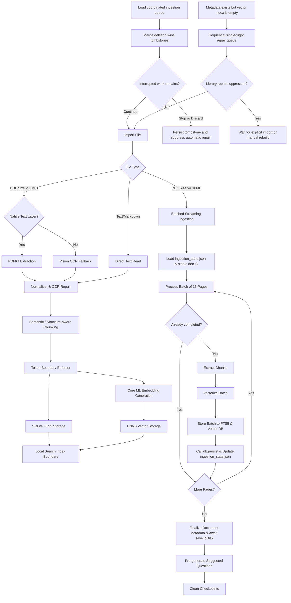

# Ingestion Pipeline — OpenIntelligence v4.6

> **Documentation status:** Source-verified on 2026-07-15. PCC Dynamic Routing does not change ingestion; indexed content remains local until a later query explicitly selects and consents to a minimized PCC synthesis envelope.
> **Source of truth:** Codebase audit in `Docs/AUDIT/`.
> **Scope:** Describes shipped behavior unless explicitly labeled experimental, developer-only, or scaffolded.

This document describes the design and implementation of the import-time document ingestion pipeline in OpenIntelligence v4.5.

---

## 1. Overview
The ingestion pipeline converts raw files (PDFs, images, text documents) into searchable text segments with semantic metadata, storing them in parallel lexical and vector indexes. 

---

## 2. Text Extraction Lanes

### PDF Ingestion
- **Standard Lane:** Uses PDFKit to extract the native text layer if available. [StructuredDocumentParser.swift](file:///Users/gunnarhostetler/Documents/GitHub/OpenIntelligence/OpenIntelligence/Services/Document/Processing/StructuredDocumentParser.swift) is used to resolve structures like tables, lists, and headings.
- **OCR Fallback Lane:** If the native text layer is missing or malformed, the pipeline invokes [LayoutAwareExtractor.swift](file:///Users/gunnarhostetler/Documents/GitHub/OpenIntelligence/OpenIntelligence/Services/Document/Processing/LayoutAwareExtractor.swift) to render pages as images and run local Apple Vision OCR, restoring page layout anchors.

### Text & Markdown Ingestion
- Text files, markdown notes, and source code are ingested directly. Markdown structures (headers, code blocks) are parsed to preserve hierarchical section paths.

---

## 3. Chunking & Token Gating

### Semantic Chunking
- Raw text is chunked using [SemanticChunker.swift](file:///Users/gunnarhostetler/Documents/GitHub/OpenIntelligence/OpenIntelligence/Services/Document/Chunking/SemanticChunker.swift). It runs adaptive windows (default size $\le 310$ words) with character overlap.

### Structure-Aware Chunking
- When structured tables or lists survive the parsing phase, they are preserved as atomic chunks to prevent layout breakage, ensuring that data cells are not separated from their column headers during retrieval.

### Token Limit Enforcement
- Before indexing, chunks are checked against local tokenizers (e.g. `BertTokenizer`) to guarantee they are within the embedding model's limit ($\le 510$ tokens).

---

## 4. Dual Index Storage

Once chunks are generated and validated, they are written to two separate storage engines:
1. **Lexical Index:** Stored in SQLite FTS5 via [SQLiteFullTextService.swift](file:///Users/gunnarhostetler/Documents/GitHub/OpenIntelligence/OpenIntelligence/Services/Storage/SQLiteFullTextService.swift). BM25 column weights prioritize section titles and entity tags.
2. **Vector Index:** Dense query vectors (384-dimensions) are generated using a local Core ML model (`EmbeddingModel.mlpackage`) and stored in [BNNSVectorDatabase.swift](file:///Users/gunnarhostetler/Documents/GitHub/OpenIntelligence/OpenIntelligence/Services/VectorStore/BNNSVectorDatabase.swift) using Cosine Similarity.
Both indexes are isolated by `container_id` to enforce library boundaries.

---

## 5. Performance Optimizations & Checkpointing

### Zero-Copy CGImage Processing
- To reduce memory allocations and CPU overhead during structure-aware parsing and OCR fallbacks:
- Bypasses raw pixel drawing and PNG serialization passes.
- Converts preprocessed `CIImage` instances directly to raw `CGImage` pointers utilizing `CIContext`.
- Vision's `RecognizeDocumentsRequest` and `RecognizeTextRequest` perform analysis directly on the raw `CGImage` memory block, accelerating extraction by 30%+ and avoiding OOM memory spikes.

### Page-Level JSON Checkpointing & State Persistence
- To prevent data loss and avoid reprocessing from page 1 during large document ingestion:
- Each page's intermediate `PageParseResult` is serialized to a Codable JSON format.
- Ingestion state and progress are tracked in a session-level `ingestion_state.json` file inside the checkpoints folder:
  `localCacheDir()/IngestionCheckpoints/<docFingerprint>/ingestion_state.json`
- This state file persists a stable `documentId` (ensuring chunks are indexed under the same ID on resume), `lastCompletedPage` index, and accumulated counts (chunks, words, chars).
- If the queue is paused or the app restarts mid-ingest:
  1. The engine restores the stable `documentId` and counts from `ingestion_state.json`.
  2. The loop skips rendering, parsing, embedding, and storage tasks for any page batch where `endPage <= lastCompletedPage`.
- After successfully committing each page batch to the FTS5 index and vector DB, `db.persist()` is called to flush vector changes, and `ingestion_state.json` is updated atomically.
- Upon successful document indexing completion or user queue item discard, the temporary checkpoint directory (containing page checkpoints and the state JSON) is deleted.

### Authoritative Queue Dismissal & Automatic Repair
- Stop/X and paused-item discard add a bounded tombstone for each removed queue ID to the coordinated `ingestion_queue.json` state. The field is optional while decoding, so older queue files remain readable.
- `WorkspaceSyncService` merges tombstones before queue items. A matching stale local or shared item is filtered out, and a tombstone-only file is retained so an empty local queue can still defeat a stale iCloud snapshot.
- Empty-vector self-healing requests enter one sequential in-process scheduler. Stop/Discard persists per-library suppression in local preferences and the rebuild checks it before each safe document stage.
- A rebuild that has already removed a document completes the matching re-add before yielding, preventing cancellation from leaving catalog metadata partially deleted. A later explicit import or manual rebuild clears the suppression.
- The tombstone history is capped at 512 newest IDs; a future explicit import receives a new ID and is not blocked by an older dismissal. `[evidence_level: code_verified, confidence: high_pending_runtime_validation, evidence_source: RAGService.swift, WorkspaceSyncService.swift, IngestionQueueOverlay.swift]`

### Streamed Ingestion Append Support
- To support progressive SQLite indexing during batch-based streaming ingestion:
- `SQLiteFullTextService.swift` implements optional `append` parameters on `store`, `storePages`, and `storeChunks` to bypass default UPSERT deletes.
- Document FTS5 text is combined iteratively with existing content, pages are inserted sequentially, and all batch chunks are appended.
- Page index numbers are aligned dynamically using the batch `pageRange` bounds offset to prevent page mapping collisions.

---

## 6. Predictive Self-Tuning & Dynamic Config Optimization

To prevent wasteful document rebuild loops (re-extraction and re-embedding), the pipeline implements **Predictive Self-Tuning** and **Non-Destructive Adjustments** to optimize the RAG parameters *before* ingestion starts:

### Predictive Document Pre-Scan
When a document is selected for import and the container's `autoAdaptDimension` flag is enabled:
1. **Sample Extraction**: The system extracts a raw text preview from the first 10 pages of the document (or the first 10,000 characters).
2. **Feature Analysis**: The `LibraryIntelligenceCenter` analyzes the preview for structural, linguistic, and content signals:
   - **Code/Math Content**: Regex and keyword patterns scan for syntax or equations.
   - **Layout Structure**: Measures list patterns, table structures, and multi-column density.
   - **Language Properties**: Classifies vocabulary richness, multilingual complexity, and technical jargon density.
3. **Pre-Ingestion Adaptation**: Based on these signals, the engine resolves the optimal `ChunkingPlan` (e.g. `densePrecision` strategy, `300` word window for structured text/code) *before* processing page 1.
4. **Dynamic Container Tuning**: The container’s active `chunkingDirective` is updated to `.auto` with these parameters. The ingestion pipeline processes the current document and all subsequent imports using this custom-tuned configuration immediately, eliminating the need to re-process the file.

### Non-Destructive Configuration Shifting
- **Chunking Strategy & Window Shifts**: Since chunk size variations do not break vector math, changes to the chunking strategy, window window size, or overlap are applied **instantly and silently** to the container configuration. The database continues to perform cosine similarity searches over existing mixed chunks, avoiding the CPU/battery drain of full database rebuilds.
- **Embedding Provider Shifts**: Changes to the embedding provider or vector dimension (e.g., from 384D Core ML to 512D Contextual) change the mathematical vector space. Mixing dimensions will crash similarity search; therefore, embedding shifts are blocked during active ingestion and require a full database rebuild to guarantee consistency.
