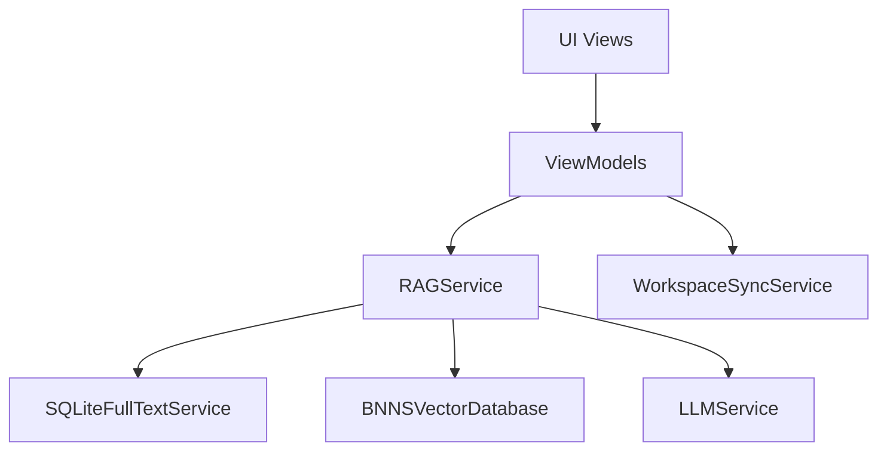
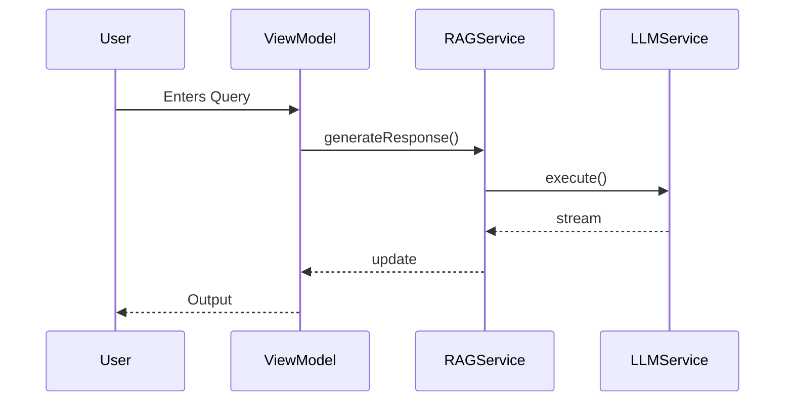
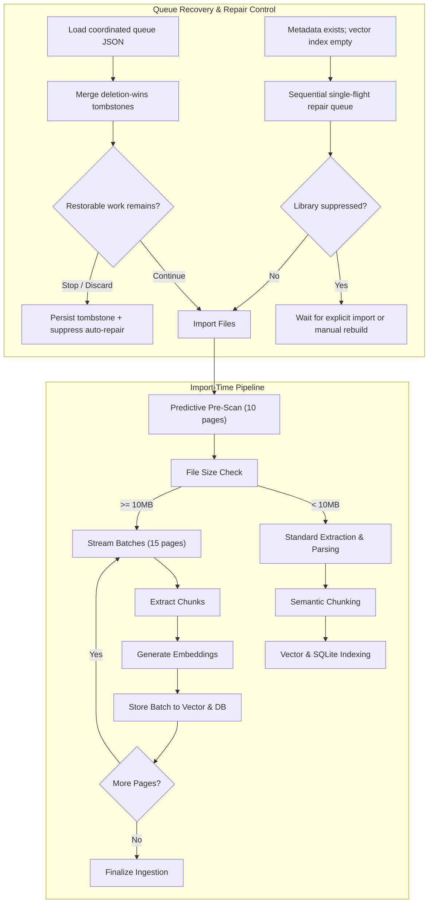
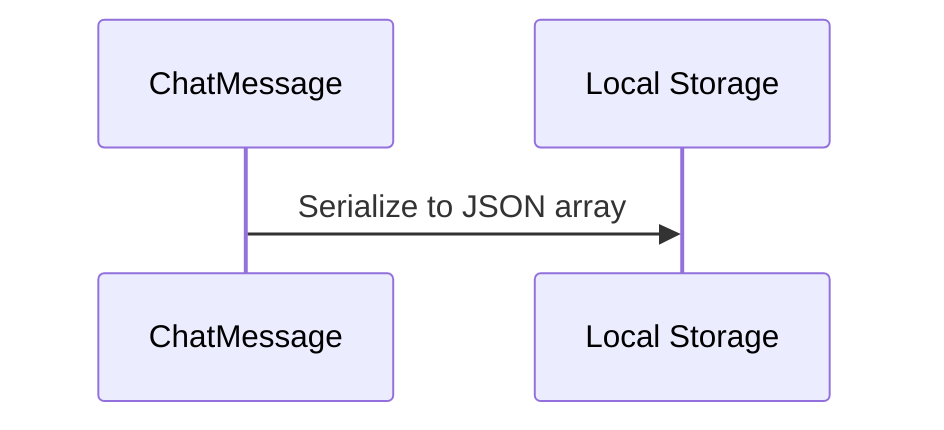
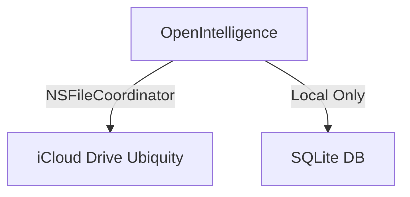
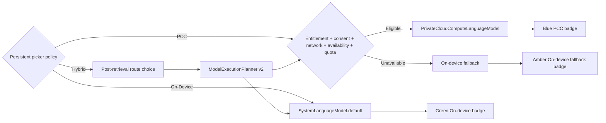
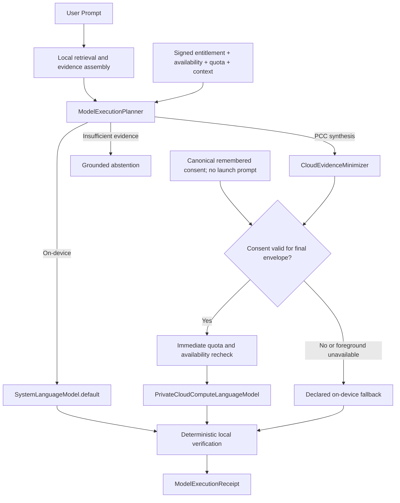
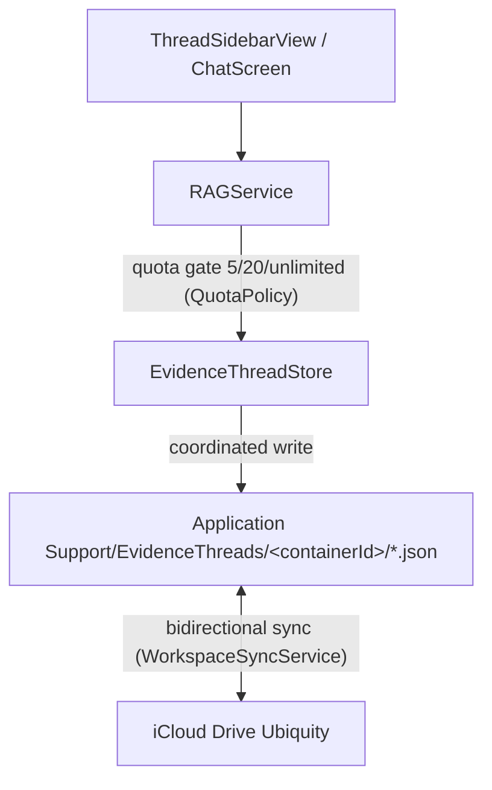

# OpenIntelligence Architecture Atlas

> **Documentation status:** Generated from the July 2026 audit; **not regenerated since**. The shipped version is 4.9. `Docs/CANONICAL_OPENINTELLIGENCE_SOURCE_OF_TRUTH.md` outranks this file where the two disagree (canonical §1).
> **Component count is drifting.** The 270 figure below came from the audit's component definition at generation time. As of 2026-08-05 the tree holds **278 first-party Swift files** (301 including vendored `swift-transformers`). Those are not necessarily the same metric, so treat 270 as the audit's number rather than a current count, and re-run the audit before quoting either figure publicly. `[evidence_level: code_verified_for_the_file_count, confidence: exact_for_files_unverified_for_component_parity]`

## 1. Executive Overview
The OpenIntelligence Architecture Atlas is the canonical representation of the repository's components, execution flows, and system boundaries. It was generated via a strict evidence-based static analysis protocol. The system is composed of 270 Swift components divided into 30 subsystems, with high-risk boundaries located in iCloud sync, StoreKit entitlements, and Private Cloud Compute (PCC) routing.

## 2. Subsystem Map
- **App Intents/Siri/Shortcuts**: 9 components
- **Apple Foundation Models**: 8 components
- **OCR/extraction**: 13 components
- **PCC routing/consent**: 3 components
- **SQLite/FTS storage**: 1 component
- **StoreKit**: 8 components
- **app lifecycle**: 6 components
- **background tasks**: 2 components
- **billing/entitlements**: 4 components
- **chat UI**: 19 components
- **chat persistence**: 3 components
- **citations/source rendering**: 20 components
- **context packing**: 1 component
- **diagnostics/telemetry**: 27 components
- **document import**: 11 components
- **embeddings**: 13 components
- **export/reporting**: 1 component
- **generation**: 7 components
- **iCloud/workspace sync**: 13 components
- **ingestion queue**: 10 components
- **library/container management**: 15 components
- **onboarding**: 5 components
- **reranking/fusion**: 5 components
- **retrieval**: 38 components
- **semantic chunking**: 4 components
- **settings**: 13 components
- **tests**: 6 components
- **vector storage**: 3 components
- **verification gates**: 3 components
- **docs/audits**: 0 components (Markdown/CSV files)

## 3. Component Dependency Map
- **UI Views** depend on **ViewModels**.
- **ViewModels** inject **Services** (e.g., `RAGService`, `WorkspaceSyncService`).
- **Services** interface with **Storage** (`SQLiteFullTextService`, `BNNSVectorDatabase`).
- **Storage** interfaces with **File System** (`Application Support`).

## 4. Service Map
- `RAGService`: Core retrieval-augmented generation orchestrator.
- `WorkspaceSyncService`: Manages iCloud Drive ubiquity sync.
- `SQLiteFullTextService`: Manages shared relational storage.
- `EntitlementStore`: Manages UserDefaults-backed billing logic.
- `LLMService`: Handles prompt compilation and PCC execution.
- `EvidenceThreadDebugService`: Diagnostics-only service to test `EvidenceThreadStore` without touching production pathways.

## 5. View/ViewModel Map
- SwiftUI Views use `@EnvironmentObject` and `@AppStorage` heavily for dependency injection and state sharing.
- `EvidenceThreadDebugView`: Standalone SwiftUI view for Evidence Threads local store diagnostics.
- **User-facing vocabulary is single-sourced in `UI/Components/Glossary.swift`.** 24 terms, each defined in a
  `plain` and a `technical` register, keyed by `GlossaryTermID` with definitions returned from one exhaustive
  `switch`, so lookup is compile-time total and returns no optional. Consumers attach a definition rather than
  restating one: `.definedTerm(_:)` on any view, `GlossaryInfoButton` on list rows, and `GlossaryView` as the
  searchable index. Wired at `OnboardingChecklistView` (pipeline capsules, metric strip, device chips),
  `HowItWorksView` (the four pipeline stages), and `SettingsView` (Hardware Envelope rows, Silicon RAG batch
  pills, the Neural Engine TOPS line, and the `Plain English` entry). The technical register's expansion state
  is one shared `AppStorage` key, so it is a per-user preference rather than per-popover state.
  `GlossaryTests` enforces that a plain definition contains no code identifier, model name, framework name or
  backtick, and pins the two hedges that must not be edited out: TOPS as a per-chip lookup rather than a
  measurement, and Core ML rather than the app deciding whether the Neural Engine runs.
  `[evidence_level: code_verified+test_verified, confidence: exact, evidence_source: Glossary.swift, GlossaryTests.swift]`
- `HowItWorksView` narrates the pipeline in order; `GlossaryView` defines single words out of order. They are
  deliberately not copies of each other, and each stage in the former links to the latter rather than
  restating a definition.
- **Deleting a library goes through one function, `LibraryDeletion.delete` in
  `Features/Documents/Library/LibraryDeletion.swift`.** It removes the container, its documents,
  chunks, vectors, Spotlight entries and entity-index rows, and its iCloud copy where it has one, and
  it **aborts before touching anything local if the iCloud delete fails**, because deleting locally
  while the shared copy survives means the next sync restores the library. `DocumentLibraryView` and
  `ContainerSettingsSheet` both call it; the latter defers its `dismiss()` until the outcome is
  `.deleted` so a refusal has somewhere to report. Two lookalikes are deliberately outside it:
  `deleteConflictedLocalLibraries` handles libraries iCloud has already dropped and ends with a
  `reconfigureIfNeeded` pass, and `OpenIntelligenceEngine.deleteLibrary` calls
  `containerService.deleteContainer` alone, leaving documents behind, because it is `public` and
  synchronous and cannot adopt an async path without breaking the SDK.
  `[evidence_level: code_verified+build_verified, confidence: exact, evidence_source: LibraryDeletion.swift]`
- **File placement under `OpenIntelligence/Services/` is a target decision, not just organisation.**
  The `OpenIntelligenceEngine` framework synchronises eighteen folders, including
  `Services/Infrastructure/Integration`, and excludes `Services/Infrastructure/Presentation` and all
  of `Features/`. A new file in an included folder is compiled into the SDK as well, so one that
  references a `Presentation` or `Features` type builds fine in the app and fails **only** the test
  build, with a scope error indistinguishable from stale DerivedData. `LibraryDeletion.swift` lives
  under `Features/` for this reason. `[evidence_level: code_verified, confidence: exact, evidence_source: project.pbxproj fileSystemSynchronizedGroups per target]`

## 6. Model/Persistence Map
- `ChatMessage`: JSON serialized and stored locally.
- `EvidenceThread` (active): Isolated JSON files per thread.

## 7. Major User Flows
1. App Launch & Container Restore
2. Library Container Context Switching
3. Document Import & Vector Extraction Pipeline
4. End-to-End RAG Query & Inference Pipeline
5. Maximum Mode & PCC Route Policy Evaluation
6. iCloud Workspace Sync & Entitlements
7. StoreKit Purchasing & Quota Resolution
8. App Intent Siri Shortcuts integration
9. Telemetry Trace Generation

## 8. Background/System Flows
- `BGTaskScheduler` used for indexing sweeps.
- `NSMetadataQuery` background updates for iCloud Drive.
- The floating iOS Silicon HUD owns a dedicated `UIWindow` and derives all frame bounds from that window's non-optional `UIWindowScene.screen`; it does not use the deprecated process-global `UIScreen.main`. `[evidence_level: build_verified+code_verified, confidence: exact_for_build, evidence_source: MotherboardHUDView.swift and generic iOS 27 simulator build 2026-07-16]`

## 9. Sync Boundaries
- **iCloud Drive (Ubiquity)**: Used for sync via `WorkspaceSyncService.swift`. `[evidence: code_verified, exact, WorkspaceSyncService.swift]`
- **NO CloudKit**: No explicit CloudKit database APIs are in use. `[evidence: code_verified, exact, WorkspaceSyncService.swift]`
- **NO SQLite Sync**: The `SQLiteFullTextService.swift` is completely local-only. `[evidence: code_verified, exact, SQLiteFullTextService.swift]`
- **Ingestion Checkpoints**: Saved under `localCacheDir()/IngestionCheckpoints/` to guarantee they are strictly local-only and excluded from iCloud syncing paths. `[evidence: code_verified, exact, DocumentProcessor.swift]`
- **Benchmark runs stand down from queue merging**: `mergeIngestionQueueIfNeeded` returns early while
  `OpenIntelligenceRuntimePaths.areOverridesPinned` is set. `localRoot` there resolves through
  `applicationSupportRoot()`, which does not consult the storage override, so every benchmark run
  merged its fixture documents into the owner's real ingestion queue; the symptom was a "Resume
  interrupted upload?" prompt listing fixture files on every launch, which survived being discarded
  because the next run rewrote it. Fixed at the caller rather than in `applicationSupportRoot()` on
  purpose: that function is also resolved by four `coordinated*` iCloud primitives and by
  `BNNSVectorDatabase`, so making it honour the override would silently redirect live iCloud sync
  into a temporary directory. The pin is only ever engaged by `DebugRAGValidationHarness`, so this
  cannot fire in a shipping app. `[evidence: code_verified, exact, WorkspaceSyncService.swift
  mergeIngestionQueueIfNeeded, OpenIntelligenceRuntimePaths.areOverridesPinned]`
- **BNNS Vector Store**: Persisted vector database files (`_meta.json`, `_vectors.bin`, `_norms.bin`) are stored locally. Loading new or empty databases is gated to skip memory-mapping operations on 0-byte vectors files, resolving startup POSIX/Cocoa Code 260 errors. `[evidence: code_verified, exact, BNNSVectorDatabase.swift]`

## 10. Routing/PCC Boundaries
- **Public Model Targets**: On-device execution uses `SystemLanguageModel.default`. Native PCC uses `PrivateCloudComputeLanguageModel` on iOS/macOS 27+ only. The app makes no 3B, 20B, Advanced, or server parameter-count claim because the public SDK does not expose those identities. iOS/macOS 26 stays local; it is never labeled simulated PCC. `[evidence_level: compile_verified+code_verified, confidence: exact, evidence_source: FoundationModelSessionFactory.swift, LLMModel.swift]`
- **Post-Retrieval Plan**: Local retrieval produces `PostRetrievalEvidence`; `ModelExecutionPlanner` combines it with user/privacy/network/foreground constraints, exact-or-labeled-fallback token budgets, signed entitlement, live PCC availability, and quota. Only the synthesis stage may target PCC; verification stays deterministic/local. `[evidence_level: code_verified, confidence: high, evidence_source: ModelExecutionPlanner.swift, RAGService.swift]`
- **Picker Policy vs. Actual Route**: `SettingsStore.fmPreference` persists the user policy independently of runtime notifications. Chat captures Hybrid as post-retrieval choice, On-Device as `onDeviceOnly`, and PCC as `cloudOnly`; the picker label always renders that policy. `ModelExecutionReceipt.completedTarget` drives a separate per-answer route badge, including planner-time and runtime PCC-to-local fallback. `[evidence_level: build_verified+code_verified, confidence: high_pending_ui_runtime_validation, evidence_source: ChatScreen.swift, ModelStatusIndicator.swift, ModelExecutionPlan.swift, LLMService.swift, MessageBubbleV2.swift and generic iOS 27 simulator build 2026-07-16]`
- **Entitlement and Quota**: `EntitlementChecker` uses native macOS `SecTask` declarations, parses the embedded signed provisioning profile for iOS/Catalyst development and ad-hoc builds, and permits only the approved PCC key to proceed to Apple's documented availability/quota checks when a distribution build omits that profile. `LiveFoundationModelCapabilityProvider` snapshots quota/context state, maps unknown future quota cases to fail-closed `.unknown`, and `FoundationModelSessionFactory` rechecks availability and quota immediately before construction. Source enablement and generic arm64 iPhoneOS compilation are complete; signed installation/distribution verification is pending. `[evidence_level: build_verified+sdk_verified+user_confirmed, confidence: high_for_source_unverified_for_distribution, evidence_source: EngineSDKCompatibility.swift, FoundationModelCapabilityProvider.swift, FoundationModelSessionFactory.swift, OpenIntelligence.entitlements]`
- **Quota fail-closed, and where it was not**: `PCCQuotaState.authorizesCloudExecution` is the single rule deciding whether a quota state permits a cloud attempt; `.belowLimit` and `.approachingLimit` do, `.limitReached`, `.unsupported` and `.unknown` do not. Both `canUsePCC` and `ModelExecutionReceipt.nonAuthorizingQuotaStates` derive from it. Before 2026-08-11 they were two hardcoded copies and had diverged: the planner tested only `!= .limitReached`, so `.unknown` authorized an attempt the route gate scores as `unauthorizedCloudAttempts`. Reachable in production because `FoundationModelCapabilityProvider` maps `pcc.quotaUsage.status` through an `@unknown default`. `[evidence_level: code_verified+test_verified, confidence: exact, evidence_source: ModelExecutionPlan.swift, RouteEvalMetrics.swift, PCCQuotaAuthorizationTests.swift]`
- **Foreground gate covers macOS**: `ModelExecutionPlanner` permits cloud only when `isForegroundInteractive || consentGranted`. That input was computed under `#if canImport(UIKit)` with the `#else` branch hardcoding `true`, so the Mac had no foreground check and a backgrounded Shortcut could reach PCC unattended. macOS now reads `NSApplication.shared.isActive`; a platform with neither UIKit nor AppKit falls closed. `[evidence_level: code_verified+build_verified, confidence: exact, evidence_source: RAGService.swift, ModelExecutionPlanner.swift]`
- **PCC Fallback UI & Subsystem Diagnostics**: A dedicated iCloud execution consent fallback panel is integrated in `ContainerSettingsSheet+Sections.swift` using `self.settings` scope visibility. An AI Subsystem Diagnostics card in the library settings displays real-time readiness status of the sentence embedding model, acceleration targets, Rust-backed tokenizer parser, vocabulary metrics, and exact citation byte offsets. `[evidence: code_verified, exact, ContainerSettingsSheet+Sections.swift]`
- **Consent and Fallback**: Consent is requested only after the minimized envelope is final. Background/App Intent execution with no remembered consent selects the declared local fallback for Hybrid and explicit PCC policy, never waits for UI. Fallback occurs only before meaningful streaming; `ModelExecutionReceipt` persists intended/attempted/actual/fallback/completed targets. `[evidence_level: code_verified, confidence: high, evidence_source: RAGService.swift, AgenticOrchestrator.swift, ModelExecutionReceipt.swift]`
- **Consent Persistence**: `cloudConsent.applePCC` is the canonical remembered decision and wins over stale `pcc.setting` compatibility state. Startup loads/migrates consent but never creates a consent record or opens the sheet; only a finalized post-retrieval transmission record can populate `pendingCloudConsent`. `[evidence_level: code_verified+test_verified, confidence: high_pending_physical_device_validation, evidence_source: SettingsStore.swift, RAGService.swift, PCCConsentPreferenceMigrationTests.swift]`
- **GPU Execution Policy**: `GPUExecutionProfile` migrates the old numeric preference into four discrete profiles. `DeviceCapabilityService` is the shared policy source for Core ML preferences, PDF rendering, large Metal vector/MMR gates, and background GPU eligibility. The UI reports policy rather than claiming exact utilization. `[evidence_level: code_verified+test_verified, confidence: high_pending_device_thermal_validation, evidence_source: DeviceCapabilityService.swift, SettingsView.swift, RAGEngine.swift, BNNSVectorDatabase.swift]`

## 11. Billing/Entitlement Boundaries
- **UserDefaults**: `EntitlementStore.swift` relies on UserDefaults for limits. `[evidence: code_verified, exact, EntitlementStore.swift]`
- **Keychain**: Strictly used for API keys, not entitlements. `[evidence: code_verified, exact]`

## 12. App Intents Boundaries
- **Limit Reached**: 9 out of 10 available shortcut slots are consumed.
- App Intents bypass normal UI and directly hit `RAGService`.

## 13. Documentation Cross-Reference
All documentation cross-references have been moved to `DOCUMENTATION_CONSISTENCY_AUDIT.md`.

## 14. High-Risk Modification Zones
1. **PCC routing/consent**
2. **Apple Foundation Models**
3. **iCloud/workspace sync**
4. **StoreKit / Billing**
5. **App Intents/Siri/Shortcuts**

## 15. Evidence Threads Implication Section
- **Design B**: Relocated from `LocalCache` to `Application Support/EvidenceThreads/<containerId>/` to support iCloud Drive synchronization. `[evidence: code_verified, exact, EvidenceThreadStore.swift]`
- **Integration**: Complete. Persistent history is integrated into `RAGService.swift` and presented through `ThreadSidebarView.swift` inside `ChatScreen.swift`.
- **Constraint**: Synchronization is performed bidirectionally on changes via `WorkspaceSyncService.swift` using coordinated file writes. `[evidence: code_verified, exact, WorkspaceSyncService.swift]`
- **Quota Gating**: Thread creation is gated by monetization tier quotas (5 for Free, 20 for Pro, unlimited for Lifetime) via `QuotaPolicy.swift`. `[evidence: code_verified, exact, QuotaPolicy.swift]`
- **App Intents**: Registered `ListEvidenceThreadsIntent` and `CreateNewEvidenceThreadIntent` App Intents for Siri/Shortcuts, utilizing `ThreadListSnippetView` snippets. Resolved in-process on the presented `RAGService.activePresentedInstance` to reload and populate presented UI screens instantly, accepting optional `OILibraryEntity` parameter inputs. `[evidence: code_verified, exact, RAGAppIntents.swift]`

## 16. Mermaid Diagrams

### High-level Module Graph

### Query Answering Flow

### Document Ingestion Flow

Queue tombstones are part of the existing iCloud Drive-coordinated `ingestion_queue.json` record. A tombstone removes the matching item before duplicate reconciliation, including when the queue otherwise has no active items. Automatic empty-vector repairs are globally serialized in-process and check persistent per-library device-local suppression before each document-safe stage; explicit user imports and manual rebuilds clear that local suppression. `[evidence_level: build_verified, confidence: high_pending_runtime_validation, evidence_source: WorkspaceSyncService.swift, RAGService.swift, IngestionQueueOverlay.swift]`

### Chat Persistence Flow

### Sync Boundary Diagram

### PCC Routing Diagram

`[evidence_level: code_verified, confidence: high_pending_physical_device_validation, evidence_source: ModelExecutionPlanner.swift, LLMService.swift, ModelStatusIndicator.swift, MessageBubbleV2.swift]`

### Evidence Threads Placement Diagram (Implemented — Design B)

Historical note: earlier planning artifacts proposed `LocalCache/EvidenceThreads/` with no sync (Phase 1A local-only design). Phase 1B relocated threads to `Application Support/EvidenceThreads/<containerId>/` with bidirectional iCloud Drive sync. `[evidence: code_verified, exact, Docs/AuditArtifacts/Implementation/phase_1b_1c_1d_post_implementation_verification.md, WorkspaceSyncService.swift]`

## 17. Core AI Embedding Subsystem Boundary

**The tokenizer is part of this boundary, and it disagreed with the model for the life of the
feature.** Both compiled models declare input shape `[1, 512]` (`scripts/compile_core_ai_model.py`
exports `torch.ones((1, 512))`), and both Swift providers pad to `maxSequenceLength` 512 themselves.
Until 2026-08-17 the bundled `tokenizer.json` files capped `truncation.max_length` at 128 and also
carried `"padding": {"strategy": {"Fixed": 128}}`.

Three consequences, all from the padding block:

- **55% of library content never reached the embedder.** Median chunk measures 273 tokens against a
  128 cap; 125 of 139 live chunks were truncated.
- **`DocumentProcessor.countTokens` returned a constant**, since it reads `encode().count` and a
  padded encode is always the pad width. Logged `maxTokens=128/430` on 3,910 of 3,910 ingestions.
- **Mean pooling averaged `[PAD]` into every vector**, because the provider builds its attention mask
  over already-padded ids.

**The boundary rule this establishes:** three artifacts must agree, and only one of them is Swift.
The model's declared input shape, the provider's `maxSequenceLength`, and the tokenizer's
`truncation`/`padding` are a single contract. Changing any one without the others is silent. Read the
artifact rather than the code that consumes it: the shape lives in the `.mlpackage` protobuf, the
tokenizer limits in `tokenizer.json`, and neither is visible from Swift.

`DocumentProcessor.verifyTokenizerCounts` now guards the counting half at load. Nothing yet guards
the shape half; a startup comparison of `MLModel.modelDescription` input shape against the
tokenizer's limit would close it.

**Dimensionality is unaffected by any of the above.** Vectors remain 384-wide and
`BNNSVectorDatabase`'s fixed-stride format is untouched. Sequence length and embedding dimension are
independent, and conflating them would turn a re-embed into a format migration.

- **Core AI Integration**: Silicon-native zero-copy sentence embeddings are generated via `CoreAISentenceEmbeddingProvider.swift` using dynamic `NDArray` and `InferenceFunction.run(inputs:)` graph execution on iOS 27 / macOS 27+ Apple Intelligence SDK. Access and selector selection availability are stabilized via shared instance caching and an awaitable readiness gate in `ContainerSettingsSheet`. The exported PyTorch graph output is explicitly bound to "embeddings" in `compile_core_ai_model.py` and correctly parsed from the MLFeatureProvider dictionary in Swift. `[evidence: code_verified, exact, CoreAISentenceEmbeddingProvider.swift, compile_core_ai_model.py]`
- **The two providers are not interchangeable, and the difference is invisible from settings.**
  Core AI runs `main.mlirb`, which takes `input_ids` only and returns `last_hidden_state[:, 0, :]`,
  the CLS position. Core ML runs the `.mlpackage`, which takes `attention_mask` and is mean-pooled
  in Swift. `all-MiniLM-L6-v2` is trained for mean pooling, so the two paths produce genuinely
  different vectors from identical weights, and every retrieval figure measured before 2026-08-17
  came from the CLS path without anyone knowing which had run. A benchmark-only override in
  `EmbeddingService.forProvider`, keyed on the `benchmarkEmbeddingProvider` user default and set
  only by `DebugRAGValidationHarness` from a launch argument, makes the two comparable in one run;
  it is absent in a shipping app. Paired over 21 comparable cases the swap moved `vector r@1` from
  0.000 to 0.571, 12 better and 0 worse, exact two-sided sign test p = 0.0005.
  `[evidence: measured+code_verified, exact, BenchmarkRuns/coreml-provider vs tokfix via
  scripts/compare_benchmark_runs.py; EmbeddingService.swift forProvider]`
- **Resource Packaging**: The compiled model is bundled as `EmbeddingModel.bundle` (a raw folder structure bypassing Xcode's build-time `mlassetc` version-gate checks that otherwise block minimum deployment targets below 27.0) and dynamically loaded at runtime. `[evidence: code_verified, exact, Package.swift, CoreAISentenceEmbeddingProvider.swift]`
- **Adaptive Auto-Tuning**: `SettingsStore` and `RAGService` automatically recommend and switch to the Core AI provider on supported hardware, falling back dynamically to `CoreMLSentenceEmbeddingProvider` on older targets. Ingestion mode scoping is strictly enforced per-document in `RAGService.addDocument()` to bypass global configuration conflicts. `[evidence: code_verified, exact, SettingsStore.swift, RAGService.swift]`

### DocumentProcessor & RAGService Streaming
In v4.5, `RAGService.importDocument` was refactored to support batched extraction via `importLargePDFStreamed`. `DocumentProcessor` accepts a `pageRange` and processes chunks dynamically, bypassing memory limits for large PDF extraction and Vector DB Upserting. Fixed FTS5 index truncation and page offset mapping errors during streaming batch ingestion, ensuring fully searchable large documents. 
In v4.5.1, resolved concurrency race conditions and deadlocks on Apple Silicon by introducing thread-safe `NSRecursiveLock` serialization around CGImage rendering in `LayoutAwareExtractor`, `StructuredDocumentParser`, and `PageComplexityAnalyzer`.

## 18. RepoOS Agent-Workflow Boundary
- **Workspace skill:** `.codex/skills/route-openintelligence-work/SKILL.md` defines the mandatory Codex workflow for this repository and points to current canonical artifacts rather than embedding a second architecture copy. `[evidence: code_verified, exact, .codex/skills/route-openintelligence-work/SKILL.md]`
- **Deterministic routing:** `repoos_router.py` scores task wording and changed paths against `Docs/AuditArtifacts/RepoOS/change_impact_matrix.csv`, reports the selected route, hard boundaries, required evidence, tests, documentation, implementation gate, Notion relevance, and artifact-derived active release, and stops on an unmapped task. Durable implementations receive an effective documentation union that includes `CHANGELOG.md` `[Unreleased]`, the active-version section in `Docs/RELEASE_NOTES.md`, and the full rule 14 set. `[evidence: code_verified, exact, .codex/skills/route-openintelligence-work/scripts/repoos_router.py]`
- **Runtime isolation:** The RepoOS skill, scripts, and agent rules are developer-workspace tooling; they do not compile into or execute inside the OpenIntelligence Apple application. `[evidence: code_verified, exact, change_impact_matrix.csv repoos_workspace_automation allowed and forbidden paths]`

## 19. Retrieval Measurement Boundary

The subsystem that measures retrieval, kept separate here because it is the only part of the project whose output is evidence rather than behaviour, and because it was absent from this Atlas until 2026-08-13.

- **Capture:** `RetrievalTraceCollector` records the rank-ordered output of each pipeline stage (`vector`, `lexical`, `fusion`, `boosted`, `candidates`, `rerank`, `final`). It deliberately does not deduplicate, because deduplicating would hide the ordering defects that ranking metrics exist to detect. `[evidence: code_verified, exact, RetrievalTraceCollector.swift]`
- **Scoring:** `RetrievalStageEvaluator.score` is the single metric implementation. Recall, MRR and nDCG use a credited relevance vector in which each ground-truth document earns credit once, at its first matching chunk; precision uses the raw per-chunk vector. Using one vector for both is the defect that let nDCG@5 report 2.131 on a metric defined over [0, 1]. `[evidence: code_verified, exact, RetrievalStageMetrics.swift:222, :269]`
- **Transport:** `DebugRAGValidationHarness.stageMetricsLines` emits `STAGE METRICS` (the Swift-computed scores) and `STAGE SOURCES` (the ranked identities they were computed from), plus `ExpectedSources` and the resolved `ExpectedSourceIds`. `run_quality_matrix.py` transports the metrics rather than recomputing them, so exactly one metric implementation exists in the project. `[evidence: code_verified, exact, DebugRAGValidationHarness.swift, run_quality_matrix.py parse_stage_metrics]`
- **Identity is the load-bearing part.** `STAGE SOURCES` carries `<chunkId>#<documentId>#<name>`. Chunk identity is required because `RAGEngine.reciprocalRankFusion` keys on `chunk.id`; document identity is required because relevance is judged per document. Emitting only the display name left the five pre-rerank stages recording `(unnamed)`, since `sourceDocument` is attached by `RAGService` after hybrid search returns, which made those stages unverifiable by hand while the metrics computed from them stayed correct. `[evidence: code_verified, exact, DebugRAGValidationHarness.swift stageMetricsLines; RAGEngine.swift:920]`
- **Offline replay:** `scripts/sweep_fusion_weight.py` reconstructs weighted RRF from the two arms' recorded rank orders for any weight, so a fusion-weight question costs seconds rather than a 4.7-hour pipeline execution. It calibrates against the app's own recorded `fusion` stage before emitting anything and refuses to print a curve it cannot verify. `[evidence: code_verified, exact, sweep_fusion_weight.py; self-test run 2026-08-13]`
- **Boundary:** this subsystem is developer tooling on the measurement side, but `RetrievalTraceCollector` and `RetrievalStageMetrics` compile into the app. `RAGEvalRunner` has zero call sites repo-wide, so the in-app half of evaluation cannot currently be invoked; every measurement goes through `run_quality_matrix.py` driving `DebugRAGValidationHarness`. `[evidence: code_verified, exact, repo-wide grep for RAGEvalRunner]`

## 20. Agentic Execution Boundary, as built

Recorded 2026-08-14. The three quality modes are a deliberate compute ladder and the boundary
between them is by design; what this section records is what happens *inside* the two modes that are
supposed to be agentic.

- **Standard is single-shot on purpose, and that is correct.** One retrieval, chunks packed into a
  character budget, one generation, `Agentic: NO`. It is the fast, cheap tier and it is not supposed
  to reach for tools or re-retrieve. Do not read the items below as an argument for making it
  agentic. `[evidence: code_verified, exact, device trace 2026-08-14 message D74F98E4; RAGService useAgentic gate]`
- **Deep Think and Maximum are where the agentic loop is supposed to fire.** The rest of this section
  is about those two modes only.
- **The reasoning chain inside them is not agentic.** `executeReasoningChain` builds every session's
  context **upfront**, in a loop that completes before session 1 runs, as fixed windows over a single
  retrieval. Those windows were 50% overlapping until 2026-08-14 and are disjoint now: at a 3500
  character session budget the overlap spent roughly four of eight sessions re-reading.
  **Partially corrected 2026-08-14:** the chain now opens with a routing turn
  (`routeChunksByTitle`) that shows the model the section titles of everything retrieval found and
  lets it choose what to read. A title costs ~50 characters against several hundred for body text,
  so twenty titles fit in one window where three chunks do not. The model therefore chooses the
  reading order, which cosine similarity previously chose on its behalf before anything was read.
  It reorders and never drops, so a wrong choice costs ordering rather than evidence. It is still
  one retrieval and still no tools mid-session, so this is narrower than agency: the model picks
  from what it was given rather than asking for more. `disableToolsForSession = true` is hardcoded, so the model has no tools in any
  session and cannot request anything. The registered exact-match tools (`count_pattern`,
  `search_exact_pattern`) are therefore unreachable from a reasoning session.
  `[evidence: code_verified, exact, AgenticOrchestrator.swift:4195 and the sessionContexts loop preceding it]`
- **The one genuine loop is a fallback, now gated on measurement rather than prose.**
  `executeRecursiveResearch` implements the real thing: it asks the model to decide, parses
  `.answer` or `.search(query)`, and re-retrieves on demand. It still has exactly one call site,
  reached only in an agentic mode and only after the chain has finished.
  **Changed 2026-08-14:** that call was gated solely on
  `answerIndicatesRetrievalMiss(chainResult.finalAnswer)`, a string heuristic scanning the answer
  for hedging. It fails in both directions: a confidently wrong answer contains no hedging so the
  loop never ran, and a grounded synthesis that correctly notes a gap does, which is how a 91%
  confidence answer came to be discarded in favour of a raw evidence dump. Meanwhile `FactBank` had
  already decomposed the query into sub-questions, tracked which the evidence answered, and compared
  that to the coverage target the chain uses for its own early stop. All of it was computed and
  discarded. `ReasoningChainResult` now carries `evidenceCoverage`, `evidenceCoverageTarget` and
  `unansweredQuestions`, and the gate fires when the chain finished below its own target. The prose
  heuristic is retained as an additional trigger, because it catches a case coverage cannot see:
  retrieval that confidently returned the wrong subject, where every sub-question reads as answered.
  Research is now aimed at the unanswered sub-questions rather than re-running the original query.
  `[evidence: code_verified, exact, AgenticOrchestrator.swift ReasoningChainResult and the recursive-research gate; FactBank.subQuestionConfidence]`

- **Synthesis truncation was removing the highest-ranked chunk, and it is now budgeted rather than
  cut.** `executeDirectSynthesis` and `executeSynthesisStep` each ended in a hardcoded
  `prefix(3000)`. Because `executeFullRetrievalPipeline` closes with a Lost-in-the-Middle reorder
  that places rank 0 at the array midpoint, and `executeSearchStepWithChunks` renders only
  `chunks.prefix(10)`, a large retrieval reached synthesis with its best evidence already gone.
  Both sites now pack against a budget derived from `FoundationModelTokenBudget` and the actual
  prompt, fill in score order, and log chunks and tokens dropped. `executeSynthesisStep` also
  carried a second cut, `prefix(150)` per reasoning step applied before the overall budget was
  consulted; the per-step allocation is now derived from the budget and trimmed at a sentence
  boundary. Parent document expansion in `RAGService` step 7.5 is gated on the same budget, so it
  can no longer inflate a result set immediately before a stage that cannot hold it. Full detail
  in `Docs/RETRIEVAL_PIPELINE.md` item 18.
  `[evidence: code_verified, exact, AgenticOrchestrator.assembleBudgetedEvidence, executeDirectSynthesis,
  executeSynthesisStep; RAGService.swift step 7.5. Build-verified and suite-verified on 2026-08-17;
  this path has no test coverage and the behavioural claim is not device-verified.]`

**The gap, stated precisely.** In Deep Think and Maximum, the modes that exist specifically to buy
more compute, the extra compute is spent re-reading fixed slices of one retrieval rather than acting
on it. Eight sessions with no tools over precomputed windows is more inference, not more agency. The
loop that would make it agency is reachable only after those sessions finish and only if a regex
over the final answer decides they failed.

**A separate concern, not to be confused with the above.** Standard's context packing has its own
defects, and they are packing defects rather than agency defects: the budget drops chunks past its
limit, "Needle Rescue" scavenges sentences from the dropped ones into leftover space, and rescue
labels its sources `[S1...]` over its own array while the packed chunks already use `[S1...]` over
theirs. A device trace on 2026-08-14 shows an answer citing `[S5]` and `[S6]` against four attached
chunks. Fixing that does not require making Standard agentic and should not be bundled with it.
`Docs/RETRIEVAL_PIPELINE.md` item 13 records the related finding that sentence selection runs
downstream of every stage the benchmark measures.

**Not a recommendation.** Promoting the loop out of its fallback position, or giving reasoning
sessions tools, is an architecture change in the highest-risk file in the repository, on a path with
no test coverage. This section exists so that decision is made against what the code does.
