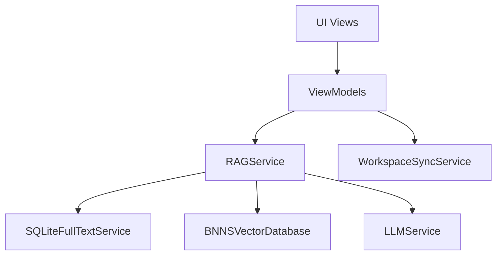
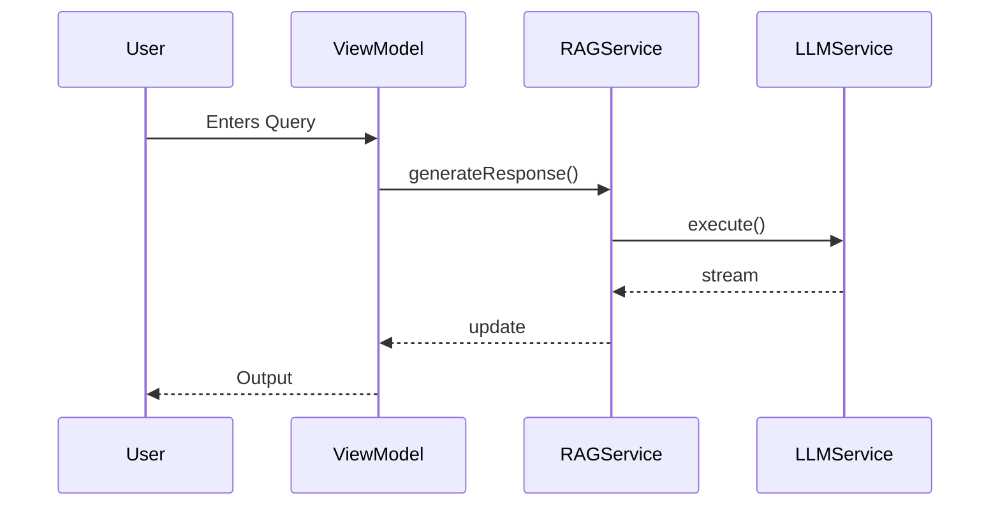
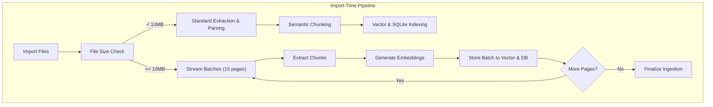
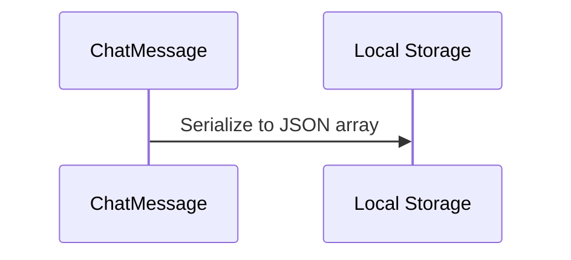
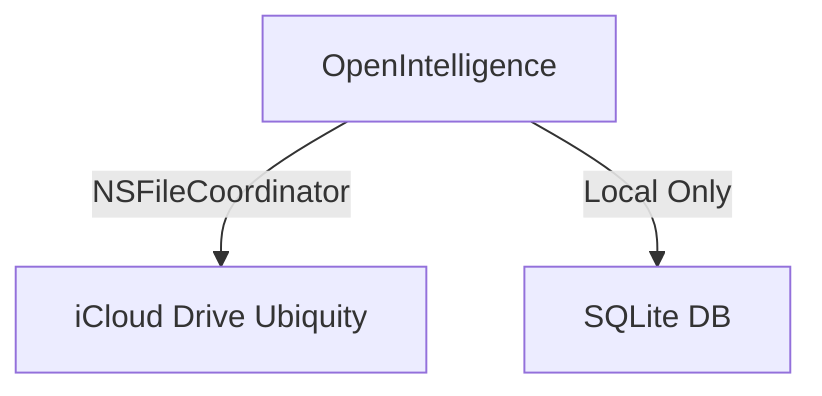
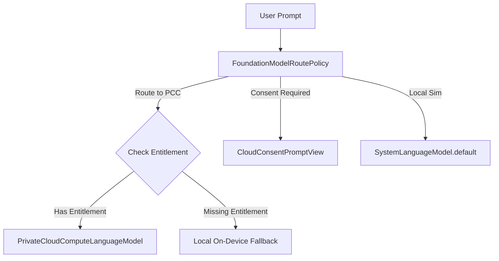
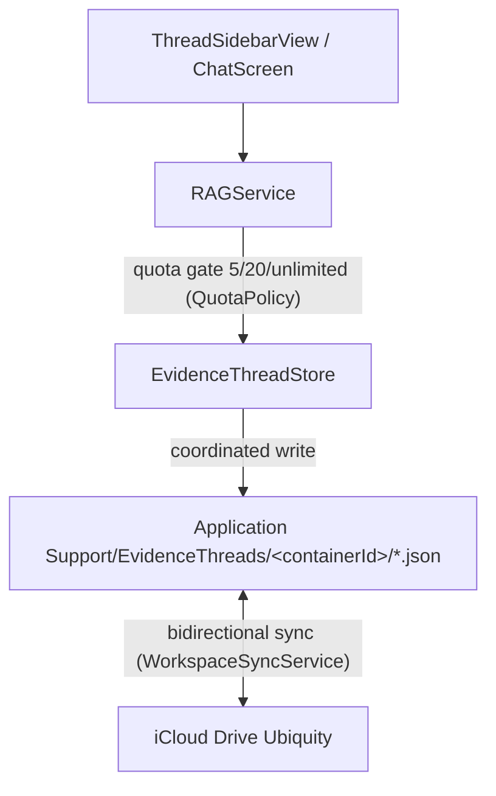

# OpenIntelligence Architecture Atlas

## 1. Executive Overview
The OpenIntelligence Architecture Atlas is the canonical representation of the repository's components, execution flows, and system boundaries. It was generated via a strict evidence-based static analysis protocol. The system is composed of 270 Swift components divided into 30 subsystems, with high-risk boundaries located in iCloud sync, StoreKit entitlements, and Private Cloud Compute (PCC) routing.

## 2. Subsystem Map
- **App Intents/Siri/Shortcuts**: 9 components
- **Apple Foundation Models**: 8 components
- **OCR/extraction**: 13 components
- **PCC routing/consent**: 3 components
- **SQLite/FTS storage**: 1 component
- **StoreKit**: 8 components
- **app lifecycle**: 6 components
- **background tasks**: 2 components
- **billing/entitlements**: 4 components
- **chat UI**: 19 components
- **chat persistence**: 3 components
- **citations/source rendering**: 20 components
- **context packing**: 1 component
- **diagnostics/telemetry**: 27 components
- **document import**: 11 components
- **embeddings**: 13 components
- **export/reporting**: 1 component
- **generation**: 7 components
- **iCloud/workspace sync**: 13 components
- **ingestion queue**: 10 components
- **library/container management**: 15 components
- **onboarding**: 5 components
- **reranking/fusion**: 5 components
- **retrieval**: 38 components
- **semantic chunking**: 4 components
- **settings**: 13 components
- **tests**: 6 components
- **vector storage**: 3 components
- **verification gates**: 3 components
- **docs/audits**: 0 components (Markdown/CSV files)

## 3. Component Dependency Map
- **UI Views** depend on **ViewModels**.
- **ViewModels** inject **Services** (e.g., `RAGService`, `WorkspaceSyncService`).
- **Services** interface with **Storage** (`SQLiteFullTextService`, `BNNSVectorDatabase`).
- **Storage** interfaces with **File System** (`Application Support`).

## 4. Service Map
- `RAGService`: Core retrieval-augmented generation orchestrator.
- `WorkspaceSyncService`: Manages iCloud Drive ubiquity sync.
- `SQLiteFullTextService`: Manages shared relational storage.
- `EntitlementStore`: Manages UserDefaults-backed billing logic.
- `LLMService`: Handles prompt compilation and PCC execution.
- `EvidenceThreadDebugService`: Diagnostics-only service to test `EvidenceThreadStore` without touching production pathways.

## 5. View/ViewModel Map
- SwiftUI Views use `@EnvironmentObject` and `@AppStorage` heavily for dependency injection and state sharing.
- `EvidenceThreadDebugView`: Standalone SwiftUI view for Evidence Threads local store diagnostics.

## 6. Model/Persistence Map
- `ChatMessage`: JSON serialized and stored locally.
- `EvidenceThread` (active): Isolated JSON files per thread.

## 7. Major User Flows
1. App Launch & Container Restore
2. Library Container Context Switching
3. Document Import & Vector Extraction Pipeline
4. End-to-End RAG Query & Inference Pipeline
5. Maximum Mode & PCC Route Policy Evaluation
6. iCloud Workspace Sync & Entitlements
7. StoreKit Purchasing & Quota Resolution
8. App Intent Siri Shortcuts integration
9. Telemetry Trace Generation

## 8. Background/System Flows
- `BGTaskScheduler` used for indexing sweeps.
- `NSMetadataQuery` background updates for iCloud Drive.

## 9. Sync Boundaries
- **iCloud Drive (Ubiquity)**: Used for sync via `WorkspaceSyncService.swift`. `[evidence: code_verified, exact, WorkspaceSyncService.swift]`
- **NO CloudKit**: No explicit CloudKit database APIs are in use. `[evidence: code_verified, exact, WorkspaceSyncService.swift]`
- **NO SQLite Sync**: The `SQLiteFullTextService.swift` is completely local-only. `[evidence: code_verified, exact, SQLiteFullTextService.swift]`
- **Ingestion Checkpoints**: Saved under `localCacheDir()/IngestionCheckpoints/` to guarantee they are strictly local-only and excluded from iCloud syncing paths. `[evidence: code_verified, exact, DocumentProcessor.swift]`

## 10. Routing/PCC Boundaries
- **PCC (Private Cloud Compute)**: Execution routes natively to secure enclaves via `FoundationModels.PrivateCloudComputeLanguageModel` on iOS 27 / macOS 27+, falling back cleanly to local `SystemLanguageModel` simulation on older versions. `[evidence: code_verified, exact, FoundationModelSessionFactory.swift]`
- **PCC Entitlement Crash Prevention**: A signature verification utility (`EntitlementChecker` in `EngineSDKCompatibility.swift`) checks for the `com.apple.developer.private-cloud-compute` entitlement at runtime. If missing, the app avoids instantiating `PrivateCloudComputeLanguageModel` (which would trigger a fatal process crash) and gracefully routes queries to local on-device models. `[evidence: code_verified, exact, FoundationModelRoutePolicy.swift, FoundationModelSessionFactory.swift]`
- **PCC Fallback UI & Subsystem Diagnostics**: A dedicated iCloud execution consent fallback panel is integrated in `ContainerSettingsSheet+Sections.swift` using `self.settings` scope visibility. An AI Subsystem Diagnostics card in the library settings displays real-time readiness status of the sentence embedding model, acceleration targets, Rust-backed tokenizer parser, vocabulary metrics, and exact citation byte offsets. `[evidence: code_verified, exact, ContainerSettingsSheet+Sections.swift]`
- **Consent Deadlock Risk**: Background executions via App Intents might block on `CloudConsentPromptView` evaluation. `[evidence: code_verified, exact, FoundationModelRoutePolicy.swift]`

## 11. Billing/Entitlement Boundaries
- **UserDefaults**: `EntitlementStore.swift` relies on UserDefaults for limits. `[evidence: code_verified, exact, EntitlementStore.swift]`
- **Keychain**: Strictly used for API keys, not entitlements. `[evidence: code_verified, exact]`

## 12. App Intents Boundaries
- **Limit Reached**: 9 out of 10 available shortcut slots are consumed.
- App Intents bypass normal UI and directly hit `RAGService`.

## 13. Documentation Cross-Reference
All documentation cross-references have been moved to `DOCUMENTATION_CONSISTENCY_AUDIT.md`.

## 14. High-Risk Modification Zones
1. **PCC routing/consent**
2. **Apple Foundation Models**
3. **iCloud/workspace sync**
4. **StoreKit / Billing**
5. **App Intents/Siri/Shortcuts**

## 15. Evidence Threads Implication Section
- **Design B**: Relocated from `LocalCache` to `Application Support/EvidenceThreads/<containerId>/` to support iCloud Drive synchronization. `[evidence: code_verified, exact, EvidenceThreadStore.swift]`
- **Integration**: Complete. Persistent history is integrated into `RAGService.swift` and presented through `ThreadSidebarView.swift` inside `ChatScreen.swift`.
- **Constraint**: Synchronization is performed bidirectionally on changes via `WorkspaceSyncService.swift` using coordinated file writes. `[evidence: code_verified, exact, WorkspaceSyncService.swift]`
- **Quota Gating**: Thread creation is gated by monetization tier quotas (5 for Free, 20 for Pro, unlimited for Lifetime) via `QuotaPolicy.swift`. `[evidence: code_verified, exact, QuotaPolicy.swift]`
- **App Intents**: Registered `ListEvidenceThreadsIntent` and `CreateNewEvidenceThreadIntent` App Intents for Siri/Shortcuts, utilizing `ThreadListSnippetView` snippets. Resolved in-process on the presented `RAGService.activePresentedInstance` to reload and populate presented UI screens instantly, accepting optional `OILibraryEntity` parameter inputs. `[evidence: code_verified, exact, RAGAppIntents.swift]`

## 16. Mermaid Diagrams

### High-level Module Graph

### Query Answering Flow

### Document Ingestion Flow

### Chat Persistence Flow

### Sync Boundary Diagram

### PCC Routing Diagram

### Evidence Threads Placement Diagram (Implemented — Design B)

Historical note: earlier planning artifacts proposed `LocalCache/EvidenceThreads/` with no sync (Phase 1A local-only design). Phase 1B relocated threads to `Application Support/EvidenceThreads/<containerId>/` with bidirectional iCloud Drive sync. `[evidence: code_verified, exact, Docs/AuditArtifacts/Implementation/phase_1b_1c_1d_post_implementation_verification.md, WorkspaceSyncService.swift]`

## 17. Core AI Embedding Subsystem Boundary
- **Core AI Integration**: Silicon-native zero-copy sentence embeddings are generated via `CoreAISentenceEmbeddingProvider.swift` using dynamic `NDArray` and `InferenceFunction.run(inputs:)` graph execution on iOS 27 / macOS 27+ Apple Intelligence SDK. Access and selector selection availability are stabilized via shared instance caching and an awaitable readiness gate in `ContainerSettingsSheet`. The exported PyTorch graph output is explicitly bound to "embeddings" in `compile_core_ai_model.py` and correctly parsed from the MLFeatureProvider dictionary in Swift. `[evidence: code_verified, exact, CoreAISentenceEmbeddingProvider.swift, compile_core_ai_model.py]`
- **Resource Packaging**: The compiled model is bundled as `EmbeddingModel.bundle` (a raw folder structure bypassing Xcode's build-time `mlassetc` version-gate checks that otherwise block minimum deployment targets below 27.0) and dynamically loaded at runtime. `[evidence: code_verified, exact, Package.swift, CoreAISentenceEmbeddingProvider.swift]`
- **Adaptive Auto-Tuning**: `SettingsStore` and `RAGService` automatically recommend and switch to the Core AI provider on supported hardware, falling back dynamically to `CoreMLSentenceEmbeddingProvider` on older targets. Ingestion mode scoping is strictly enforced per-document in `RAGService.addDocument()` to bypass global configuration conflicts. `[evidence: code_verified, exact, SettingsStore.swift, RAGService.swift]`

### DocumentProcessor & RAGService Streaming
In v4.5, `RAGService.importDocument` was refactored to support batched extraction via `importLargePDFStreamed`. `DocumentProcessor` accepts a `pageRange` and processes chunks dynamically, bypassing memory limits for large PDF extraction and Vector DB Upserting. Fixed FTS5 index truncation and page offset mapping errors during streaming batch ingestion, ensuring fully searchable large documents.