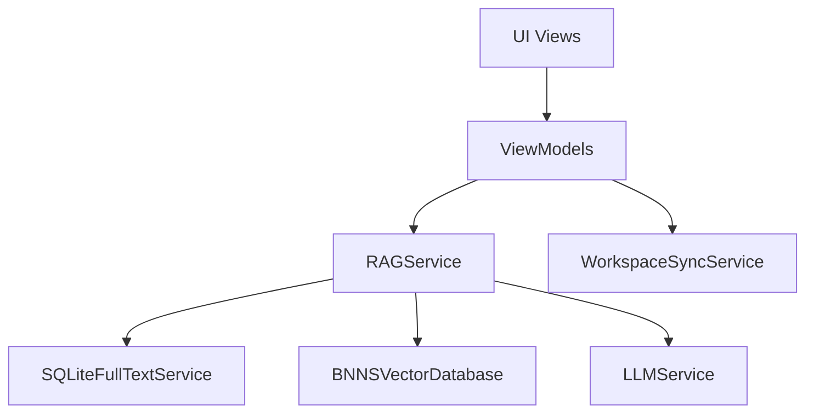
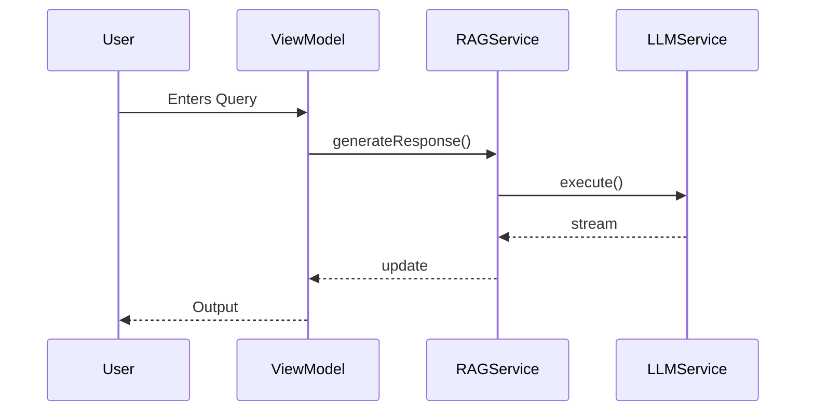
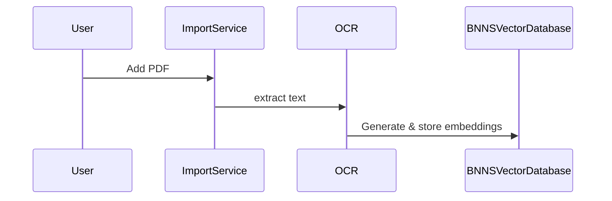
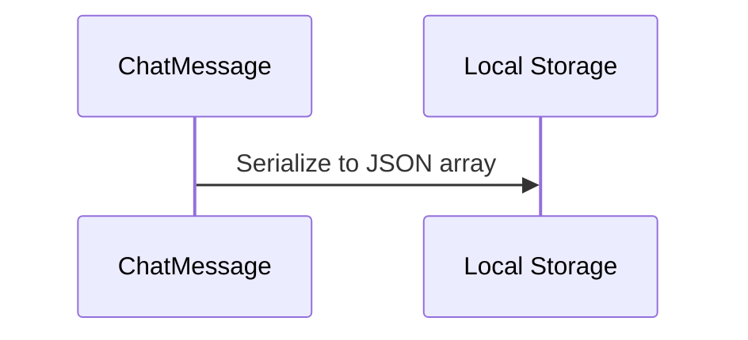
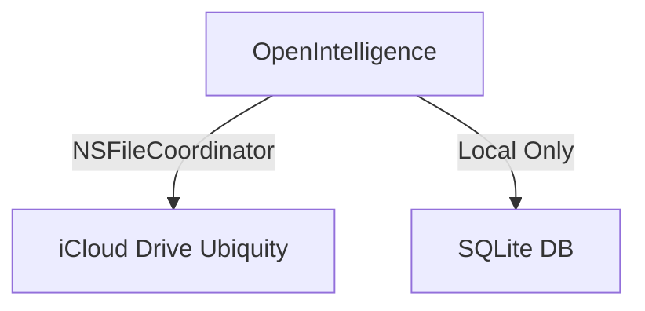
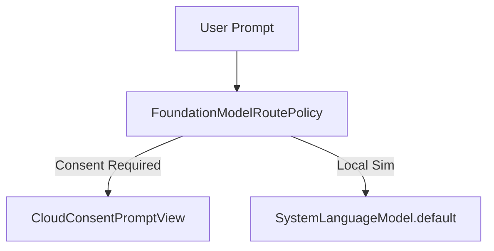
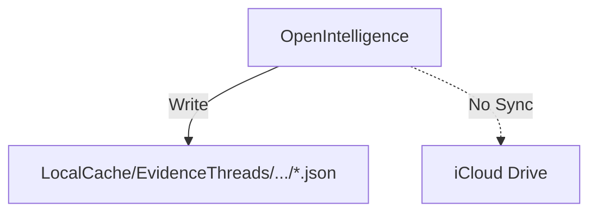

# OpenIntelligence Architecture Atlas

## 1. Executive Overview
The OpenIntelligence Architecture Atlas is the canonical representation of the repository's components, execution flows, and system boundaries. It was generated via a strict evidence-based static analysis protocol. The system is composed of 270 Swift components divided into 30 subsystems, with high-risk boundaries located in iCloud sync, StoreKit entitlements, and Private Cloud Compute (PCC) routing.

## 2. Subsystem Map
- **App Intents/Siri/Shortcuts**: 9 components
- **Apple Foundation Models**: 8 components
- **OCR/extraction**: 13 components
- **PCC routing/consent**: 3 components
- **SQLite/FTS storage**: 1 component
- **StoreKit**: 8 components
- **app lifecycle**: 6 components
- **background tasks**: 2 components
- **billing/entitlements**: 4 components
- **chat UI**: 19 components
- **chat persistence**: 3 components
- **citations/source rendering**: 20 components
- **context packing**: 1 component
- **diagnostics/telemetry**: 27 components
- **document import**: 11 components
- **embeddings**: 13 components
- **export/reporting**: 1 component
- **generation**: 7 components
- **iCloud/workspace sync**: 13 components
- **ingestion queue**: 10 components
- **library/container management**: 15 components
- **onboarding**: 5 components
- **reranking/fusion**: 5 components
- **retrieval**: 38 components
- **semantic chunking**: 4 components
- **settings**: 13 components
- **tests**: 6 components
- **vector storage**: 3 components
- **verification gates**: 3 components
- **docs/audits**: 0 components (Markdown/CSV files)

## 3. Component Dependency Map
- **UI Views** depend on **ViewModels**.
- **ViewModels** inject **Services** (e.g., `RAGService`, `WorkspaceSyncService`).
- **Services** interface with **Storage** (`SQLiteFullTextService`, `BNNSVectorDatabase`).
- **Storage** interfaces with **File System** (`Application Support`).

## 4. Service Map
- `RAGService`: Core retrieval-augmented generation orchestrator.
- `WorkspaceSyncService`: Manages iCloud Drive ubiquity sync.
- `SQLiteFullTextService`: Manages shared relational storage.
- `EntitlementStore`: Manages UserDefaults-backed billing logic.
- `LLMService`: Handles prompt compilation and PCC execution.
- `EvidenceThreadDebugService`: Diagnostics-only service to test `EvidenceThreadStore` without touching production pathways.

## 5. View/ViewModel Map
- SwiftUI Views use `@EnvironmentObject` and `@AppStorage` heavily for dependency injection and state sharing.
- `EvidenceThreadDebugView`: Standalone SwiftUI view for Evidence Threads local store diagnostics.

## 6. Model/Persistence Map
- `ChatMessage`: JSON serialized and stored locally.
- `EvidenceThread` (active): Isolated JSON files per thread.

## 7. Major User Flows
1. App Launch & Container Restore
2. Library Container Context Switching
3. Document Import & Vector Extraction Pipeline
4. End-to-End RAG Query & Inference Pipeline
5. Maximum Mode & PCC Route Policy Evaluation
6. iCloud Workspace Sync & Entitlements
7. StoreKit Purchasing & Quota Resolution
8. App Intent Siri Shortcuts integration
9. Telemetry Trace Generation

## 8. Background/System Flows
- `BGTaskScheduler` used for indexing sweeps.
- `NSMetadataQuery` background updates for iCloud Drive.

## 9. Sync Boundaries
- **iCloud Drive (Ubiquity)**: Used for sync via `WorkspaceSyncService.swift`. `[evidence: code_verified, exact, WorkspaceSyncService.swift]`
- **NO CloudKit**: No explicit CloudKit database APIs are in use. `[evidence: code_verified, exact, WorkspaceSyncService.swift]`
- **NO SQLite Sync**: The `SQLiteFullTextService.swift` is completely local-only. `[evidence: code_verified, exact, SQLiteFullTextService.swift]`

## 10. Routing/PCC Boundaries
- **PCC (Private Cloud Compute)**: Execution routes natively to secure enclaves via `FoundationModels.PrivateCloudComputeLanguageModel` on iOS 27 / macOS 27+, falling back cleanly to local `SystemLanguageModel` simulation on older versions. `[evidence: code_verified, exact, FoundationModelSessionFactory.swift]`
- **Consent Deadlock Risk**: Background executions via App Intents might block on `CloudConsentPromptView` evaluation. `[evidence: code_verified, exact, FoundationModelRoutePolicy.swift]`

## 11. Billing/Entitlement Boundaries
- **UserDefaults**: `EntitlementStore.swift` relies on UserDefaults for limits. `[evidence: code_verified, exact, EntitlementStore.swift]`
- **Keychain**: Strictly used for API keys, not entitlements. `[evidence: code_verified, exact]`

## 12. App Intents Boundaries
- **Limit Reached**: 9 out of 10 available shortcut slots are consumed.
- App Intents bypass normal UI and directly hit `RAGService`.

## 13. Documentation Cross-Reference
All documentation cross-references have been moved to `DOCUMENTATION_CONSISTENCY_AUDIT.md`.

## 14. High-Risk Modification Zones
1. **PCC routing/consent**
2. **Apple Foundation Models**
3. **iCloud/workspace sync**
4. **StoreKit / Billing**
5. **App Intents/Siri/Shortcuts**

## 15. Evidence Threads Implication Section
- **Design B**: Isolated JSON files under `LocalCache/EvidenceThreads/<containerId>/`. `[evidence: artifact_derived, exact, evidence_threads_design_decision.md]`
- **Integration**: Complete. Persistent history is integrated into `RAGService.swift` and presented through `ThreadSidebarView.swift` inside `ChatScreen.swift`.
- **Constraint**: `ChatMessage.swift` and existing sync routines remain untouched (preserved by using `ChatMessage` in `EvidenceThread` messages array).

## 16. Mermaid Diagrams

### High-level Module Graph

### Query Answering Flow

### Document Ingestion Flow

### Chat Persistence Flow

### Sync Boundary Diagram

### PCC Routing Diagram

### Evidence Threads Proposed Placement Diagram

