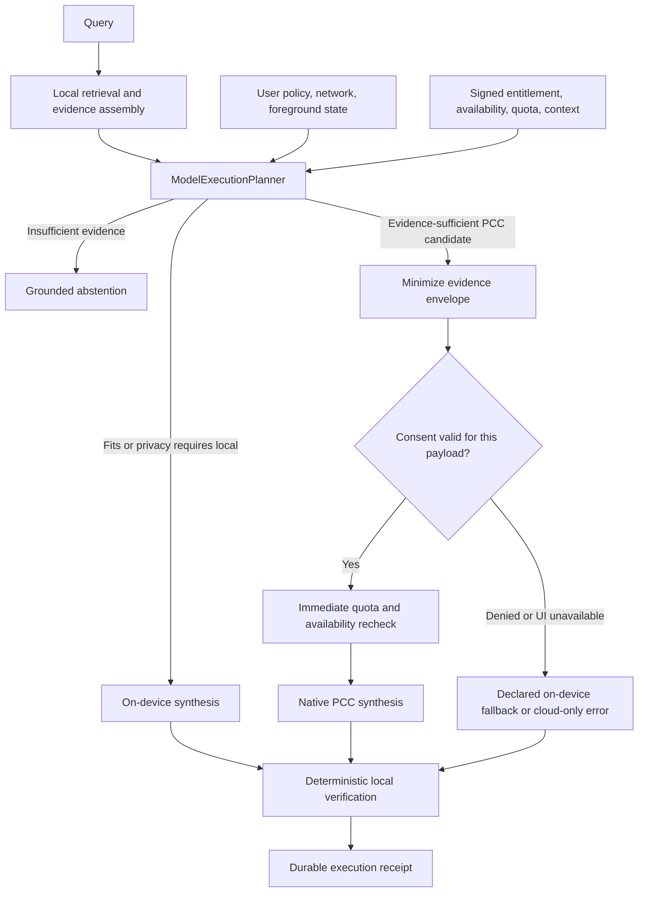

# Privacy and Model Routing — OpenIntelligence v4.6

> **Documentation status:** Source-verified on 2026-07-15. Signed physical-device, Archive/TestFlight, quota-exhaustion, network-transition, and background/App Intent validation remain pending.
> **Source of truth:** `Docs/CANONICAL_OPENINTELLIGENCE_SOURCE_OF_TRUTH.md` and the current implementation.

OpenIntelligence is local-first. Extraction, OCR, embeddings, vector and lexical retrieval, evidence scoring, route planning, transcript handling, and response verification run on the device. No document or query content is sent to a third-party AI provider. Apple Private Cloud Compute (PCC) is the only remote model target.

## Public execution targets

- **On-device:** `SystemLanguageModel.default` on supported Apple Intelligence devices.
- **Private Cloud Compute:** `FoundationModels.PrivateCloudComputeLanguageModel` on iOS/macOS 27+ when every capability and consent gate passes.

The public SDK does not expose separately selectable 3B, 20B, Advanced, or server parameter-count identities. OpenIntelligence therefore does not claim those models. iOS/macOS 26 is genuinely local-only; local generation is never labeled or simulated as PCC. `[evidence_level: compile_verified+code_verified, confidence: exact, evidence_source: FoundationModelSessionFactory.swift, EngineSDKCompatibility.swift]`

## Post-retrieval decision flow

`QueryRuntimeCoordinator` preserves the user's policy but does not predict a final route. After retrieval, `ModelExecutionPlanner` evaluates:

- evidence sufficiency, score distribution, context size, and multi-document synthesis need;
- automatic, on-device-only, prefer-cloud, or cloud-only policy;
- network and foreground/background state;
- signed PCC entitlement, live availability, live quota, and SDK-reported context size;
- exact SDK token counts where available, otherwise a receipt-labeled conservative estimate.

Escalation never substitutes for missing evidence. Weak or irrelevant retrieval abstains or stays local according to the grounding policy. `[evidence_level: code_verified, confidence: high, evidence_source: ModelExecutionPlanner.swift, FoundationModelTokenBudget.swift, RAGService.swift]`

## Entitlement, OS, and quota gates

Apple approval of `com.apple.developer.private-cloud-compute` was confirmed by the user on 2026-07-15, and the source entitlement is enabled. `EntitlementChecker` reads the entitlement from the running process's signed code object through Security.framework; it does not depend on an embedded provisioning profile that distribution may remove.

Before PCC construction, the app verifies:

1. iOS/macOS 27 availability;
2. signed entitlement presence;
3. `PrivateCloudComputeLanguageModel` availability;
4. quota is not exhausted;
5. network and policy permit PCC;
6. the planned envelope fits the live context budget.

Quota is rechecked immediately before the model is constructed. A quota failure is not retried on PCC. Automatic/prefer-cloud may use the declared local fallback; cloud-only fails explicitly. `[evidence_level: code_verified+user_confirmed, confidence: high_for_source_unverified_for_distribution, evidence_source: FoundationModelCapabilityProvider.swift, FoundationModelSessionFactory.swift, OpenIntelligence.entitlements]`

## Evidence minimization and consent

PCC consent happens only after the route and cloud evidence envelope are final. `CloudEvidenceMinimizer` selects a bounded set of source IDs, names, page numbers, and text. The consent sheet displays provider/model, prompt size, context size, chunk count, total estimated bytes, and the machine-readable route reason.

- **Allow once:** grants the current in-process PCC provider session.
- **Always allow:** persists provider consent; each transmission still produces a local record.
- **Deny:** blocks PCC. Automatic/prefer-cloud uses on-device fallback; cloud-only returns an error.

Background and App Intent execution never waits for a foreground consent sheet. Remembered consent may permit PCC; otherwise the planner selects local execution or fails cloud-only explicitly. `[evidence_level: code_verified, confidence: high, evidence_source: RAGService.swift, CloudConsentPromptView.swift, AgenticOrchestrator.swift]`

## Fallback and stream integrity

- PCC may fall back to on-device only before meaningful response text has streamed.
- Once a meaningful partial response exists, OpenIntelligence returns that single-target partial response rather than mixing cloud and local output.
- PCC is not automatically retried after quota failure.
- Intermediate Deep Think/Maximum reasoning sessions stay on-device; only final post-retrieval synthesis may be selected for PCC.
- Retrieval evidence and citation verification remain local even when synthesis uses PCC.

`[evidence_level: code_verified, confidence: high, evidence_source: RAGService.generateWithFallback, AgenticOrchestrator.generateWithFreshSession]`

## Route telemetry

`ModelExecutionReceipt` is the durable route truth. It records plan/policy IDs, timestamps, reason codes, intended target, attempts, actual target, fallback reason, completed target, quota category, and verification result. `ResponseMetadata.executionRoute` is a compatibility summary derived from the completed receipt.

Telemetry may include identifiers, public target names, counts, budgets, hashes, quota categories, reason codes, and verification status. It must not include raw query text, document text, transcript content, or generated reasoning. Historical responses remain readable because receipt metadata is optional. `[evidence_level: code_verified, confidence: high, evidence_source: ModelExecutionReceipt.swift, RAGQuery.swift, LLMService.swift]`

## Validation boundary

The source implementation and Swift parsing are complete. Production readiness is not yet claimed until the following pass on a signed iOS 27 device and distribution artifact: entitlement inspection, native PCC execution, intended-versus-actual receipt confirmation, consent allow/deny/revoke, App Intent/background behavior, quota approach/exhaustion, offline and mid-request network changes, and physical-device thermal/battery checks. `[evidence_level: code_verified, confidence: exact_for_unverified_status, evidence_source: PCC dynamic routing test matrix]`
