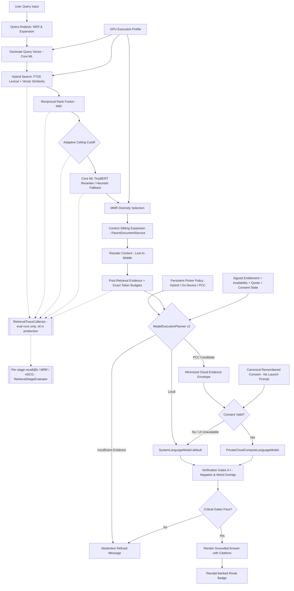

# Retrieval Pipeline — narrative source-verified at v4.6; claims re-checked 2026-09-01

> **Documentation status:** Sections 1–5 source-verified 2026-07-15 against v4.6 and **not re-narrated since**; 4.8–4.9 changed retrieval behaviour in ways they do not describe. The numbered items 12–21 and the Suggested questions section are individually dated and evidence-tagged and are the current record.
>
> **Shipped versions:** read `Docs/SHIPPED_VERSION.json`, the per-platform record. This document deliberately states no current version number, because each one it stated went stale: before 2026-09-01 this block said "iOS/macOS 4.9 is the shipped version" while the title said v5.0, and the correction made that day (iOS 5.0, macOS 5.0.2) has since been superseded too. The 2026-09-01 note that PCC device/distribution validation was pending predates PCC shipping; `Docs/SHIPPED_CAPABILITIES.json` records `private_cloud_compute` as `shipping` since 2026-09-10. <!-- verify-doc-claims: ignore, this line quotes the withdrawn claim -->
>
> **Claims re-checked against source 2026-09-01, all holding:** the seven `RetrievalTraceCollector` stages and their order; `executeFullRetrievalPipeline` taking a defaulted `trace` parameter (item 19); the collector defaulting to `nil` everywhere, so production pays a nil check; the Core ML TinyBERT cross-encoder with heuristic fallback in the flow diagram, which is loaded at `RAGEngine.swift:82` and invoked at `:331`; and every referenced document existing.
>
> **The benchmark directories cited in items 12 and 19 — `BenchmarkRuns/20260811-133233-matrix` and `BenchmarkRuns/paired-retry` — are archived, not deleted.** All 90 run directories are in `~/OpenIntelligence-BenchmarkArchive/BenchmarkRuns-2026-09-01.tar.gz`, verified byte-identical before removal. Extract to read them; see `BenchmarkRuns/LEDGER.md`.
> **Known drift as of 2026-08-05** — each of these is in the changelog under 4.9 (moved on 2026-09-24 from `CHANGELOG.md` to `Docs/Archive/CHANGELOG_2.0_to_5.2.md`) but not yet reflected below:
> - Gate E measures query coverage as the better of combined-evidence and best-single-chunk, not the per-chunk maximum.
> - `DomainIsolationService` relaxes only the cross-domain-mixing clause when the retrieved chunks all come from one `documentId`.
> - `executeReasoningChain` retries the user's original wording when a rewrite fuses zero chunks, before any downstream relevance gate judges the library.
> - `makePostRetrievalModelPlan` takes the maximum similarity over the chunk set rather than reading `chunks.first`, which is not the best chunk after MMR, expansion, and Lost-in-the-Middle reordering.
> **Source of truth:** the code. The codebase audit this line used to cite in `Docs/AUDIT/` is not in the repository (`Docs/AUDIT/` is gitignored). For anything retrieval-related in 4.8–4.9, read those sections of `Docs/Archive/CHANGELOG_2.0_to_5.2.md`, where they moved from `CHANGELOG.md` on 2026-09-24.
> **Scope:** Describes shipped behavior unless explicitly labeled experimental, developer-only, or scaffolded.

---

## 1. Overview
The retrieval pipeline is the core engineering idea in OpenIntelligence: answers are grounded in user-provided material and expose the exact evidence that influenced them. The app is built to bias responses toward groundedness, showing uncertainty when evidence is weak rather than inventing confident prose.

---

## 2. RAG Retrieval Flow

---

## 3. Pipeline Stages

1. **Import**: Files enter through Apple platform document workflows.
2. **Extraction**: Text, layout, and metadata are extracted.
3. **Chunking**: Chunks are generated with metadata using semantic and structure-aware rules.
4. **Indexing**: Chunks are written into local search (SQLite FTS5) and vector databases ([BNNSVectorDatabase.swift](../OpenIntelligence/Services/VectorStore/BNNSVectorDatabase.swift)).
5. **Query Analysis & Planning**: Incoming questions are classified, scoped, and prepared for retrieval.
6. **Retrieval**: Candidate chunks are selected from the active library or workspace container.
7. **Reranking and Packing**: Evidence is scored using a local Core ML TinyBERT cross-encoder (with proximity-based heuristic fallback if the model is absent), deduplicated (MMR), expanded with sibling context, and compressed.
8. **Post-Retrieval Model Routing & Generation**: `ModelExecutionPlanner` combines evidence sufficiency and synthesis burden with the captured persistent policy, foreground state, network, signed entitlement, live quota/availability, and SDK token/context budgets. Hybrid chooses per query, On-Device is local-only, and explicit PCC requests cloud but records a truthful local completion when any cloud gate prevents use. Local execution uses `SystemLanguageModel.default`; eligible iOS/macOS 27 synthesis may use native PCC after the exact minimized envelope is consented. iOS/macOS 26 remains local-only. `[evidence_level: code_verified, confidence: high_pending_physical_device_validation, evidence_source: ChatScreen.swift, ModelExecutionPlanner.swift, LLMService.swift, RAGService.swift]`
9. **Fidelity Verification & Receipt**: Responses pass through local verification checks. Route metadata is persisted as a `ModelExecutionReceipt` that separates intended, attempted, actual, fallback, and completed targets. `[evidence_level: code_verified, confidence: high, evidence_source: VerificationGateService.swift, ModelExecutionReceipt.swift, RAGQuery.swift]`
10. **Presentation**: Answers are shown with liquid glass UI indicators, citations, quality gauges, and review affordances.
11. **Continuous Evaluation**: `RAGEvalRunner` runs the cases in `Benchmarks/rag_eval_v1.jsonl` through the live pipeline and scores answer match, retrieval recall, citation precision and abstention.

    **Corrected 2026-08-08.** This item previously read "verified against quality targets (e.g. Recall@5 $\ge 0.85$, Citation Precision $\ge 0.90$) using the native Evaluations harness". Two parts of that were untrue and are withdrawn rather than deleted, so the record shows what was claimed. The `\ge 0.85` recall gate was never met and could not be: `retrievalRecallAt5` returned exactly `0.0` on every run regardless of retrieval quality, because the runner only scored recall when a case supplied `groundTruthChunkIds` and every committed case carries `null` there. And there is no native Evaluations harness: `AppleEvaluationsBridge.swift` is named for Apple's Evaluations framework but imports only `Foundation` and `FoundationModels`. `[evidence_level: code_verified, confidence: exact, evidence_source: AppleEvaluationsBridge.swift imports, Benchmarks/rag_eval_v1.jsonl all 20 records, CHANGELOG.md 4.9]`

12. **Per-stage retrieval measurement** *(added 2026-08-08)*: A `RetrievalTraceCollector` may be attached to a query. It records the rank-ordered output of each retrieval stage, and `RetrievalStageEvaluator` scores recall@1/3/5/10, MRR, nDCG@5/10 and precision@5 **per stage** rather than once at the end.

    `RetrievalTraceCollector.Stage` has seven cases, in pipeline order: `vector`, `lexical`, `fusion`, `boosted`, `candidates`, `rerank`, `final`. The first five are recorded by `HybridSearchService` in both its search paths; `rerank` is recorded by `RAGService` after `RAGEngine.rerank`, because that is where reranking runs; `final` is recorded at the `queryWithAudit` boundary from the chunks on the response.

    The split matters for attribution. Reranking cannot recover a chunk the first stage never returned, so a single end-of-pipeline number cannot tell a first-stage regression from a reranker regression, and a later stage can mask an earlier one. A recall drop between `boosted` and `candidates` means top-K truncation is too tight; a drop between `candidates` and `rerank` means the cross-encoder demoted the right chunk.

    **That last inference holds only when ground truth credits every document the question requires, and on 2026-08-11 it did not.** `scripts/build_eval_dataset.py` emitted a single-element `expectedCitations` from the manifest's singular `expected_source`, and `scripts/run_quality_matrix.py` passed that one filename to the harness. All five `multi_hop_project_m*` cases ask a two-part question whose halves live in different fixtures, so ranking the *other* required document first scored as a demotion. That produced `rerank` MRR@10 0.972 and `final` 0.917 against a `vector` stage at 1.000, and the arithmetic closed exactly at `(17 + 0.5)/18` and `(15 + 1.5)/18` while all five cases answered correctly. The reranker was not demoting anything. Both scripts now read a plural `expected_sources`, falling back to the singular key, and the manifest carries both filenames for those five cases. **Before attributing a late-stage drop to the reranker, check that every case in play credits all of its required documents.** `[evidence_level: measured+code_verified, confidence: exact, evidence_source: BenchmarkRuns/20260811-133233-matrix/results.json, build_eval_dataset.py, run_quality_matrix.py, tiny_research_suite/manifest.json]`

    The collector is one instance per query, passed explicitly as a defaulted parameter. It is `nil` in production, where the only cost is a nil check per stage. It is deliberately not a shared sink: retrieval runs concurrent child tasks, and a process-wide collector would interleave stages from overlapping queries with no way to separate them. `[evidence_level: code_verified, confidence: exact, evidence_source: RetrievalTraceCollector.swift, HybridSearchService.swift, RAGService.swift, RetrievalStageMetrics.swift]`

13. **Sentence selection, which runs after the last measured stage** *(added 2026-08-13)*: `RAGService.extractRelevantSentences` turns the retrieved chunks into the text the model actually sees. It runs **downstream of `final`**, so none of the seven stage metrics above observe it. A query whose every stage figure is excellent can still reach the model with nothing usable in its context, and on 2026-08-13 one did.

    **What a device log showed.** For "How often must reprocessing occur?" retrieval completed in 88.5ms with 177 candidates, 57 of them found by FTS5 and missed by vector search, and the reranker normalised the top chunk from 0.10 to 0.90 with the correct section in first place. Sentence selection then handed the reasoning chain **67 characters against a 3000+ character budget**: a section label and a filename. Deep Think ran eight sessions over that, its insights degenerated to "[S1] contains a section titled", and the final generation failed to parse. The user's query failed while every retrieval metric was healthy.

    **Two independent causes, both fixed.** Selection kept a sentence only if it contained a query keyword as a raw substring, with no stemming, while FTS5 indexes with `porter unicode61`. Retrieval therefore matched "reprocessed" to a query saying "reprocessing" and selection then discarded those same sentences, leaving only lines carrying the literal token. Separately, a line qualified as a heading only if it contained no digits at all, which rejects every heading in a numbered technical manual ("4 Reprocessing", "4.5.1 Overview"), so no sentence could inherit its section's keywords. Keyword matching is now additive across raw substring and a shared suffix-stripped stem, the digit test applies only after a leading section number is removed, and the section is seeded from `chunk.metadata.sectionTitle` rather than re-derived from raw text. `[evidence_level: measured+code_verified, confidence: exact, evidence_source: iPhone console capture 2026-08-13, app 4.9 build 150, not retained in the repository (root .txt is gitignored: these captures run to several MB and carry container UUIDs and document names); the figures it produced are quoted inline above and in the 2026-08-13 CHANGELOG entry; RAGService.swift extractRelevantSentencesOffMain; DocumentChunk.swift ChunkMetadata.sectionTitle]`

    **Confirmed on device the same day.** A second capture after the fix, on a different question ("What safety protocols are mandatory?"), recorded session contexts of **855, 1468, 850, 242, 252, 252, 242, 899 characters** against the pre-fix 106, 123, 67, 53, 167, 111, 67, 67. The four sessions landing near 242 are the new too-small fallback firing. Insights carried real cited findings rather than "contains a section titled", and no session echoed its system prompt. **The query still failed**, which disproved the assumption that context starvation was contributing to the final parse error: that failure is independent, and is a rate limit. See the 2026-08-13 CHANGELOG entry on escalating backoff. `[evidence_level: measured, confidence: exact, evidence_source: second iPhone console capture 2026-08-13, same caveat on retention]`

    **The general lesson, and it is the same one item 12 records one level up.** Stage metrics measure retrieval, not what the model receives. `AgenticOrchestrator` had a fallback to raw chunk content, but it tested `isEmpty`, and 67 characters of section title is not empty. Guard the layers between retrieval and generation on *usefulness*, not on presence.

---

## 4. Library Isolation
Library and workspace boundaries are critical because retrieval quality depends on scope. The app is designed so that a query is answered strictly against the user-selected document container rather than all files indiscriminately, preventing cross-container leakage.

---

## 5. Diagnostics & Telemetry
Diagnostic and telemetry surfaces are included for inspecting chunks, retrieval quality, answer details, and pipeline behavior. These are engineering tools for iteration and must not be interpreted as validation for regulated or safety-critical workflows.

14. **Citation labels are one namespace, and the response must be able to resolve them** *(added 2026-08-14)*: `RAGEngine.assembleContext` packs chunks until the character budget runs out and labels them `[S1]`...`[S{used}]`. Whatever did not fit is handed to **Needle Rescue**, which runs `extractRelevantSentences` over the dropped chunks and appends the result to the *same* prompt. Rescue previously labelled its sources from `[S1]` again, so one prompt presented two different chunks under the same label. A device trace on 2026-08-14 shows the consequence: four packed sources, then rescue sources numbered from one, and an answer citing `[S5]` and `[S6]`, being the fifth and sixth sources the model had been shown. Those resolved to nothing, because `includedRetrievedChunks` was `orderedCandidates.prefix(actualChunksUsed)` and carried only the packed four.

    Two rules now hold together, and neither works alone. Rescue continues the packed block's numbering through a `labelOffset`, and the chunks rescue contributed are attached to the response. `SentenceExtractionResult.usedSourceIndices` exists to make the second possible; returning only a count is what let the prompt and the response disagree about what a citation meant.

    **The general rule:** anything that puts text in front of the model under a citation label must also put the corresponding chunk in the response. Three separate layers already drop out-of-range citations (`StructuredAnswer.citedEvidence`, the empty-evidence confidence floor, `normalizeStructuredCitations`) and Gate B fails on them. None of that helps, because the answer prose is not validated and it is the only part a reader sees.

15. **The prompt's source array and the response's source array must be the same array** *(added 2026-08-14)*: `RAGEngine.assembleContext` reorders chunks for Lost-in-the-Middle mitigation **before** numbering them, so `[S1]`...`[Sn]` are labels over `front + back.reversed()`, not over the input. Every caller independently rebuilt the citation list as `prefix(used)` of the array it had passed *in*, which is a different set for any query with four or more chunks. `[A,B,C,D]` is presented as `[A,C,D,B]`, so a citation of `[S2]` meant C and resolved to B.

    This was undetectable by every guard in place. Indices were in range, chunks existed, and the citation resolved to a real source. It was simply the wrong one. Five call sites had the same defect, which is the signature of a label related to its chunk by convention rather than by construction.

    `assembleContext` now returns `sources`: the chunks in the exact order their labels were assigned. Callers must use it and must not recompute a prefix. **If you add a stage that puts text in the prompt under a citation label, it must return the chunks it labelled.** Item 14 records the related case where needle rescue appended labelled text whose chunks reached no one.

16. **The right fusion weight is corpus-dependent, and the app can already tell which kind it is facing** *(added 2026-08-14)*: the offline sweep (`Docs/EVALS.md`) found MRR@10 maximised at dense weight 0.00, monotonically. That was measured on `qasper_external_v1`, whose questions were written by readers shown only a title and abstract and therefore reuse the paper's exact vocabulary, which favours the lexical arm. It is a property of the fixture, not of retrieval.

    Device captures on 2026-08-14 show the arms inverting between real libraries. A manuals corpus returned 120 vector + 60 FTS5 with 57 lexical-only hits. A research corpus asked "What is the role of serotonin signaling?" returned **140 vector + 6 FTS5**, and the log explains why: it reports that the keyword `serotonin` hit 51% of chunks and therefore received zero boost. On a corpus where the domain term is on every page, lexical search discriminates nothing and the dense arm is carrying the entire query. Zeroing the dense weight there would sink 140 candidates beneath six.

    **Do not set a single global weight from a single fixture.** `HybridSearchService` already computes per-keyword hit rates and builds `discriminativeKeywords` before fusion runs, so the signal needed to choose a weight per query already exists at the moment the weight is applied. The completion log now reports `unique: N vector-only, M lexical-only` with the weights actually used, which is the evidence any future weight change should be argued from.

17. **Retrieval has a second consumer, and it needs the passage judged rather than the output judged** *(added 2026-08-15)*: `SuggestedQuestionsService` runs the same retrieval and turns the chunks into the questions offered before the user types anything. `buildGroundedPassages` took `chunks.prefix(limit)` with no quality test, so whatever retrieval returned became question material.

    The service already carried five filters, and every one of them inspects the **generated question**: `isJunkString`, `sanitizeGeneratedQuestion`, `isUsableLLMGeneratedQuestion`, `isUsableGeneratedQuestion`, `isStructuralOrMetaQuestion`. A reference list defeats all five at once. It is grammatical, it is dense with capitalised domain nouns, and the question it produces is well formed, so no test applied to the question can separate "What is the role of Neurosci Yagishita Transient?" from a real one. The defect is only visible in the source text.

    `questionSourcePenalty` scores the chunk instead, on citation density, dot leaders, access boilerplate, digit-to-letter ratio, vowel-free token ratio, and absence of sentence enders. It **demotes rather than filters**, because a hard filter returns an empty set for a document that is entirely a reference list or a scanned table, which disables the feature precisely where it is already weakest.

    **Hand-built samples were not enough to get this right, and the corpus run is what corrected it.** The first version passed all nine hand-built cases and still hard-demoted 51 chunks of ordinary body prose out of a 5,425-chunk sample of the real library. Two signals were wrong in a way no synthetic sample exposed. A parenthetical year counted three or more times is the marker of an author-year citation *in running text*, so it fires hardest on the related-work paragraph, which is good question material; a numbered reference list writes `2017;6:e20975` instead, so the signal was evidence **against** a bibliography. And matching author initials as `[A-Z][a-z]{2,}\s+[A-Z]{1,3}[,.]` without requiring the entries to be consecutive matched "Detection DET." and "Twitter PHEME," in any paper whose body is full of acronyms.

    Author detection now requires three consecutive `Surname AB,` entries **with distinct surnames**. The surname test is the part that generalises beyond papers: "Phase A, Phase A, Phase B," is shape-identical to "Correia PA, Lottem E, Banerjee D," and a repeat count cannot separate them, while "Section A, Section B, Section C" and "Option A, Option B, Option C" are ordinary content in manuals, forms and agreements. `[evidence_level: measured, confidence: high, evidence_source: the shipped function extracted verbatim and run over a stratified 5,425-chunk sample of LocalCache/FTS5/fulltext.sqlite; 99.2% score 0 and zero are falsely hard-demoted, while bibliography, numbered references, table of contents, running header and numeric table all still demote hard]`

    The general rule this is an instance of: **item 12's stage metrics stop at `final`, and both known defects since have been downstream of it.** Item 13 was sentence selection, this is question generation. A stage figure cannot tell you that a consumer of the stage output is unusable.

18. **A fixed-size cut over a Lost-in-the-Middle ordering removes the best chunk by construction** *(added 2026-08-17)*: `executeFullRetrievalPipeline` finishes with a Lost-in-the-Middle reorder, and Deep Think's synthesis then truncated what it received. Both stages were defensible alone. Composed, they discarded the single highest-scoring chunk on every query large enough to matter.

    The reorder sorts by score and interleaves: even ranks are appended, odd ranks are inserted at the midpoint. For 85 chunks that yields `[c1, c3, c5, ...]` with **rank 0 at index 42**, so the best chunk sits in the exact middle of the array. `executeSearchStepWithChunks` then rendered `chunks.prefix(10)`, which for 85 chunks is ranks 1, 3, 5 ... 19 and excludes rank 0 outright, and `executeDirectSynthesis` applied `String(searchResults.prefix(3000))` to what was left. The comment above that cut justified 3000 characters against a system prompt it no longer matched.

    Nothing about this was visible. The cut logged nothing, the citations that survived resolved correctly, and Self-RAG scored the result `relevance=70%, citations=1/1, confidence=88%`. The observable symptom was an inversion: on "How does dopamine affect social behavior?" Deep Think answered that the documents provide no evidence, in 202.7s, while Standard assembled 3 chunks and 522 words, fit inside its budget, and answered correctly in 6.7s. `[evidence_level: measured, confidence: exact, evidence_source: device capture Standard+DeepThink+Xcodeconsole.txt 2026-08-16, gitignored per the item 13 retention caveat; figures quoted inline]`

    **Three changes, and the ordering one is the load-bearing one.** Synthesis now packs from the chunks rather than the pre-rendered string, sorted by score with array position as a deterministic tiebreak, so truncation removes the least relevant evidence instead of the most relevant. The budget is derived from `FoundationModelTokenBudget` against the actual system prompt, query and output reserve rather than a hardcoded character count. And every assembly emits one line naming chunks kept, tokens used and chunks dropped, so a future instance of this is readable in a trace instead of inferable from a wrong answer.

    Parent document expansion is now gated on the same budget. It grew an 18-chunk result to 85 immediately before a cut that could hold roughly eight, so it was not neutral: it added nothing that fit and displaced the ranked set that did. Primary matches are never gated, only siblings, because dropping retrieval's own results here would trade one silent loss for another.

    **Rank-ordered packing does not license recomputing the citation list.** Item 15's invariant still binds: the budgeted subset is passed to `generateWithProperConsent` as `sourceChunks` in the order it was labelled, because `[S1]` resolves positionally. Reordering for relevance without carrying the order forward would have swapped one defect for a misattribution. `[evidence_level: code_verified, confidence: exact, evidence_source: AgenticOrchestrator.assembleBudgetedEvidence and executeDirectSynthesis; RAGService.swift step 7.5; reorder reproduced directly for n=85]`

    **Not device-verified.** The change is build-verified and passes the 236-test suite, and this path has no test coverage, so the claim that Deep Think stops abstaining on the dopamine query remains unverified until the identical query is re-run on hardware and compared against the saved trace. `[evidence_level: code_verified, confidence: high_pending_device_validation]`

19. **The agentic path was never measured, which is why its recall gap could not be attributed** *(added 2026-08-19)*: item 12 records seven per-stage metrics — `vector`, `lexical`, `fusion`, `boosted`, `candidates`, `rerank`, `final`. Those come from `HybridSearchService` and from `queryWithAudit`. **Deep Think and Maximum reach retrieval through `AgenticOrchestrator`, which calls `executeFullRetrievalPipeline`, and that function took no `trace` parameter at all.**

    The consequence showed up the first time the two modes were benchmarked against each other. Standard reported all seven stages; Deep Think reported exactly one, `final`, recorded downstream from the response.

    | stage | standard r@10 | deep-think r@10 |
    | :--- | :---: | :---: |
    | vector | 0.571 | — |
    | lexical | **0.857** | — |
    | fusion | 0.714 | — |
    | rerank | 0.857 | — |
    | **final** | **1.000** | **0.625** |

    Standard's retrieval is perfect on this set: r@5 and r@10 both 1.000 across seven scored cases. Deep Think finds the gold document 62.5% of the time on the same eight. **That gap is the entire quality difference between the modes**, because `correct == (gold_recall == 1.0)` held in 14 of 15 scored runs — synthesis was right whenever it had the evidence and wrong whenever it did not.

    **Two hypotheses were formed and refuted by reading source within the hour.** That query expansion degrades the lexical arm: false, `searchWithFTS5` searches `originalQuery` and uses expansions only as a fallback when the original returns nothing. That expansion replaces the original query: false for the same reason, and the keyword boost also uses `originalQuery`. A third guess was not attempted. The path is now instrumented instead.

    `executeFullRetrievalPipeline` takes a `trace`, and `queryWithAudit` holds the collector for the query's duration so all nine agentic call sites inherit it without a signature change. That property is diagnostic-only and not concurrency-safe: two overlapping traced queries would share a collector. The harness runs one case at a time and production passes nil, so it cannot arise today; a second concurrent traced query would need a task-local instead.

    **Also confirmed by the same table, and already an open row:** fusion ranks *below* the lexical arm it is fusing, 0.714 against 0.857. The keyword arm alone would have retrieved more than the hybrid did.

    `[evidence_level: measured, confidence: exact_for_the_gap, cause_unattributed_pending_instrumented_run, evidence_source: BenchmarkRuns/paired-retry stage_summaries, 8 cases, pool_limit 10, qasper_external_v1]`

20. **Retrieval is nondeterministic, which subordinates every measurement in this document** *(added 2026-09-01)*: two runs of one build return different retrieved evidence, and different answers, for the same question against the same library.

    That does not invalidate the per-stage machinery in item 12 — the stages, the metrics and the attribution logic are all sound. It invalidates **comparison**. Every figure above that contrasts one thing with another assumes the only difference between two runs is the change under test, and right now that assumption does not hold. Item 19's Standard-versus-Deep-Think table, item 16's arm inversion, and any future A/B over fusion weights, reranking or contextual retrieval all inherit the problem.

    **The practical rule until this is fixed:** treat a single run as an observation, never as a measurement, and do not attribute a difference between two runs to a code change without establishing that the same run repeats. Item 12's warning about attribution was about *which stage* lost recall; this is a level beneath it, about whether the numbers are stable enough to attribute at all.

    The cause is upstream of tie-breaking and is not yet identified. Tracked as a `Future Backlog` row at High priority because it gates every other retrieval row, including the embedding migration and contextual retrieval. `[evidence_level: observed, confidence: high, evidence_source: repeated runs of a single build returning different retrieved evidence and different answers for one question]`

21. **The cross-encoder reranker is real and lives in `Orchestration`, not `Retrieval`** *(added 2026-09-01)*: stated here because a search scoped to `Services/RAG/Retrieval/` finds only heuristic scoring and reads as though no reranker exists. It does. `RAGEngine.swift:82` loads `ReRankerModel` at launch and `rerankWithCrossEncoder` runs at `:331` whenever the model and its tokenizer are both present, falling back when either is missing to the heuristic scorer in the same function, not to fusion order: each candidate's incoming score plus keyword, proximity, chunk-position and metadata boosts, minus the TOC, question-bank and bibliography penalties, with a `Cross-encoder unavailable ... heuristic fallback` warning logged every time. **Corrected 2026-09-24:** this sentence said "falling through to fusion order", which contradicted the flow diagram and item 7. `[evidence_level: code_verified, confidence: exact, evidence_source: RAGEngine.swift:330, :343, :370-400]` It is bound to `cross-encoder/ms-marco-TinyBERT-L2-v2` by exact path in `THIRD_PARTY_NOTICES.md`.

    The flow diagram in section 2 has always shown this correctly as "Core ML TinyBERT Reranker / Heuristic Fallback". An audit on 2026-08-29 nonetheless concluded the reranker was absent, and that claim reached a published document and a roadmap row before `Docs/ai/ARCHITECTURE.md` contradicted it. `[evidence_level: code_verified, confidence: exact, evidence_source: RAGEngine.swift:82 and :331; Resources/MLModels/ReRankerModel.mlpackage]`

22. **The extractive lookup may answer only when the question asks for the kind of value it found** *(added 2026-09-26)*: `SpecificationExtractor.extract` runs the specification patterns over the retrieved chunks and scores every value they match. `RAGService.highPrecisionLookupOverrideAnswer` makes a span scoring at or above `EvidenceScoringPolicyService.precisionLockThreshold` (0.82, or 0.90 for a forced attempt) the answer. Deep Think and Maximum return that span before the model runs, Standard swaps it in after generation, and the source-only check declines any source-locked answer (`RAGService.swift:17293`). Nothing downstream asks whether the span answers the question, so the extractor's own scoring is the only defence against a wrong lock. `[evidence_level: code_verified, confidence: high, evidence_source: RAGService.swift highPrecisionLookupOverrideAnswer and its call sites at :8705, :8734, :9199, :14383 and :15192; EvidenceScoringPolicyService.swift:82-84]`

    **What a device showed.** On 2026-09-25, on the macOS Debug build of 5.4 in Deep Think, "How much notice do I have to give before I move out?" was answered "1 lb." from an air fryer manual's cooking chart, with a Verified badge; the lease in the same library says 60 days. Two scoring rules stacked. "Much" and "many" appended five volume words to any question, which made every "how much" question a measurement question and added +0.12 to every measurement in the evidence. The liquid-unit test matched " l" as a substring, which "1 lb" contains, for another +0.22. Together they put "1 lb" at 0.85.

    **Now.** "Much" and "many" add the volume words only when the question also names an anchor the extractor already keeps for measurement answers: gas, gasoline, fuel, tank, capacity, volume, coolant or oil. "Capacity" and "hold" add them as before. The unit test compares the measurement's unit exactly, so a pound is never a liquid unit, and "4.5L" written without a space now counts as one. `PrecisionLockAnswerTypeTests` pins both rules. `[evidence_level: code_verified+measured, confidence: exact_for_these_runs, evidence_source: SpecificationExtractor.parseQueryEntities and measurementUnitMatchesQuery; the extractor built from source with Swift 6.4 on Linux fails 3 of the 4 tests before the change and passes 4 of 4 after, Docs/AuditArtifacts/RAGArchitectureAudit_2026-09-26/swift/]`

    **What an 18-question probe shows about the rest of the lookup.** The change removes three wrong locks and gains one right one. It costs one: "How much water does the reservoir take?" now goes to the model instead of locking the right "1.2 L", because "water" is not an anchor. It leaves three wrong locks exactly as they were. On a car manual's capacities list, both fuel-tank questions and the coolant question lock the engine oil's figure. When several volumes in one passage score the same, the extractor treats them as variants of one specification and keeps the first. No unit or keyword rule can say which value belongs to which label, and that is the roadmap row on regex extraction in the answer seat. `[evidence_level: measured, confidence: exact_for_these_runs, evidence_source: swift/probe_before.txt and probe_after.txt in that folder, over fictional passages; not run against real ingested chunks]`

    **Not device-verified.** None of this has been built in Xcode, run on the iOS 27 simulator, or re-asked on a device.

## Suggested questions

`Services/Query/UX/SuggestedQuestionsService.swift` writes the chips on the Chat tab's empty state.
It is retrieval-adjacent rather than retrieval: it reads chunks, never the index. Three paths,
in the order they are tried:

1. **The curated set**, for the sample workspace. Hand-written questions that skip generation.
   Since 2026-09-14 the workspace is recognised by sample *identity* (`sampleIdentity(for:)`):
   each canonical sample filename or a numbered copy of it (`<stem>-<digits>.md`, which managed
   storage produces when a filename collides), with all three samples present. Before that the
   check was an exact filename match and one numbered copy switched the curated set off.
2. **Model-written questions**, per document, at ingestion for user documents and on demand for
   a library whose bank is empty. Accepted only when at least two survive passage grounding.
3. **Template questions** from specifications, procedures, warnings, definitions and terms.
   Since 2026-09-14 these fail closed when the model is present: an empty model result shows no
   question rather than a raw template. They still ship on a device with no model, and a bank that
   holds no model-written question is rebuilt once per launch when the model becomes available
   (`shouldRebuildBank`), because the sample library's bank is built on first launch, when Apple
   Intelligence is least likely to be ready, and used to be kept forever. `isAcceptableTemplateTopic`
   rejects lone abstract words, article-plus-word phrases and runs of the document's own title, and
   the research templates key on `documentCategory == .scientificPaper` rather than the word
   "study" in a passage.

Sample duplicates are removed by `SampleDocumentManager.removeNumberedSampleCopies`, on every refresh
pass and only when the canonical file is also present.

`[evidence_level: code_verified, confidence: exact, evidence_source: SuggestedQuestionsService.swift sampleIdentity, isSampleWorkspace(filenames:), shouldRebuildBank, isAcceptableTemplateTopic, generateQuestionsForDocumentOnly; SampleDocumentManager.swift numberedCopiesToRemove; SuggestedQuestionsSampleWorkspaceTests and SampleDocumentCopyCleanupTests, 2026-09-14]`
