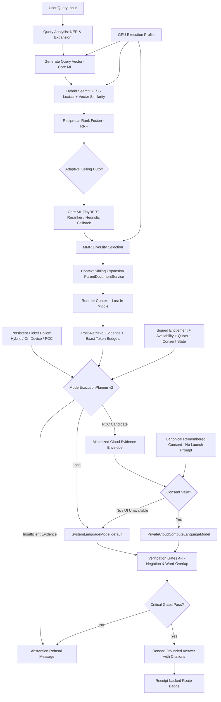

# Retrieval Pipeline — OpenIntelligence v4.6

> **Documentation status:** Source-verified on 2026-07-15; PCC device/distribution validation remains pending.
> **Source of truth:** Codebase audit in `Docs/AUDIT/`.
> **Scope:** Describes shipped behavior unless explicitly labeled experimental, developer-only, or scaffolded.

---

## 1. Overview
The retrieval pipeline is the core engineering idea in OpenIntelligence: answers are grounded in user-provided material and expose the exact evidence that influenced them. The app is built to bias responses toward groundedness, showing uncertainty when evidence is weak rather than inventing confident prose.

---

## 2. RAG Retrieval Flow

---

## 3. Pipeline Stages

1. **Import**: Files enter through Apple platform document workflows.
2. **Extraction**: Text, layout, and metadata are extracted.
3. **Chunking**: Chunks are generated with metadata using semantic and structure-aware rules.
4. **Indexing**: Chunks are written into local search (SQLite FTS5) and vector databases ([BNNSVectorDatabase.swift](file:///Users/gunnarhostetler/Documents/GitHub/OpenIntelligence/OpenIntelligence/Services/VectorStore/BNNSVectorDatabase.swift)).
5. **Query Analysis & Planning**: Incoming questions are classified, scoped, and prepared for retrieval.
6. **Retrieval**: Candidate chunks are selected from the active library or workspace container.
7. **Reranking and Packing**: Evidence is scored using a local Core ML TinyBERT cross-encoder (with proximity-based heuristic fallback if the model is absent), deduplicated (MMR), expanded with sibling context, and compressed.
8. **Post-Retrieval Model Routing & Generation**: `ModelExecutionPlanner` combines evidence sufficiency and synthesis burden with the captured persistent policy, foreground state, network, signed entitlement, live quota/availability, and SDK token/context budgets. Hybrid chooses per query, On-Device is local-only, and explicit PCC requests cloud but records a truthful local completion when any cloud gate prevents use. Local execution uses `SystemLanguageModel.default`; eligible iOS/macOS 27 synthesis may use native PCC after the exact minimized envelope is consented. iOS/macOS 26 remains local-only. `[evidence_level: code_verified, confidence: high_pending_physical_device_validation, evidence_source: ChatScreen.swift, ModelExecutionPlanner.swift, LLMService.swift, RAGService.swift]`
9. **Fidelity Verification & Receipt**: Responses pass through local verification checks. Route metadata is persisted as a `ModelExecutionReceipt` that separates intended, attempted, actual, fallback, and completed targets. `[evidence_level: code_verified, confidence: high, evidence_source: VerificationGateService.swift, ModelExecutionReceipt.swift, RAGQuery.swift]`
10. **Presentation**: Answers are shown with liquid glass UI indicators, citations, quality gauges, and review affordances.
11. **Continuous Evaluation**: Pipeline stages are run against local JSONL benchmarks and verified against quality targets (e.g. Recall@5 $\ge 0.85$, Citation Precision $\ge 0.90$) using the native Evaluations harness.

---

## 4. Library Isolation
Library and workspace boundaries are critical because retrieval quality depends on scope. The app is designed so that a query is answered strictly against the user-selected document container rather than all files indiscriminately, preventing cross-container leakage.

---

## 5. Diagnostics & Telemetry
Diagnostic and telemetry surfaces are included for inspecting chunks, retrieval quality, answer details, and pipeline behavior. These are engineering tools for iteration and must not be interpreted as validation for regulated or safety-critical workflows.
