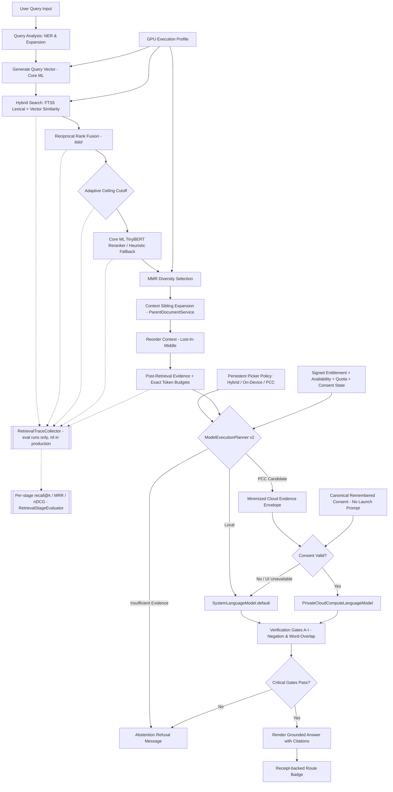

# Retrieval Pipeline — source-verified at v4.6, shipped tree is v4.9

> **Documentation status:** Source-verified on 2026-07-15 against v4.6. **Not re-verified since.** iOS/macOS 4.9 is the shipped version, and 4.8–4.9 changed retrieval behavior in ways this document does not yet describe. PCC device/distribution validation remains pending.
> **Known drift as of 2026-08-05** — each of these is in `CHANGELOG.md` under 4.9 but not yet reflected below:
> - Gate E measures query coverage as the better of combined-evidence and best-single-chunk, not the per-chunk maximum.
> - `DomainIsolationService` relaxes only the cross-domain-mixing clause when the retrieved chunks all come from one `documentId`.
> - `executeReasoningChain` retries the user's original wording when a rewrite fuses zero chunks, before any downstream relevance gate judges the library.
> - `makePostRetrievalModelPlan` takes the maximum similarity over the chunk set rather than reading `chunks.first`, which is not the best chunk after MMR, expansion, and Lost-in-the-Middle reordering.
> **Source of truth:** Codebase audit in `Docs/AUDIT/`, plus `CHANGELOG.md` 4.8–4.9 for anything retrieval-related.
> **Scope:** Describes shipped behavior unless explicitly labeled experimental, developer-only, or scaffolded.

---

## 1. Overview
The retrieval pipeline is the core engineering idea in OpenIntelligence: answers are grounded in user-provided material and expose the exact evidence that influenced them. The app is built to bias responses toward groundedness, showing uncertainty when evidence is weak rather than inventing confident prose.

---

## 2. RAG Retrieval Flow

---

## 3. Pipeline Stages

1. **Import**: Files enter through Apple platform document workflows.
2. **Extraction**: Text, layout, and metadata are extracted.
3. **Chunking**: Chunks are generated with metadata using semantic and structure-aware rules.
4. **Indexing**: Chunks are written into local search (SQLite FTS5) and vector databases ([BNNSVectorDatabase.swift](file:///Users/gunnarhostetler/Documents/GitHub/OpenIntelligence/OpenIntelligence/Services/VectorStore/BNNSVectorDatabase.swift)).
5. **Query Analysis & Planning**: Incoming questions are classified, scoped, and prepared for retrieval.
6. **Retrieval**: Candidate chunks are selected from the active library or workspace container.
7. **Reranking and Packing**: Evidence is scored using a local Core ML TinyBERT cross-encoder (with proximity-based heuristic fallback if the model is absent), deduplicated (MMR), expanded with sibling context, and compressed.
8. **Post-Retrieval Model Routing & Generation**: `ModelExecutionPlanner` combines evidence sufficiency and synthesis burden with the captured persistent policy, foreground state, network, signed entitlement, live quota/availability, and SDK token/context budgets. Hybrid chooses per query, On-Device is local-only, and explicit PCC requests cloud but records a truthful local completion when any cloud gate prevents use. Local execution uses `SystemLanguageModel.default`; eligible iOS/macOS 27 synthesis may use native PCC after the exact minimized envelope is consented. iOS/macOS 26 remains local-only. `[evidence_level: code_verified, confidence: high_pending_physical_device_validation, evidence_source: ChatScreen.swift, ModelExecutionPlanner.swift, LLMService.swift, RAGService.swift]`
9. **Fidelity Verification & Receipt**: Responses pass through local verification checks. Route metadata is persisted as a `ModelExecutionReceipt` that separates intended, attempted, actual, fallback, and completed targets. `[evidence_level: code_verified, confidence: high, evidence_source: VerificationGateService.swift, ModelExecutionReceipt.swift, RAGQuery.swift]`
10. **Presentation**: Answers are shown with liquid glass UI indicators, citations, quality gauges, and review affordances.
11. **Continuous Evaluation**: `RAGEvalRunner` runs the cases in `Benchmarks/rag_eval_v1.jsonl` through the live pipeline and scores answer match, retrieval recall, citation precision and abstention.

    **Corrected 2026-08-08.** This item previously read "verified against quality targets (e.g. Recall@5 $\ge 0.85$, Citation Precision $\ge 0.90$) using the native Evaluations harness". Two parts of that were untrue and are withdrawn rather than deleted, so the record shows what was claimed. The `\ge 0.85` recall gate was never met and could not be: `retrievalRecallAt5` returned exactly `0.0` on every run regardless of retrieval quality, because the runner only scored recall when a case supplied `groundTruthChunkIds` and every committed case carries `null` there. And there is no native Evaluations harness: `AppleEvaluationsBridge.swift` is named for Apple's Evaluations framework but imports only `Foundation` and `FoundationModels`. `[evidence_level: code_verified, confidence: exact, evidence_source: AppleEvaluationsBridge.swift imports, Benchmarks/rag_eval_v1.jsonl all 20 records, CHANGELOG.md 4.9]`

12. **Per-stage retrieval measurement** *(added 2026-08-08)*: A `RetrievalTraceCollector` may be attached to a query. It records the rank-ordered output of each retrieval stage, and `RetrievalStageEvaluator` scores recall@1/3/5/10, MRR, nDCG@5/10 and precision@5 **per stage** rather than once at the end.

    Seven stages, in pipeline order: `vector`, `lexical`, `fusion`, `boosted`, `candidates`, `rerank`, `final`. The first five are recorded by `HybridSearchService` in both its search paths; `rerank` is recorded by `RAGService` after `RAGEngine.rerank`, because that is where reranking runs; `final` is recorded at the `queryWithAudit` boundary from the chunks on the response.

    The split matters for attribution. Reranking cannot recover a chunk the first stage never returned, so a single end-of-pipeline number cannot tell a first-stage regression from a reranker regression, and a later stage can mask an earlier one. A recall drop between `boosted` and `candidates` means top-K truncation is too tight; a drop between `candidates` and `rerank` means the cross-encoder demoted the right chunk.

    **That last inference holds only when ground truth credits every document the question requires, and on 2026-08-11 it did not.** `scripts/build_eval_dataset.py` emitted a single-element `expectedCitations` from the manifest's singular `expected_source`, and `scripts/run_quality_matrix.py` passed that one filename to the harness. All five `multi_hop_project_m*` cases ask a two-part question whose halves live in different fixtures, so ranking the *other* required document first scored as a demotion. That produced `rerank` MRR@10 0.972 and `final` 0.917 against a `vector` stage at 1.000, and the arithmetic closed exactly at `(17 + 0.5)/18` and `(15 + 1.5)/18` while all five cases answered correctly. The reranker was not demoting anything. Both scripts now read a plural `expected_sources`, falling back to the singular key, and the manifest carries both filenames for those five cases. **Before attributing a late-stage drop to the reranker, check that every case in play credits all of its required documents.** `[evidence_level: measured+code_verified, confidence: exact, evidence_source: BenchmarkRuns/20260811-133233-matrix/results.json, build_eval_dataset.py, run_quality_matrix.py, tiny_research_suite/manifest.json]`

    The collector is one instance per query, passed explicitly as a defaulted parameter. It is `nil` in production, where the only cost is a nil check per stage. It is deliberately not a shared sink: retrieval runs concurrent child tasks, and a process-wide collector would interleave stages from overlapping queries with no way to separate them. `[evidence_level: code_verified, confidence: exact, evidence_source: RetrievalTraceCollector.swift, HybridSearchService.swift, RAGService.swift, RetrievalStageMetrics.swift]`

---

## 4. Library Isolation
Library and workspace boundaries are critical because retrieval quality depends on scope. The app is designed so that a query is answered strictly against the user-selected document container rather than all files indiscriminately, preventing cross-container leakage.

---

## 5. Diagnostics & Telemetry
Diagnostic and telemetry surfaces are included for inspecting chunks, retrieval quality, answer details, and pipeline behavior. These are engineering tools for iteration and must not be interpreted as validation for regulated or safety-critical workflows.
