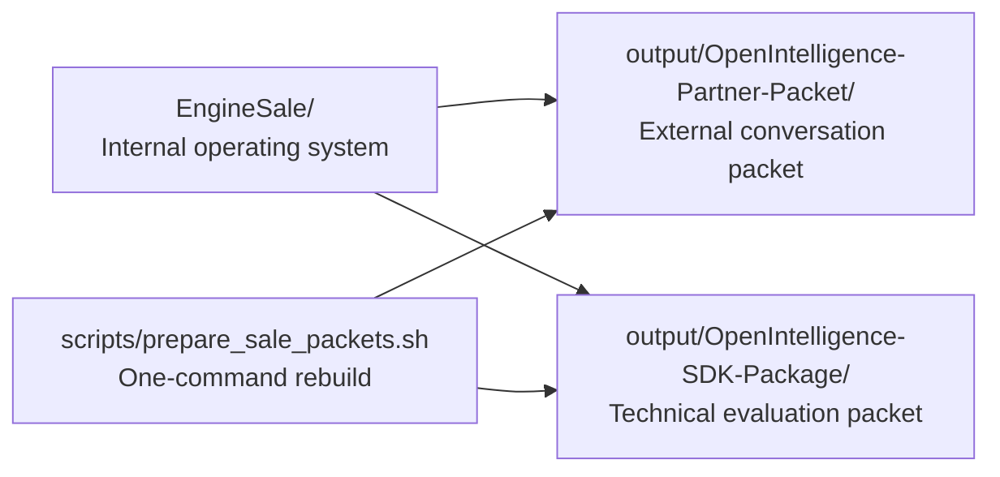

# EngineSale Control Tower

This folder is the internal control tower for the sellable-engine lane.

It exists to answer three questions fast:

1. What is this repo saying externally?
2. What should be pushed versus kept local?
3. Which packet does a buyer actually see?

## One-Screen Push Rule

| Bucket                               | Push?                             | What belongs there                                                                                       | Why                                                                                               |
| ------------------------------------ | --------------------------------- | -------------------------------------------------------------------------------------------------------- | ------------------------------------------------------------------------------------------------- |
| Durable sale system                  | Yes                               | `EngineSale/`, packet docs under `output/`, packet scripts under `scripts/`                              | These are the repeatable operating system and packet source of truth.                             |
| Staged evaluation artifact           | Yes, when refreshed intentionally | `output/OpenIntelligence-SDK-Package/OpenIntelligenceEngine.xcframework/` and packet-local support files | This repo currently versions the evaluation packet itself, not just the code that can rebuild it. |
| Generated sendable bundles           | No                                | `output/OpenIntelligence-SDK-Package/build/`, `output/OpenIntelligence-Partner-Packet/build/`            | These are local export artifacts that can be regenerated at any time.                             |
| Buyer-specific or sensitive material | No                                | signed agreements, buyer names, negotiated side terms, credentials, provisioning assets, API keys        | Private repo is still the wrong place for live deal paper and secrets.                            |
| Mixed unrelated app work             | No, not in a sale commit          | app feature diffs, product experiments, benchmark churn unrelated to the packet                          | Keep sale commits readable and explainable.                                                       |

## Folder Map

| Path                                      | Audience            | What it does                                                                |
| ----------------------------------------- | ------------------- | --------------------------------------------------------------------------- |
| `EngineSale/`                             | Internal only       | Messaging, diligence framing, handoff process, claim guardrails.            |
| `output/OpenIntelligence-Partner-Packet/` | Buyer-facing        | The docs packet for real conversations, pilots, and scope discussions.      |
| `output/OpenIntelligence-SDK-Package/`    | Technical evaluator | The staged evaluation packet, sample app, and current XCFramework artifact. |
| `scripts/prepare_sale_packets.sh`         | Internal operator   | Rebuilds both sale packets in one pass.                                     |
| `scripts/build_partner_packet_bundle.sh`  | Internal operator   | Creates the docs-only partner zip.                                          |
| `scripts/prepare_engine_buyer_packet.sh`  | Internal operator   | Rebuilds the technical buyer packet from current source.                    |
| `scripts/validate_sdk_package.sh`         | Internal operator   | Checks that the staged SDK packet is complete before sharing.               |

## Commit Rule

Push a change when it does at least one of these:

- explains the engine more honestly or clearly
- improves buyer qualification, diligence, or transfer flow
- rebuilds, validates, or documents the staged evaluation packet
- keeps sale materials aligned to the current release line

Keep a change out of git when it is:

- a generated zip or local export
- buyer-specific negotiation material
- a secret or account credential
- scratch analysis that is not part of the durable sale system

## Best Reading Order

1. `SALE_OPERATING_SYSTEM.md`
2. `INBOUND_MESSAGE_TEMPLATES.md`
3. `HANDOFF_CHECKLIST.md`
4. `ENGINE_INVENTORY.md`
5. `../output/OpenIntelligence-Partner-Packet/README.md`
6. `../output/OpenIntelligence-SDK-Package/START_HERE.md`

## Practical Rule

If a future `git status` looks messy, ask one question:

Does this help explain, validate, or regenerate the sale packets from current source?

If yes, it probably belongs in the sale lane.
If no, it is probably noise, local export output, or unrelated product work.
