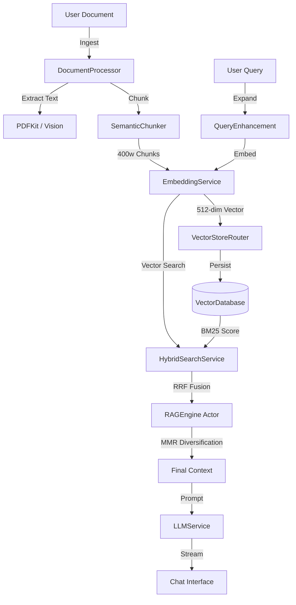

# OpenIntelligence

[](https://developer.apple.com/ios/)
[](https://swift.org)
[](LICENSE)
[](Docs/reference/ARCHITECTURE.md)

**Privacy-first RAG for iOS.** Import documents, ask questions, and receive grounded answers powered by advanced hybrid search and on-device intelligence.

OpenIntelligence is a reference implementation of a production-grade **Retrieval-Augmented Generation (RAG)** pipeline on iOS. It demonstrates how to orchestrate local LLMs, vector databases, and hybrid search algorithms (BM25 + Vector + RRF) in a highly concurrent, memory-safe Swift environment.

---

## 🚀 Key Features

- **Privacy by Design**: All processing happens on-device by default. Optional Private Cloud Compute (PCC) with cryptographic zero-retention.
- **Hybrid Search Engine**: Combines **BM25** (keyword) and **Vector Search** (semantic) using **Reciprocal Rank Fusion (RRF)** and **Maximal Marginal Relevance (MMR)** for diverse, high-quality retrieval.
- **Multi-Model Support**:
  - **Apple Intelligence**: Foundation Models with PCC fallback.
  - **Local GGUF**: Run Llama 3, Mistral, etc., directly on-device via `llama.cpp`.
  - **Core ML**: Native Neural Engine acceleration.
  - **OpenAI**: Optional API integration for macOS/testing.
- **Agentic Tooling**: 12+ `@Tool` decorated functions allowing the LLM to search, summarize, and analyze your library.
- **Observability**: Real-time telemetry badges (📱/☁️/🔑), execution timers (TTFT), and vector space visualization.

---

## 🏗 Architecture

OpenIntelligence uses a **Protocol-First** architecture with strict **Actor Isolation** to handle heavy RAG workloads without blocking the main thread.

### Data Flow Pipeline



### Core Components

| Component | Responsibility | Implementation Details |
|-----------|----------------|------------------------|
| **`RAGService`** | Orchestration | `@MainActor` singleton. Manages state, ingestion, and routing. |
| **`RAGEngine`** | Math & Logic | `actor`. Offloads BM25 scoring, RRF fusion, and MMR to background threads. |
| **`VectorStoreRouter`** | Storage Access | Manages container-isolated `PersistentVectorDatabase` instances. |
| **`LLMService`** | Generation | Protocol with 6 implementations (Apple FM, GGUF, OpenAI, etc.). |
| **`SemanticChunker`** | Pre-processing | Intelligent splitting with topic boundary detection and overlap. |

---

## 🛠 Getting Started

### Prerequisites

- **Xcode 26+** (Required for Swift 6)
- **iOS 26.0+** (Minimum deployment)
- **Device**: iPhone 15 Pro or newer recommended for local inference.

### Installation

1. **Clone the repository**:

   ```bash
   git clone https://github.com/yourusername/OpenIntelligence.git
   cd OpenIntelligence
   ```

2. **Open in Xcode**:

   ```bash
   open OpenIntelligence.xcodeproj
   ```

3. **Build & Run**:
   - Select the **OpenIntelligence** scheme.
   - Destination: **iPhone 17 Pro Max** (Simulator) or physical device.
   - Press `Cmd+R`.

### Troubleshooting

If you encounter build issues or UI glitches, run the clean script:

```bash
./clean_and_rebuild.sh
```

---

## 📖 Usage Guide

### 1. Ingestion

Navigate to the **Documents** tab. Drag and drop PDFs, Markdown, or Text files. The app will:

- **Parse** text using PDFKit or Vision OCR.
- **Chunk** content into 400-word segments.
- **Embed** chunks using the on-device `NLEmbedding` model.
- **Index** for both vector and keyword search.

### 2. Chat & Retrieval

Go to the **Chat** tab. Ask questions about your documents.

- **Telemetry Badges**:
  - 📱 **On-Device**: Inference ran locally.
  - ☁️ **PCC**: Private Cloud Compute was used.
  - 🔑 **API**: External API (e.g., OpenAI) was used.
  - 🔧 **Tools**: Shows how many agent tools were called.
- **Citations**: Tap any citation to view the source chunk.

### 3. Model Configuration

In **Settings**, choose your AI backend:

- **Apple Intelligence**: Best for privacy and integration.
- **GGUF Local**: Download models like Llama 3.2 directly in the app.
- **OpenAI**: Requires an API key (stored in Keychain).

---

## 📂 Project Structure

```text
OpenIntelligence/
├── App/                    # Entry point and configuration
├── Models/                 # Shared data structures (RAGQuery, Chunk)
├── Services/               # Core business logic
│   ├── RAG/                # RAGService, RAGEngine, HybridSearch
│   ├── LLM/                # LLMService implementations
│   ├── Ingestion/          # DocumentProcessor, SemanticChunker
│   └── Storage/            # VectorDatabase, ModelRegistry
├── Views/                  # SwiftUI Views
│   ├── Chat/               # Chat interface components
│   ├── Documents/          # Document management
│   └── Telemetry/          # Debug dashboards
└── Resources/              # Assets and Localizations
```

---

## 🤝 Contributing

Contributions are welcome! Please follow these steps:

1. **Fork & Clone**: Create your own fork of the repository.
2. **Branch**: Create a feature branch (`git checkout -b feature/amazing-feature`).
3. **Implement**: Write clean, Swift 6 compliant code. Prefer `actor` isolation for heavy tasks.
4. **Test**:
   - Run the **Smoke Test** procedure outlined in [`smoke_test.md`](smoke_test.md).
   - Verify no regressions in the Telemetry Dashboard.
5. **Pull Request**: Submit a PR with a clear description of changes.

### Coding Standards

- **Concurrency**: Use `Task`, `actor`, and `await`. Avoid GCD (`DispatchQueue`) unless absolutely necessary.
- **Privacy**: Never send user data to the cloud without explicit, logged consent.
- **Documentation**: Update `Docs/reference/` if changing architecture.

---

## 📄 License

This project is licensed under the MIT License - see the [LICENSE](LICENSE) file for details.
