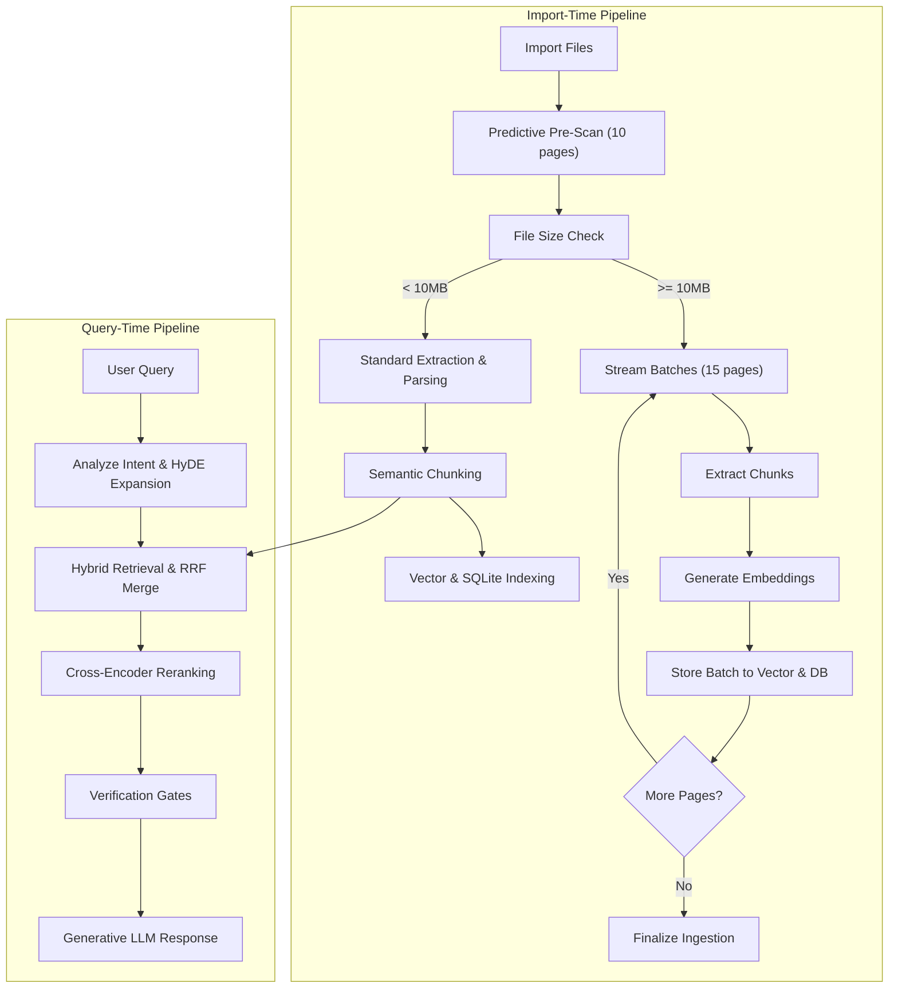

# OpenIntelligence

> **Documentation status:** Source-verified for OpenIntelligence v4.8 on July 30, 2026. Native PCC execution is owner-confirmed on a physical device; PCC edge scenarios and signed-distribution validation remain pending.
> **Scope:** Describes shipped behavior for on-device Apple Intelligence RAG architecture.
> **Recent correction:** Deep Think and Maximum carried two defects fixed on 2026-07-30 — their reasoning chain abstained on every session and contributed nothing, and the model picker did not reach their routing at all. Both are fixed and device-verified for the first; see `Docs/AUDIT/QUALITY_MODE_VERIFICATION_2026-07-30.md`. Claims about those modes below describe behavior as of commit `6f29d2d`.

<p align="center">
   
</p>

<p align="center">
   <strong>Local-first document intelligence for macOS and iOS, featuring an entirely on-device Retrieval-Augmented Generation (RAG) pipeline and native Apple Foundation Models integration.</strong>
</p>

<p align="center">
   <a href="https://apps.apple.com/us/app/openintelligence/id6756559175"></a>
   <a href="Docs/DEMO.md"></a>
   <a href="Docs/OPENINTELLIGENCE_ARCHITECTURE_ATLAS.md"></a>
   <a href="https://gunzino.notion.site/OpenIntelligence-Public-Roadmap-e4446012bb8940e6b78a745aee688075"></a>
</p>

OpenIntelligence is an exploratory, privacy-obsessed document query assistant built natively for Apple platforms. Document ingestion, vector indexing, lexical retrieval, planning, and verification remain on device. On iOS/macOS 27+, optional final synthesis may use Apple Private Cloud Compute only after entitlement evidence, capability, quota, minimization, and consent gates pass. The platform-specific entitlement path is generic arm64 iPhoneOS compile-verified, and no third-party cloud wrapper is used. Signed-installation PCC validation remains pending. `[evidence_level: build_verified, confidence: high_for_source_unverified_for_device, evidence_source: EngineSDKCompatibility.swift, ModelExecutionPlanner.swift, RAGService.swift, FoundationModelCapabilityProvider.swift]`

GPU-capable work is configured through four execution profiles rather than a fake utilization percentage. The persisted profile gates PDF rendering, Core ML compute preferences at model reload boundaries, sufficiently large Metal vector/MMR operations, and background GPU eligibility; Apple frameworks still choose the final hardware route. Remembered PCC consent persists canonically, and the app requests it only for a real finalized evidence envelope—not during launch. `[evidence_level: code_verified+test_verified, confidence: high_pending_physical_device_validation, evidence_source: DeviceCapabilityService.swift, SettingsStore.swift, RAGService.swift, RAGEngine.swift, BNNSVectorDatabase.swift]`

The chat model picker is a persistent routing policy: Hybrid chooses per query, On-Device never selects PCC, and PCC requests native PCC with a declared on-device fallback when a cloud gate or quota prevents execution. The picker does not mutate to the last route. Each Apple-model answer renders its actual completed route from durable receipt metadata as an on-device, PCC, or on-device-fallback badge.

That policy held only in Standard until 2026-07-30. In Deep Think and Maximum the picker was inert: `AgenticOrchestrator.generateWithProperConsent` built a fresh `InferenceConfig` carrying only maxTokens, temperature, and systemPrompt, so `fmPreference`, `executionContext`, and `allowPrivateCloudCompute` all fell back to defaults. Three device runs — one per picker setting — were identical in routing, and an On-Device selection still sent a minimized evidence envelope to PCC. The cloud-consent gate was never bypassed (a `.denied` consent state genuinely blocked PCC, and the runs show a remembered grant), but the picker itself did not restrict routing. Fixed in `6f29d2d`: the user's selection is now captured per query and applied to the config before planning, so On-Device is absolute and covers synthesis. `[evidence_level: device_verified_for_the_defect+build_verified+test_verified_for_the_fix, confidence: high_for_the_defect_unverified_on_device_for_the_fix, evidence_source: PCC/On-Device/Hybrid device logs 2026-07-30, ChatScreen.swift, AgenticOrchestrator.swift, RAGService.swift]`

The floating Silicon HUD resolves geometry from its owning iOS window scene rather than a deprecated process-global screen, so restored and dragged positions stay associated with the active display. `[evidence_level: build_verified+code_verified, confidence: exact_for_build, evidence_source: MotherboardHUDView.swift and generic iOS 27 simulator build 2026-07-16]`

Interrupted ingestion is recoverable, but user dismissal is authoritative: queue discards sync deletion-wins markers, and automatic empty-index repair remains suppressed for that library on the current device until the user explicitly imports or requests a rebuild. `[evidence_level: code_verified, confidence: high_pending_runtime_validation, evidence_source: RAGService.swift, WorkspaceSyncService.swift, IngestionQueueOverlay.swift]`

---

## 📚 Rigorous Engineering Documentation

OpenIntelligence is backed by extensive, rigorous engineering documentation detailing how reliable, hallucination-resistant on-device RAG is achieved using Apple's 4K-token local context windows.

### 🗺️ Documentation Atlas
* [**Documentation Atlas (`Docs/README.md`)**](Docs/README.md): The unified index of all verified codebase audits, pipeline specs, and technical research sheets. Start here to navigate the documentation.

### Core Architecture & Systems
* [**System Architecture**](Docs/OPENINTELLIGENCE_ARCHITECTURE_ATLAS.md): The high-level view of the decoupled import-time and query-time pipelines.
* [**Retrieval Pipeline (`RETRIEVAL_PIPELINE.md`)**](Docs/RETRIEVAL_PIPELINE.md): Deep dive into the hybrid search engine (BM25 + Core ML Vector) and Reciprocal Rank Fusion implementation.
* [**Ingestion Pipeline (`INGESTION_PIPELINE.md`)**](Docs/INGESTION_PIPELINE.md): Details of the semantic chunker, local Vision OCR fallbacks, and NLP metadata extraction.
* [**Privacy & Routing (`PRIVACY_AND_ROUTING.md`)**](Docs/PRIVACY_AND_ROUTING.md): Strict local-first data guarantees, local cache layouts, and routing protocols.

### Apple Intelligence Engineering Specs
* [**Apple Foundation Models Specs**](Docs/Engineering/APPLE_MODELS.md): Optimization guide for macOS/iOS 26.x/27, managing 4K token budgets, guided generation via `@Generable`, and `SystemLanguageModel` sessions.
* [**Apple Document Intelligence**](Docs/Engineering/APPLE_DOCUMENT_INTELLIGENCE.md): Practical integration with Vision OCR, SFSpeechRecognizer, PDFKit, and CoreText for semantic document parsing.
* [**Private Cloud Compute (PCC)**](Docs/Engineering/PRIVATE_CLOUD_COMPUTE.md): Analysis of Apple's PCC enclave constraints, secure remote processing, and native execution routing layers.

### Audits & Constraints
* [**Hard Limits**](Docs/Engineering/HARD_LIMITS.md): A centralized reference for token boundaries, model caps, memory limitations, and platform bottlenecks.
* [**Current State & Gaps**](Docs/CURRENT_STATE_AND_GAPS.md): Analysis of local inference latency, context packing, and model capability gaps.
* [**Evaluation Framework**](Docs/EVALS.md): Detailed verification procedures using `scripts/run_rag_benchmarks.py` to assert extraction accuracy and similarity scores.

### Agent Workspace Operations
* [**RepoOS Command Center**](Docs/RepoOS/00_REPO_COMMAND_CENTER.md): Routes repository work through canonical evidence, safe edit boundaries, required tests, documentation synchronization, and release gates.
* [**OpenIntelligence RepoOS Skill**](.codex/skills/route-openintelligence-work/SKILL.md): Gives Codex a repository-local task navigation layer backed by the live change-impact matrix, explicit Notion relevance checks, and active-release-aware changelog and release-notes targets. `[evidence: code_verified, exact, .codex/skills/route-openintelligence-work/scripts/repoos_router.py]`

---

## ⚙️ Technical Architecture Overview

The runtime operates in two decoupled phases:


```mermaid
flowchart TD
  subgraph INGEST["Import-Time Pipeline"]
    A1["Import Files"]
    SCAN["Predictive Pre-Scan (10 pages)"]
    A1 --> SCAN
    SCAN --> A2["File Size Check"]
    A2 -- "< 10MB" --> A3["Standard Extraction & Parsing"]
    A3 --> A4["Semantic Chunking"]
    A4 --> A5["Vector & SQLite Indexing"]
    
    A2 -- ">= 10MB" --> S1["Stream Batches (15 pages)"]
    S1 --> S2["Extract Chunks"]
    S2 --> S3["Generate Embeddings"]
    S3 --> S4["Store Batch to Vector & DB"]
    S4 --> S5{"More Pages?"}
    S5 -- "Yes" --> S1
    S5 -- "No" --> S6["Finalize Ingestion"]
  end

  subgraph QUERY["Query-Time Pipeline"]
    B1["User Query"]
    B2["Analyze Intent & HyDE Expansion"]
    B3["Hybrid Retrieval & RRF Merge"]
    B4["Cross-Encoder Reranking"]
    B5["Verification Gates"]
    B6["Generative LLM Response"]
    B1 --> B2 --> B3 --> B4 --> B5 --> B6
  end

  A4 --> B3
```

### 🧠 Quality Modes & Inference Routing
The entire RAG architecture operates on a strict **29-Step Pipeline** (6 Ingestion steps + 23 Query Loop steps). To handle complex queries, the query loop routes dynamically across three agentic modes and foundation models:

#### 3 Agentic Quality Modes
* **Standard:** Executes the 23-step query loop sequentially for maximum speed and battery life. The only mode with a measured accuracy baseline: **80% over 20 ground-truthed cases, zero hallucinations** (local-only, 2026-07-30).
* **Deep Think:** Runs **4–8 sequential reasoning sessions** over rotating context windows, passing compressed insights forward, then synthesizes. Sessions are serial, not concurrent — each one's prompt contains the prior findings. The chain stops early when accumulated confidence reaches its threshold, and is capped at `maxConfidence` 0.95. Measured end-to-end on a physical A18 Pro: ~99s for an 8-session run, of which ~65s is on-device generation.
* **Maximum:** Removes the 8-session ceiling, granting the orchestrator an unlimited budget to recursively hunt down answers up to 50 loops, with `maxConfidence` 0.98. Shares `executeReasoningChain` with Deep Think; not separately device-verified since the 2026-07-30 fixes.

> Neither Deep Think nor Maximum yet has a score against `Benchmarks/rag_eval_v1.jsonl`. Until 2026-07-30 their reasoning chain produced nothing, so the question this architecture exists to answer — *does more compute buy more correctness?* — remains open. Do not cite a Deep Think accuracy figure; none has been measured.

#### 2 Public Foundation Model Targets
* **On-Device Apple Intelligence:** `SystemLanguageModel.default` executes retrieval-adjacent analysis and any synthesis that fits the live SDK context budget. OpenIntelligence does not claim a separately selectable 3B, 20B, or Advanced runtime because the installed public SDK exposes no such model selector.
* **Private Cloud Compute:** On iOS/macOS 27+, the post-retrieval planner may select `FoundationModels.PrivateCloudComputeLanguageModel` for an evidence-sufficient long-context or multi-document synthesis. The app checks its signed PCC entitlement, live availability, quota, network, foreground/consent state, and exact context budget; only a minimized evidence envelope crosses the PCC boundary. iOS/macOS 26 remains local-only.

Each response can carry a durable route receipt separating the intended, attempted, actual, fallback, and completed targets. Retrieval and verification remain local regardless of synthesis target. `[evidence_level: code_verified, confidence: high, evidence_source: ModelExecutionPlanner.swift, RAGService.swift, LLMService.swift]`

---

## 🗺️ Codebase Map

| Module | Core Files | Responsibility |
| :--- | :--- | :--- |
| **Ingestion** | `DocumentProcessor.swift`, `LayoutAwareExtractor.swift` | Document content extraction, Vision OCR fallback, semantic structure recovery. |
| **Chunking** | `SemanticChunker.swift`, `ContentTaggingService.swift` | Context-aware document chunking, entity resolution, NLP metadata enrichment. |
| **Indexing** | `SQLiteFullTextService.swift`, `BNNSVectorDatabase.swift` | SQLite FTS5 lexical storage and local BNNS-accelerated vector indexing. |
| **Retrieval** | `HybridSearchService.swift`, `ContextPackingService.swift` | BM25 + Vector hybrid merging, parent-chunk reconstruction, exact token packing. |
| **Orchestration** | `RAGEngine.swift`, `AgenticOrchestrator.swift` | Reranking, MMR, context packing, execution coordination, and closed-loop agentic reasoning. |
| **Foundation Models**| `LLMService.swift`, `FoundationModelRoutePolicy.swift` | On-device SLM context execution, Private Cloud Compute escalation, and routing. |
| **Evidence Threads**| `EvidenceThread.swift`, `EvidenceThreadStore.swift` | Thread-safe local persistence of conversational research queries and verification results. |
| **Storage & Sync**| `SettingsStore.swift`, `EntitlementStore.swift` | Persistence of feature gates, StoreKit 2 quotas, and iCloud ubiquity container sync. |
| **User Interface**| `ChatScreen.swift`, `DocumentLibraryView.swift` | Primary SwiftUI surfaces for conversational RAG queries and library document management. |
| **Shortcuts** | `RAGAppIntents.swift`, `ScreenAwarenessIntents.swift` | Siri voice integration and entity-native App Intents resolving in-process. |
| **Diagnostics** | `EvidenceThreadDebugService.swift` | Developer-only view and helper service to test local persistent store integrity. |

---

## 🛠️ Placeholders & Scaffolding Warnings

To maintain codebase transparency, please note:
* **Core AI Integration:** Fully integrated and registered via `CoreAISentenceEmbeddingProvider.swift`. Runs zero-copy Silicon-native sentence embeddings on iOS 27+ / macOS 27+ compatible devices, automatically falling back to the standard `CoreMLSentenceEmbeddingProvider` on older targets. Powered by a unified, high-performance Rust-backed `swift-tokenizers` (DePasqualeOrg) wrapper target for microsecond-latency batch tokenization and exact byte-level offset matching.
* **Private Cloud Compute (PCC):** Apple approved the managed entitlement on 2026-07-15 and the source entitlement is enabled. Native PCC execution is owner-confirmed on a physical iOS 27 device — PCC actually runs rather than silently falling back on-device. Still unverified: live quota-exhaustion behavior, mid-stream network-transition fallback, background/App Intent consent, and Archive/TestFlight distribution signatures. `[evidence_level: user_confirmed+code_verified, confidence: high_for_execution_path_unverified_for_edge_scenarios, evidence_source: OpenIntelligence.entitlements, owner device testing 2026-07-28]`
* **iCloud Sync:** Sync utilizes iCloud Drive ubiquity containers (`NSFileCoordinator` and `NSMetadataQuery`). The app does not utilize CloudKit databases.
* **Pro Tier Document Limit:** Document uploads are restricted to a hard quota of 1,000 documents under the Pro tier. Unlimited uploads are restricted to the Lifetime tier.
* **Evidence Thread Synchronization:** Thread history JSON arrays are stored under `Application Support/EvidenceThreads/<containerId>/` and are synchronized bidirectionally across devices via `WorkspaceSyncService` in iCloud Drive, gated by tier-specific limits (5 Free / 20 Pro / Unlimited Lifetime).

---

## 🚀 Build & Verification

### Requirements
* macOS Tahoe (26.x) with Xcode 26+
* iOS 26.0+ SDK target support
* Apple Silicon (M1+ / A17 Pro+) for adequate Neural Engine throughput

### Instructions
1. Clear macOS extended attributes to prevent codesign failure:
   ```bash
   /usr/bin/xattr -cr /Users/gunnarhostetler/Documents/GitHub/OpenIntelligence
   ```
2. Compile the simulator smoke target:
   ```bash
   ./scripts/build_simulator_smoke.sh
   ```
3. Execute the quality-mode benchmark matrix (all 20 cases × each quality mode):
   ```bash
   python3 scripts/run_quality_matrix.py
   ```
   PCC is denied by default so runs are reproducible offline; results separate `Measured` from `Unmeasured` rather than scoring an empty run as a failure.

4. Check for iCloud conflict copies before any signing work:
   ```bash
   ./scripts/check_icloud_conflicts.sh
   ```

---

## License
OpenIntelligence is open-source software. See [LICENSE](LICENSE) for details.

---

## Document Ingestion Optimization

OpenIntelligence supports massive documents (500+ pages) through an end-to-end streamed and batched ingestion pipeline, preventing OOM crashes during CoreImage text-layer rendering and LLM embedding generation.
