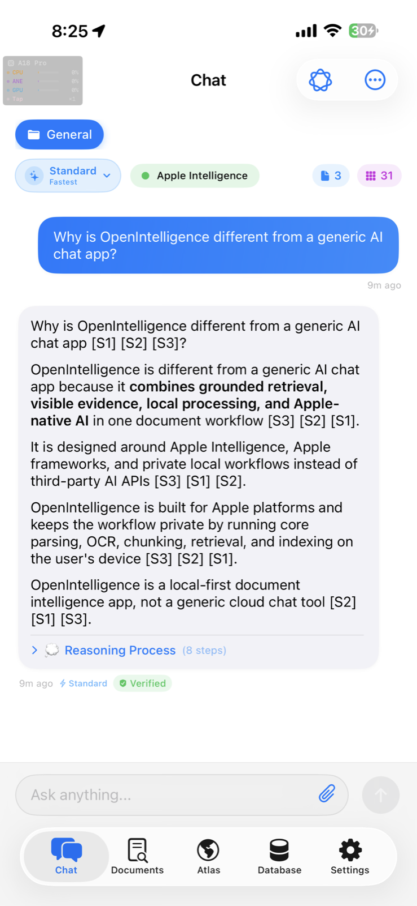
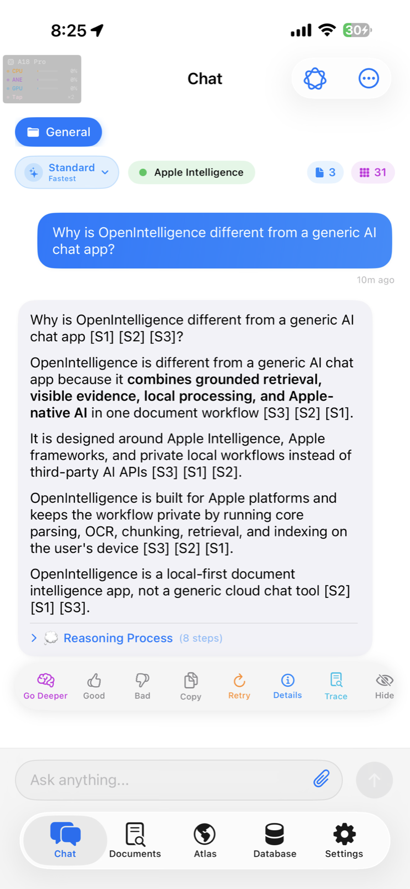
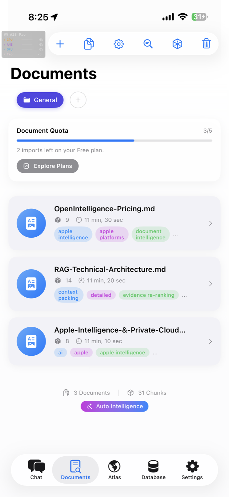

<p align="center">
   
</p>

<h1 align="center">OpenIntelligence</h1>

<p align="center">
   <strong>Ask your own documents anything. Every answer cites the page it came from.</strong>
</p>

<p align="center">
   <a href="https://apps.apple.com/us/app/openintelligence/id6756559175"></a>
   <a href="Docs/DEMO.md"></a>
   <a href="Docs/OPENINTELLIGENCE_ARCHITECTURE_ATLAS.md"></a>
   <a href="https://gunzino.notion.site/OpenIntelligence-Public-Roadmap-e4446012bb8940e6b78a745aee688075"></a>
</p>

---

Drop in PDFs, Office files, code, images, audio, or video. OpenIntelligence reads
them, builds a private searchable index, and answers questions about them with
citations you can tap and check.

**It runs on your device.** Ingestion, indexing, retrieval, ranking, and
verification are all local. Nothing is uploaded to make search work. There is no
account, no server of ours, and no third-party AI service anywhere in the path.

On iOS and macOS 27+, in a build compiled with Xcode 27, you can optionally allow Apple **Private Cloud Compute** to
write the final answer — and only after you have seen exactly which excerpts
would be sent. Every answer carries a badge showing where it actually ran, read
from an execution receipt rather than from what was requested.

<p align="center">
  
  
  
  
</p>
<p align="center">
  <em>A cited answer · inspecting the evidence behind it · the live pipeline · the library</em>
</p>

## Why it exists

Most document AI asks you to upload your files somewhere first. If those files
are medical, legal, financial, or simply yours, that is the whole problem.

This is a bet that a genuinely good retrieval engine fits on an iPhone, and that
an answer is more trustworthy when you can see what it was built from.

## What it does

| | |
| :-- | :-- |
| **Reads real documents** | PDFs with tables and figures, Office files, code, plain text, images, audio, and video. Pages, Numbers and Keynote are not readable and must be exported first. Vision handles OCR when a PDF's text layer is unreliable. |
| **Searches two ways at once** | Meaning-based vector search and keyword BM25 run together, then fuse and re-rank. Hunting a part number and asking a conceptual question both work. |
| **Shows its work** | A live pipeline view names each stage as it runs, and every claim links back to the excerpt behind it. |
| **Explains its own vocabulary** | Every figure it shows defines itself where it sits, in a plain register and a technical one. Tapping `38 TOPS` says what the number is, and says that it is a per-chip rating rather than a measurement. |
| **Answers offline** | Airplane mode included. |

### Quality modes

**Standard** answers in one pass — best for lookups and direct questions. It is
the only mode with a measured accuracy baseline: **80% across 20 ground-truthed
cases with zero hallucinations**, local-only.

**Deep Think** runs 4–8 sequential reasoning sessions over rotating context
windows, passing compressed findings forward before synthesising. It stops early
once it stops learning.

**Maximum** lifts the session ceiling for questions that span a whole library.

> Neither Deep Think nor Maximum has a score against `Benchmarks/rag_eval_v1.jsonl`
> yet. Their reasoning chain was broken until mid-2026, so the question this
> architecture exists to answer — *does more compute buy more correctness?* —
> is still open. Please don't cite a Deep Think accuracy figure; none has been measured.

## How it works

```
Import    →  extract → chunk → embed → index (vectors + full-text)

Question  →  expand → hybrid search → fuse → re-rank → diversify
          →  expand to parent sections → pack context → answer → verify
```

Dense vector similarity and BM25 keyword matching run in parallel, merge through
Reciprocal Rank Fusion, get re-ranked by a cross-encoder, then pass through MMR
so the context is diverse rather than five phrasings of one paragraph. Answers
face verification gates that check the response is genuinely grounded in the
retrieved text before you see it.

Measured on a physical A18 Pro: **27 tokens/sec on-device**, **86 tokens/sec on
PCC**, time-to-first-token 2.2–3.2s. The PCC figure is real and was measured from a
local Xcode 27 build; it is not what an App Store build does today, for the toolchain
reason described under Status.

### Routing, and what the badge means

The model picker is a policy, not a hint:

- **On-Device** never uses PCC. Not for planning, not for synthesis.
- **PCC** requests Private Cloud Compute, with a declared local fallback if a gate or quota blocks it. In an App Store build the compiler gate is itself such a gate, so this mode currently always takes the local fallback.
- **Hybrid** decides per query, based on the evidence actually retrieved.

Cloud consent is requested only for a real, finalised evidence envelope — never
at launch, never speculatively. Retrieval and verification stay local regardless
of which model writes the answer.

There is no separately selectable "3B" or "20B" on-device model here, because the
public SDK exposes no such selector. Apple's larger on-device model is real and
managed by the OS; no app can choose or observe it.

## Documentation

The engineering docs are unusually detailed, and label every claim with how it
was verified — source-read, build-checked, test-covered, or confirmed on a
physical device. Where something is unproven, it says so.

**Start here:** [Documentation Atlas](Docs/README.md)

**Architecture**
- [System Architecture](Docs/OPENINTELLIGENCE_ARCHITECTURE_ATLAS.md) — import-time and query-time pipelines
- [Retrieval Pipeline](Docs/RETRIEVAL_PIPELINE.md) — hybrid search, RRF, re-ranking
- [Ingestion Pipeline](Docs/INGESTION_PIPELINE.md) — semantic chunking, OCR fallbacks, metadata
- [Privacy & Routing](Docs/PRIVACY_AND_ROUTING.md) — local-first guarantees and the routing protocol

**Apple platform specifics**
- [Apple Foundation Models](Docs/Engineering/APPLE_MODELS.md) — token budgets, guided generation
- [Apple Document Intelligence](Docs/Engineering/APPLE_DOCUMENT_INTELLIGENCE.md) — Vision, PDFKit, Speech
- [Private Cloud Compute](Docs/Engineering/PRIVATE_CLOUD_COMPUTE.md) — enclave constraints, native integration

**Honest limits**
- [Hard Limits](Docs/Engineering/HARD_LIMITS.md) — token boundaries, model caps, memory ceilings
- [Limitations](Docs/LIMITATIONS.md) — what is slow, what is missing, what is unverified
- [Evaluation Framework](Docs/EVALS.md) — how accuracy is measured
- [Changelog](CHANGELOG.md) · [User-facing changelog](Docs/USER_CHANGELOG.md) · [Roadmap](Docs/ROADMAP.md)

**Contributing agents:** [RepoOS Command Center](Docs/RepoOS/00_REPO_COMMAND_CENTER.md) routes
repository work through canonical evidence, safe edit boundaries, and required tests.

## Codebase map

| Module | Core files | Responsibility |
| :--- | :--- | :--- |
| **Ingestion** | `DocumentProcessor.swift`, `LayoutAwareExtractor.swift` | Content extraction, Vision OCR fallback, structure recovery |
| **Chunking** | `SemanticChunker.swift`, `ContentTaggingService.swift` | Context-aware chunking, entity resolution, metadata |
| **Indexing** | `SQLiteFullTextService.swift`, `BNNSVectorDatabase.swift` | SQLite FTS5 and BNNS-accelerated vector storage |
| **Retrieval** | `HybridSearchService.swift`, `ContextPackingService.swift` | Hybrid merge, parent-chunk reconstruction, token packing |
| **Orchestration** | `RAGEngine.swift`, `AgenticOrchestrator.swift` | Re-ranking, MMR, agentic reasoning loops |
| **Foundation Models** | `LLMService.swift`, `FoundationModelRoutePolicy.swift` | On-device execution, PCC escalation, routing receipts |
| **Evidence Threads** | `EvidenceThread.swift`, `EvidenceThreadStore.swift` | Local persistence of conversations and verification state |
| **Storage & Sync** | `SettingsStore.swift`, `WorkspaceSyncService.swift` | Feature gates, StoreKit 2 quotas, iCloud workspace sync |
| **Interface** | `ChatScreen.swift`, `DocumentLibraryView.swift` | Chat and library surfaces |
| **Vocabulary** | `Glossary.swift`, `GlossaryViews.swift` | One definition per term in two registers, attached in place via `.definedTerm(_:)` |
| **Shortcuts** | `RAGAppIntents.swift`, `ScreenAwarenessIntents.swift` | Siri and App Intents, resolving in-process |

## Building

**Requirements:** macOS 26 or later with Xcode 26+, iOS 26.0 deployment target,
Apple Silicon (M1+ / A17 Pro+) for usable Neural Engine throughput. Xcode 27 is
needed for the iOS/macOS 27 paths — Core AI embeddings and native Private Cloud
Compute — which compile out below that SDK.

```bash
# iCloud sets extended attributes that break codesign — clear them first
/usr/bin/xattr -cr .

# Simulator smoke build
./scripts/build_simulator_smoke.sh

# Quality-mode benchmark matrix, 20 cases per mode
python3 scripts/run_quality_matrix.py

# Guard against iCloud conflict copies before any signing work
./scripts/check_icloud_conflicts.sh
```

The benchmark denies PCC by default so runs reproduce offline, and reports
`Measured` separately from `Unmeasured` rather than scoring an empty run as a
failure.

> This repository lives in iCloud Drive, so builds need a `-derivedDataPath`
> outside `~/Documents`, and `.git` is redirected through `.git.nosync`.

## Large documents

500+ page PDFs go through a streamed, batched ingestion pipeline with page-level
checkpointing, so a long import survives memory pressure and app restarts instead
of starting over.

## Status

Shipping on the App Store for iPhone, iPad, and Mac. Actively developed against a
[public roadmap](https://gunzino.notion.site/OpenIntelligence-Public-Roadmap-e4446012bb8940e6b78a745aee688075)
synced from the same database the work is planned in.

Private Cloud Compute execution is confirmed on a physical device **from a local Xcode 27 build**. It has never been present in an App Store build: releases are produced by Xcode Cloud on the "Latest Release" toolchain, currently Xcode 26.6, which compiles the eleven `#if compiler(>=6.4)` sites out. Edge cases —
quota exhaustion, mid-stream network transitions, background consent — are still
unverified, and tracked as open items rather than quietly assumed.

## License

MIT. See [LICENSE](LICENSE).
