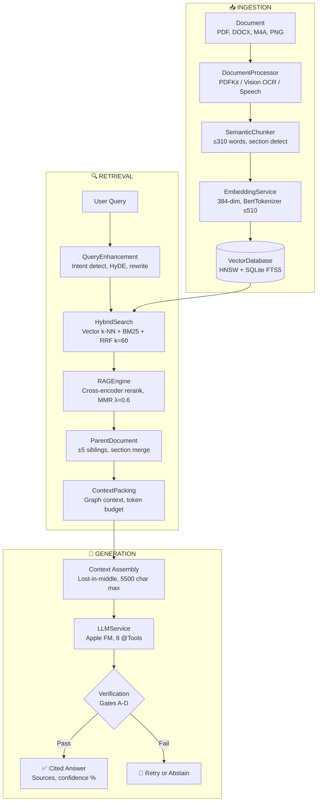

# OpenIntelligence

[](https://developer.apple.com/ios/)
[](https://swift.org)
[](LICENSE)
[](Docs/reference/ARCHITECTURE.md)

**Ask your documents anything. Get cited answers.**

OpenIntelligence is a document question-answering app powered by Apple Intelligence. Import any document—PDFs, Office files, audio, images—ask questions in plain English, and get accurate answers with citations. All processing happens on your device.

---

## What It Does

```
┌─────────────┐      ┌─────────────┐      ┌─────────────┐      ┌─────────────┐
│  1. ADD     │ ───▶ │  2. INDEX   │ ───▶ │   3. ASK    │ ───▶ │ 4. ANSWER   │
│  Documents  │      │ Chunk+Embed │      │ Your query  │      │ With sources│
└─────────────┘      └─────────────┘      └─────────────┘      └─────────────┘
```

1. **Add** - Tap "+" in the Documents tab, select files from the picker (PDF, Office, audio, images, code)
2. **Index** - App chunks text (≤310 words), generates 384-dim embeddings, builds vector + keyword indexes
3. **Ask** - Go to Chat tab, type a question; app retrieves relevant chunks via hybrid search
4. **Answer** - Apple Intelligence generates a response citing exact source passages

---

## Supported File Formats

| Category        | Formats                                                                                         | Notes                                                  |
| --------------- | ----------------------------------------------------------------------------------------------- | ------------------------------------------------------ |
| **Documents**   | PDF                                                                                             | Native PDFKit + Vision OCR @ 360 DPI for scanned pages |
| **Office**      | DOCX, XLSX, PPTX                                                                                | Native ZIP-based XML extraction (no dependencies)      |
| **Text**        | TXT, MD, RTF                                                                                    | Direct text extraction                                 |
| **Code**        | Swift, Python, JS, TS, Java, C/C++, Go, Rust, Ruby, PHP, HTML, CSS, JSON, XML, YAML, SQL, Shell | Syntax-aware chunking                                  |
| **Data**        | CSV, JSON                                                                                       | Unlimited rows, handles special characters             |
| **Images**      | PNG, JPEG, HEIC, TIFF, GIF                                                                      | Vision OCR extracts text from images                   |
| **Audio/Video** | M4A, MP3, WAV, MP4, MOV                                                                         | Speech.framework transcription to text                 |
| **Apple**       | Pages, Numbers, Keynote                                                                         | Supported via export or direct extraction              |

---

## Core Technology

### Embedding Pipeline

| Component           | Technology          | Specification                          |
| ------------------- | ------------------- | -------------------------------------- |
| **Embedding Model** | CoreML MiniLM-L6-v2 | 384 dimensions, bundled in app         |
| **Tokenizer**       | BertTokenizer       | 510 token max (512 - CLS/SEP)          |
| **Chunk Size**      | SemanticChunker     | ≤310 words + 30-word contextual prefix |
| **Vector Index**    | HNSW (in-memory)    | Cosine similarity, LRU cache           |
| **Keyword Index**   | SQLite FTS5         | BM25 scoring, Porter stemmer           |

### Search & Retrieval

| Component           | Technology           | Specification                     |
| ------------------- | -------------------- | --------------------------------- |
| **Hybrid Search**   | Vector + BM25        | Reciprocal Rank Fusion (k=60)     |
| **Reranker**        | CoreML Cross-Encoder | `ReRankerModel.mlpackage` bundled |
| **Diversification** | MMR                  | λ=0.6 relevance/diversity balance |
| **Context Window**  | Lost-in-Middle       | Best chunks at start AND end      |

### LLM Generation

| Component         | Technology              | Specification                           |
| ----------------- | ----------------------- | --------------------------------------- |
| **Primary**       | Apple Foundation Models | iOS 26 FoundationModels framework       |
| **Fallback**      | Private Cloud Compute   | Apple PCC with zero-retention guarantee |
| **Context Limit** | 4,096 tokens            | ~5,500 characters with margin           |
| **Agentic Tools** | 8 @Tool functions       | Search, summarize, compare, analyze     |

---

## 8 Agentic @Tool Functions

The LLM can call these tools autonomously during reasoning:

| Tool                       | Purpose                           | Example Use                              |
| -------------------------- | --------------------------------- | ---------------------------------------- |
| `SearchDocumentsTool`      | Semantic search across all chunks | "Find sections about safety"             |
| `ListDocumentsTool`        | List all ingested documents       | "What documents do I have?"              |
| `GetDocumentSummaryTool`   | Get/generate document summary     | "Summarize the contract"                 |
| `CountPatternTool`         | Count pattern occurrences         | "How many times is 'revenue' mentioned?" |
| `SearchExactPatternTool`   | Find exact text matches           | "Find all phone numbers"                 |
| `GetCorpusStatsTool`       | Library-wide statistics           | "How many pages total?"                  |
| `FindRelatedDocumentsTool` | Find similar documents            | "What's related to this memo?"           |
| `CompareDocumentsTool`     | Compare two documents             | "How do these contracts differ?"         |

---

## Quality Modes

| Mode           | Sessions | Use Case                                 | Response Time |
| -------------- | -------- | ---------------------------------------- | ------------- |
| **Standard**   | 1-3      | Quick factual questions                  | 2-3 seconds   |
| **Deep Think** | 4-8      | Complex analysis, multi-step reasoning   | 5-15 seconds  |
| **Maximum**    | 8-50     | Exhaustive research, document comparison | 15-60 seconds |

Deep Think and Maximum modes use **Self-RAG 2.0**: multiple reasoning sessions that enrich (not verify) answers, adding details from different evidence chains.

---

## 23-Step Pipeline

OpenIntelligence processes every query through 23 distinct steps:

```
INGESTION (6 steps):
  1. Parse         → PDFKit / Vision OCR @ 360 DPI / Office ZIP extraction
  2. Chunk         → SemanticChunker (≤310 words, section boundary detection)
  3. Extract       → Entity extraction (NLTagger NER + PascalCase detection)
  4. Validate      → Token validation (BertTokenizer, truncate if >510)
  5. Embed         → CoreML MiniLM-L6-v2 (384-dim vectors)
  6. Store         → HNSW index + SQLite FTS5 + EntityIndex

RETRIEVAL (17 steps):
  Step 0    Corpus Analysis        → Build vocabulary cache per container
  Step 1    Query Understanding    → Pronoun resolution, NER extraction
  Step 1.5  Query Expansion        → Corpus-aware synonym expansion
  Step 1.6  Intent Classification  → lookup / procedure / compare / summarize
  Step 2    Query Embedding        → 384-dim vector from same model
  Step 2.5  RAPTOR-lite Routing    → Overview queries → L1 summaries
  Step 3    Hybrid Search          → Vector k-NN + BM25 + RRF fusion
  Step 4    Cross-Encoder Rerank   → CoreML ReRankerModel.mlpackage
  Step 4.3  Low-Confidence Filter  → Drop chunks below threshold
  Step 4.4  Multi-Doc Representation → Ensure source diversity
  Step 4.5  MMR Diversification    → λ=0.6 relevance/diversity
  Step 4.6  Parent Document        → Expand ±5 sibling chunks
  Step 4.7  Contextual Compression → LLM filters irrelevant sentences
  Step 4.9  Graph Context Packing  → Optimal token budget allocation
  Step 5    Context Assembly       → Lost-in-middle reordering
  Step 5.9  Extractive Summary     → For summarize intent
  Step 5.10 Extractive QA          → For lookup intent
  Step 6    LLM Generation         → Apple FM / Private Cloud Compute
  Step 7    Quality Assessment     → Confidence scoring
  Step 7.5  Verification Gates     → Gates A-D (see below)
  Step 8    Package Results        → Build response with sources
  Step 8.1  Calibrated Confidence  → Platt scaling (0.0-1.0)
  Step 9    Response Metadata      → Timing, token counts, source URIs
```

---

## Verification Gates (Anti-Hallucination)

Every response passes through 4 verification gates:

| Gate  | Name                 | What It Checks                                            |
| ----- | -------------------- | --------------------------------------------------------- |
| **A** | Retrieval Confidence | `max(score) ≥ τ` AND `margin ≥ μ` between top results     |
| **B** | Evidence Coverage    | All claims must cite `evidence_ids` from retrieved chunks |
| **C** | Numeric Sanity       | Numbers in response must match source documents           |
| **D** | Contradiction Sweep  | Detect conflicting evidence across chunks                 |

If any gate fails, the system either abstains or triggers iterative retrieval.

---

## Architecture

**51 services** organized into **9 categories**:

| Category           | Count | Key Services                                                        |
| ------------------ | ----- | ------------------------------------------------------------------- |
| **RAG Pipeline**   | 14    | RAGService, RAGEngine, HybridSearchService, VerificationGateService |
| **Query**          | 6     | QueryEnhancementService, HyDEService, ContextualCompressionService  |
| **Document**       | 10    | DocumentProcessor, SemanticChunker, AudioTranscriptionService       |
| **Embedding**      | 2     | EmbeddingService, CoreMLSentenceEmbeddingProvider                   |
| **Storage**        | 3     | FullTextStorageService, SQLiteFullTextService                       |
| **VectorStore**    | 4     | VectorDatabase, InMemoryVectorDatabase, BNNSVectorDatabase          |
| **LLM**            | 7     | AppleFoundationLLMService, OnDeviceAnalysisService                  |
| **Agentic**        | 3     | AgenticOrchestrator, ConversationMemoryService, WritingToolsService |
| **Infrastructure** | 7     | ContainerService, GPUComputeService, DeviceCapabilityService        |

**Full inventory**: See [ARCHITECTURE.md](Docs/reference/ARCHITECTURE.md) → "Complete Service Inventory (51 Services)"

### Data Flow


```mermaid
flowchart TD
    subgraph ING[" 📥 INGESTION "]
        A[Document<br/>PDF, DOCX, M4A, PNG] --> B[DocumentProcessor<br/>PDFKit / Vision OCR / Speech]
        B --> C[SemanticChunker<br/>≤310 words, section detect]
        C --> D[EmbeddingService<br/>384-dim, BertTokenizer ≤510]
        D --> E[(VectorDatabase<br/>HNSW + SQLite FTS5)]
    end

    subgraph RET[" 🔍 RETRIEVAL "]
        F[User Query] --> G[QueryEnhancement<br/>Intent detect, HyDE, rewrite]
        G --> H[HybridSearch<br/>Vector k-NN + BM25 + RRF k=60]
        H --> I[RAGEngine<br/>Cross-encoder rerank, MMR λ=0.6]
        I --> J[ParentDocument<br/>±5 siblings, section merge]
        J --> K[ContextPacking<br/>Graph context, token budget]
    end

    subgraph GEN[" 💬 GENERATION "]
        L[Context Assembly<br/>Lost-in-middle, 5500 char max] --> M[LLMService<br/>Apple FM, 8 @Tools]
        M --> N{Verification<br/>Gates A-D}
        N -->|Pass| O[✅ Cited Answer<br/>Sources, confidence %]
        N -->|Fail| P[🔄 Retry or Abstain]
    end

    E --> H
    K --> L
```

<details>
<summary><strong>📖 Glossary — Why Each Piece Is In OpenIntelligence</strong> (click to expand)</summary>

| Term                       | Why It's Here                                                                                                                                                                                                                |
| -------------------------- | -------------------------------------------------------------------------------------------------------------------------------------------------------------------------------------------------------------------------------------------------- |
| **HNSW**                   | Our `InMemoryVectorDatabase` uses HNSW to search 50,000 chunks in ~5ms. Without it, finding relevant chunks would take seconds instead of milliseconds. This is what makes instant answers possible.                                               |
| **SQLite FTS5**            | Our `SQLiteFullTextService` uses FTS5 for keyword search. When you search for "VIN 1HGCM82633A004352", vector search won't find it — but FTS5 matches the exact string instantly.                                                                  |
| **BM25**                   | FTS5's ranking algorithm. When 10 chunks mention "oil change", BM25 ranks the one that mentions it 8 times (the actual procedure) above the one that mentions it once (a passing reference).                                                       |
| **BertTokenizer**          | MiniLM uses WordPiece tokenization — "unbelievable" becomes ["un", "##believ", "##able"]. `CoreMLSentenceEmbeddingProvider` counts actual tokens (max 510) to prevent truncation. NLTokenizer counts words wrong for technical text.               |
| **Contextual Prefix**      | `SemanticChunker` prepends ~30 words of section context to each chunk ("Chapter 5: Maintenance > Oil Change Procedure:"). So the embedding knows WHERE in the document this chunk lives.                                                           |
| **HyDE**                   | `HyDEService.swift` generates a hypothetical answer before searching. Query: "how to reset" → HyDE generates "To reset the system, press and hold..." → we search for chunks similar to THAT, not your vague question. Enabled in Deep Think mode. |
| **RRF (k=60)**             | `HybridSearchService` fuses vector and keyword results using Reciprocal Rank Fusion. k=60 is the smoothing constant (per Cormack et al. 2009). Ensures a chunk ranked #1 in keywords and #10 in vectors still surfaces.                            |
| **MMR (λ=0.6)**            | `RAGEngine.applyMMR()` diversifies results. λ=0.6 means 60% weight on relevance, 40% on diversity. Prevents 5 chunks from the same paragraph drowning out other sources. Configurable per query intent.                                            |
| **k-NN**                   | k-Nearest Neighbors via HNSW. `EmbeddingService` converts your query to a 384-dim vector, then we find the k=20 chunks with the closest vectors. This is semantic search — "car maintenance" matches "vehicle servicing".                          |
| **Cross-encoder**          | `ReRankerModel.mlpackage` (TinyBERT, 4.5MB) scores query+chunk pairs together. Bi-encoders (used for initial search) are fast but miss nuances. Cross-encoder is slow but precise — so we only run it on top ~20 candidates.                       |
| **Parent Document**        | `ParentDocumentService` expands matched chunks with ±5 siblings from the same section. If chunk #47 matches, we also grab #42-46 and #48-52 for full paragraph context.                                                                            |
| **Contextual Compression** | `ContextualCompressionService` uses Apple FM to strip irrelevant sentences from chunks BEFORE generation. A 300-word chunk might compress to 80 words of query-relevant content. Saves ~40-60% tokens.                                             |
| **RAPTOR-lite**            | `QueryRouterService` detects "overview" queries ("what is this document about?") and routes them to L1 summary chunks instead of searching all L0 detail chunks. 80% of RAPTOR benefit at 20% complexity.                                          |
| **Lost-in-middle**         | `RAGEngine.applyLostInMiddleReordering()` reorders chunks. Research (Liu et al. 2023) shows LLMs forget middle context. We put best chunks at positions 1, 2 AND n-1, n — so Apple FM sees them even with 5,500 chars of context.                  |
| **Verification Gates**     | 4 anti-hallucination checks: (A) retrieval confidence, (B) evidence coverage, (C) numeric sanity, (D) contradiction sweep. If any gate fails → abstain or retry with different chunks.                                                             |
| **Entity Index**           | `EntityIndexService` extracts named entities (people, orgs, places) and technical terms (PascalCase) at ingestion. Query "John Smith" → instantly find all chunks mentioning him across all documents.                                             |
| **PCC**                    | `AppleFoundationLLMService` falls back to Private Cloud Compute when on-device limits are exceeded. Apple's Secure Enclave-based cloud with cryptographic attestation that your data is deleted after each response. Zero-retention guarantee.     |

</details>

---

## Telemetry Badges

Every response shows execution metadata:

| Badge            | Meaning                                                 |
| ---------------- | ------------------------------------------------------- |
| 📱 **On-Device** | Inference ran locally on Neural Engine                  |
| ☁️ **PCC**       | Apple Private Cloud Compute (encrypted, zero-retention) |
| 🔧 **Tools: N**  | Number of @Tool functions called during reasoning       |
| ⏱️ **X.Xs**      | Total response time                                     |

---

## Privacy

- **On-device by default**: All parsing, embedding, and retrieval runs locally
- **Optional PCC**: Private Cloud Compute uses Apple's end-to-end encryption with cryptographic deletion after response
- **No third-party APIs**: No OpenAI, no external cloud services
- **No telemetry**: No analytics sent anywhere

See [PRIVACY.md](PRIVACY.md) for full details.

---

## Getting Started

### Requirements

- **iOS 26.0+** (required for FoundationModels framework)
- **Xcode 26+** (required for Swift 6)
- **Device**: iPhone 15 Pro or newer recommended (A17+ for best performance)

### Installation

```bash
# Clone
git clone https://github.com/Gunnarguy/OpenIntelligence.git
cd OpenIntelligence

# Fetch submodules (swift-transformers)
git submodule update --init --recursive

# Open in Xcode
open OpenIntelligence.xcodeproj

# Build & Run
# Select OpenIntelligence scheme → iPhone 17 Pro → Cmd+R
```

### Troubleshooting

```bash
# Clean build if you see stale UI or build errors
./clean_and_rebuild.sh
```

---

## Project Structure

```text
OpenIntelligence/
├── App/                        # Entry point, ContentView
├── Core/
│   ├── Extensions/             # Swift extensions
│   ├── Models/                 # DocumentChunk, RAGResponse, etc.
│   └── Protocols/              # Service protocols
├── Features/
│   ├── Billing/                # StoreKit subscription UI
│   ├── Camera/                 # Vision camera overlay (v2.0)
│   ├── Chat/                   # Chat interface, message bubbles
│   ├── Database/               # Container management UI
│   ├── Diagnostics/            # Debug dashboards
│   ├── Documents/              # Document picker, ingestion UI
│   ├── Onboarding/             # First-launch experience
│   ├── Settings/               # Settings views
│   └── Telemetry/              # Execution metrics display
├── Resources/
│   ├── MLModels/               # EmbeddingModel + ReRankerModel
│   └── StoreKit/               # Subscription configuration
├── Services/
│   ├── Agentic/                # AgenticOrchestrator, ConversationMemory
│   ├── Billing/                # StoreKitBillingService
│   ├── Document/               # DocumentProcessor, SemanticChunker, OCR
│   ├── Embedding/              # EmbeddingService, CoreMLProvider
│   ├── Infrastructure/         # ContainerService, GPUCompute, Settings
│   ├── LLM/                    # AppleFoundationLLMService, tools
│   ├── Query/                  # QueryEnhancement, HyDE, Compression
│   ├── RAG/                    # RAGService, RAGEngine, HybridSearch
│   ├── Storage/                # FullTextStorage, SQLiteFTS5
│   └── VectorStore/            # VectorDatabase, BNNS, Router
└── UI/                         # Shared UI components
```

---

## Reference Documentation

| Document                                          | Description                                            |
| ------------------------------------------------- | ------------------------------------------------------ |
| [ARCHITECTURE.md](Docs/reference/ARCHITECTURE.md) | Complete technical architecture, 51-service inventory  |
| [ADVANCED_RAG.md](Docs/reference/ADVANCED_RAG.md) | RAG technique reference (HyDE, compression, reranking) |
| [AFW.md](Docs/reference/AFW.md)                   | Apple Intelligence deep dive (Foundation Models, PCC)  |
| [PRIVACY.md](PRIVACY.md)                          | Privacy policy and data handling                       |
| [ROADMAP.md](ROADMAP.md)                          | Feature roadmap and version history                    |

---

## Contributing

1. Fork the repository
2. Create a feature branch: `git checkout -b feature/your-feature`
3. Write Swift 6 compliant code with `actor` isolation for heavy tasks
4. Test on device (Simulator lacks Apple FM)
5. Submit a PR with clear description

### Coding Standards

- Use `async/await` and `actor` for concurrency (no GCD)
- Never send data to cloud without explicit consent
- Update `Docs/reference/` when changing architecture

---

## License

MIT License - see [LICENSE](LICENSE) for details.
