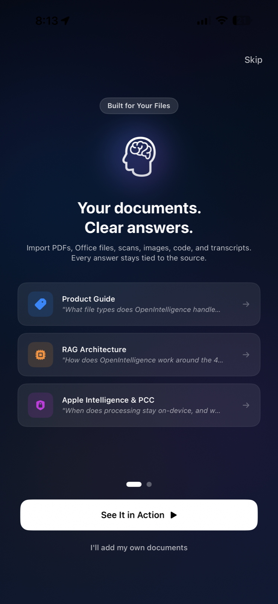
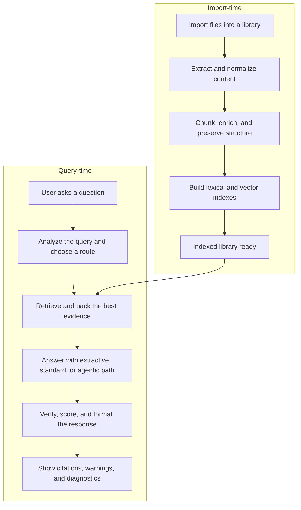

# OpenIntelligence

   

   <strong>Your documents. Clear answers. On your devices.</strong>

   Apple-native document intelligence for iOS, iPadOS, and macOS.

   
   
   

   <a href="HOW_IT_WORKS.md">How it works</a> ·
   <a href="Docs/RETRIEVAL_PIPELINE.md">Retrieval pipeline</a> ·
   <a href="Benchmarks/README.md">Benchmarks</a> ·
   <a href="WHATS_NEW.md">What's new</a>

   
   
   
   
   

I built OpenIntelligence because I got annoyed with standard chat wrappers hallucinating answers about my private documents. I wanted a real, native document intelligence layer for my iPhone, iPad, and Mac—something built from the ground up for Apple platforms, not a lazy web app. There had to be another way to get verifiable, cited answers without uploading my entire life to a random SaaS cloud.

So, I built a Neural RAG engine in SwiftUI that actually runs offline. You throw messy, real-world PDFs, scans, and notes at it, and it pulls out exact answers with visible reasoning paths and explicit citations you can check yourself. It works in airplane mode, utilizing Apple Intelligence and local on-device models, keeping your files yours.

*Note: This is an engineering portfolio project and proof-of-concept showing how Apple Intelligence can enable powerful on-device document query systems. It is not an enterprise SDK, medical device, or VC-backed SaaS.*

## Product Tour

<em>Current UI from the App Store build. Click any screenshot to open the full-size image.</em>

### 1) Bring in the documents you actually work with

   

I wanted it to handle the messy reality of documents: PDFs, random Office docs, scanned invoices, code snippets, and notes. It all gets ingested securely.

### 2) Watch the system build the library

   

No opaque black boxes here. The app exposes the ingestion pipeline so you can see it extracting text, running OCR, chunking the document, and creating embeddings for SQLite FTS5 and vector storage.

### 3) Ask a question and inspect the answer

   

When you ask a question, you get answers with hard citations `[S1]`, `[S2]`. If evidence is weak, the system abstains. There's a trace view that shows you the exact reasoning paths the localized Neural RAG engine used to give you the answer.

### 4) Keep everything isolated inside focused libraries

   

Throwing every file you own into one giant vector junk-drawer ruins precision. Documents stay grouped and tagged inside focused libraries so when you ask about your mortgage, it doesn't cross-contaminate with a PDF recipe you saved years ago. 

## The Details

- **Not Just iPhone:** It's natively built for iOS, iPadOS, and macOS. Same intelligence, anywhere you work.
- **Privacy-Forward:** True offline, airplane-mode capability. No mandatory cloud subscriptions to read your own files.
- **OCR-Aware Extraction:** It doesn't treat complex PDFs or scans like plain text. It runs native OCR so structure and meaning are preserved.
- **Grounded Retrieval:** Uses citations, evidence review, and confidence signals. If the document doesn't have the answer, it tells you, rather than making it up.

## Start Exploring

- [App Store](https://apps.apple.com/us/app/openintelligence/id6756559175): Live for iOS, iPadOS, and macOS.
- [What's New](WHATS_NEW.md) & [Changelog](CHANGELOG.md): History of updates.
- [Architecture](Docs/ARCHITECTURE.md): App structure, Apple-native boundaries, and data flow.
- [Retrieval pipeline](Docs/RETRIEVAL_PIPELINE.md): Ingestion, chunking, retrieval, context packing, and grounded answer generation.
- [RAG tech specs](Docs/Engineering/RAG_TECHNICAL.md): My notes on implementation for HyDE, parent retrieval, and reranking on-device.
- [Storage & trace](Docs/Engineering/STORAGE_AND_PIPELINE_TRACE.md): Under-the-hood look at the SQLite/vector stack.
- [Demo guide](Docs/DEMO.md): How I run public demos without blowing things up.

## How the Pipeline Works

To keep things precise, the system splits work exactly down the middle: Import time, and Query time.

```mermaid
flowchart TD
  subgraph INGEST[Import-time]
    A1[Import files into a library]
    A2[Extract and normalize content]
    A3[Chunk, enrich, and preserve structure]
    A4[Build lexical and vector indexes]
    A5[Indexed library ready]
    A1 --> A2 --> A3 --> A4 --> A5
  end

  subgraph QUERY[Query-time]
    B1[User asks a question]
    B2[Analyze the query and choose a route]
    B3[Retrieve and pack the best evidence]
    B4[Answer with extractive, standard, or agentic path]
    B5[Verify, score, and format the response]
    B6[Show citations, warnings, and diagnostics]
    B1 --> B2 --> B3 --> B4 --> B5 --> B6
  end

  A5 --> B3
```

*(You can see all the deeper, technical retrieval failure mode handlings and fallbacks in the detailed docs. The main takeaway is that extractive and source-only paths protect precision, rather than treating every prompt like a creative writing exercise).*

## Release History

*(Highlights of what changed version-by-version)*

| Version | Release focus                                                                                                                                                                        |
| ------- | ------------------------------------------------------------------------------------------------------------------------------------------------------------------------------------ |
| 3.6     | Per-library Local Only versus iCloud Drive storage, cross-device library review, safer shared-library reconciliation, and more conservative handling for clean digital text imports. |
| 3.5     | Reliability cleanup for exact answers, harder PDFs, grounded starter prompts, and first-run product clarity.                                                                         |
| 3.3     | Stronger import recovery, adaptive visual ingestion, searchable figures, and better exact table/spec lookups.                                                                        |
| 3.2.5   | Corrective pass for direct source-backed fact answers, exact measurements, and stricter grounded starter questions.                                                                  |
| 3.1     | Better OCR and table preservation, corrective retrieval on weak evidence, and stricter grounded answer handling.                                                                     |
| 3.0     | Retrieval hardening for noisy PDFs and tables, stronger extractive handling, and clearer diagnostics around recovery behavior.                                                       |
| 2.5     | Better suggested questions, stronger answer grounding and evidence review, and broader rendering and PDF-cleanup polish.                                                             |
| 2.0.x   | Faster everyday document Q&A, sharper source review, and stability/polish follow-up work after launch.                                                                               |
| 2.0.0   | Initial App Store release with multi-format import, library organization, cited answers, and paid access tiers.                                                                      |
